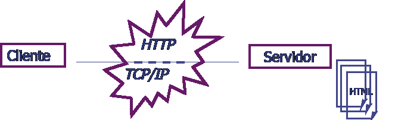
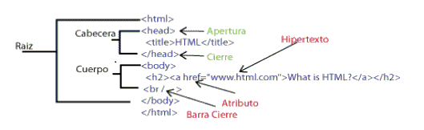
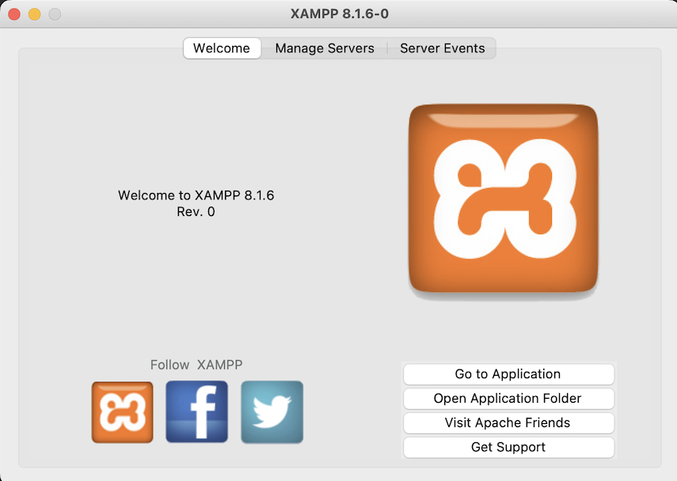
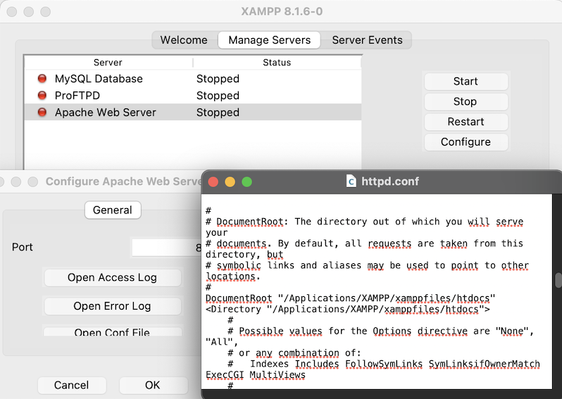
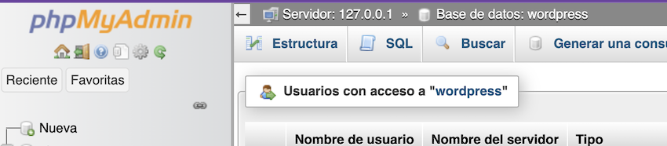
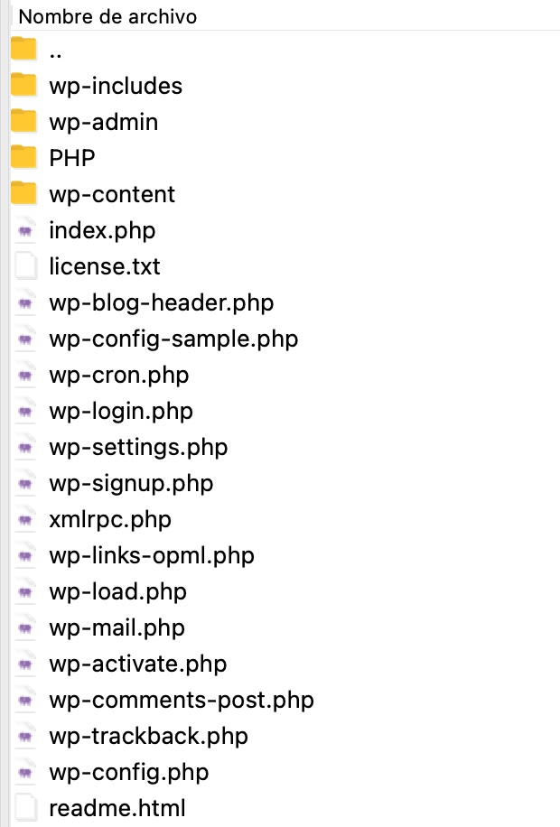
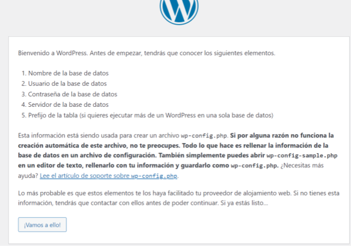
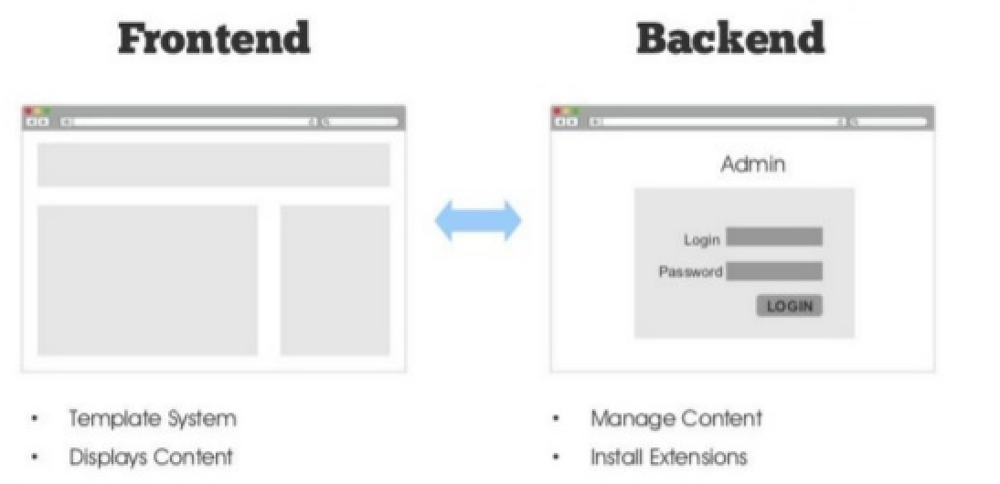
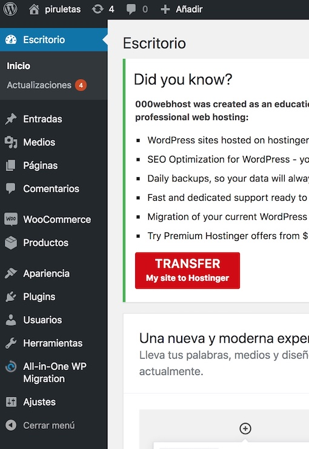
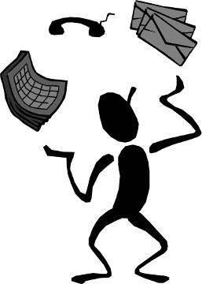

# Seminario EI1036_1042
## Introducción a la WWW
## Instalación WordPress


#### EI1042 - Tecnologías y Aplicaciones Web

#### EI1036- Tecnologías Web para los Sistemas de Información (2022/2023)

##### Profesorado: Dra. Dolores María Llidó Escrivá


[Universitat Jaume I](https://www.uji.es/).

---

## Tabla de contenidos

- Arquitectura Cliente Servidor Web
- HTML
- Cliente Web
- Servidor Web
- Protocolo HTTP
- URL
- Introducción Wordpress
- Conceptos de Wordpress
- Frontend/Backend: Escritorio principal WP
- Roles de Usuarios
- Tripas WP
- Wordpres y PHP


---


#  Arquitectura Cliente Servidor Web



--

### HTML



--

#### Internacionalización codificación de carácteres
```
<!DOCTYPE html >
<html lang="es">
<head>
<meta charset="ISO-8859-1">
```


Html5 el estandar es utf-8


- HTML(HyperText Markup Language)
- XML(eXtensible Markup Language)

https://validator.w3.org/#validate_by_uri+with_options


--


## Clientes WEB CURL/GET

- Descargar un documento html.
<small>curl http://www.pekegifs.com/  -o pp.html
</small>


 - Descargar todos los ficheros MP3 de un subdirectorio.  
<small> wget ‐‐level=1 ‐‐recursive ‐‐no-parent ‐‐accept mp3,MP3 http://example.com/mp3/
</small>


---

## Servidor WEB 

- Servidor WEB [Apache ](https://es.wikipedia.org/wiki/Servidor_HTTP_Apache): [LAMP](https://es.wikipedia.org/wiki/LAMP)
- Servidor WEB local php: '''php -S localhost'''

---

## 2. El protocolo HTTP

Cliente

```txt
 GET /un/ejemplo.html HTTP/1.0 CRLF
 User Agent: Mozilla CRLF
 (..)
 Referer:http://anubis.uji.es/index.html
 CRLF
```

Servidor

```txt
 HTTP/1.1 200 OK CRLF
 Date: Mon, 27 Sep 199 21:23:20 GMT CRLF
 Server: Apache/1.3.3 (Unix) CRLF
 Last-Modified: Sun, 26 Sep 1999 ... CRLF
 Content-Length: 5654 CRLF
 Content-Type: text/html CRLF
 CRLF
 <PAGE HTML>
```

--


--

### Métodos

 GET|HEAD|POST|PUT|DELETE |OPTIONS|TRACE

- HEAD: recupera las cabeceras HTTP de respuesta.
  - obtener meta-información sobre el recurso.
  - comprobar la validez de hiperenlaces.
  - comprobar la accesibilidad, actualización, etc.
- POST: ejecuta el recurso con los datos del cuerpo de la petición.
  - Envío de un mensaje a un grupo de noticias.
  - Insertar un nuevo registro en una base de datos.
  - Formularios.
  

--

### Códigos de estado HTTP

- 2xx: la petición se realizó con éxito.
- 200 OK.
- 3xx: redireccion.
- 301 Moved Permanently.
- 302 Moved Temporarily
- 4xx: error del cliente
- 400 Bad Request
- 403 Forbidden
- 404 Not Found
- 5xx: error del servidor
- 500 Internal Server Error
- 501 Not Implemented


---

# 3. URL: Uniform Resource Locator

Són cadenas de caracteres con un formato que identifica recursos indicando su dirección electrónica


```<esquema>://<user>:<password>@<host>:<port>/<url-path>```

esquema=protocolo sistema:
  
- http://host[:port][abs_path]

- http://anubis.uji.es/index.html

- ftp://al007@anubis.uji.es/un/ejemplo.txt
  
- https://aulavirtual.uji.es/course/view.php?id=64297#section-3


--


--

## URL amigables

[http://www.example.com/camaras/reflex/canon-eos-5d-mark-2/](http://www.example.com/camaras/reflex/canon-eos-5d-mark-2/)

- Mejora el SEO ( Search Engine Optimization)
- El servidor http  manipula la URL para redirigir esta url  a los recursos internos correctamente.


--

#### Ejemplos URL amigables
 
- Página de entradas de la categoría correspondiente a la primera sesión del curso:
 https://cursoswp.educacion.navarra.es/cursowp2018/categoria/sesion-1/. La “Sesión 1” es una categoría de entradas, que agrupa todos los elementos de contenido que se tratarán en dicha sesión.
- Página de las entradas que han sido marcadas con la etiqueta “widgets”: https://cursoswp.educacion.navarra.es/cursowp2018/etiqueta/widgets/. La etiqueta “widgets” es un marcador semántico que sirve para poder agrupar todos los artículos que contengan dicho concepto.

---

## Instalació Wordpress al Ordinador:


1. Descarga XAMP
https://www.apachefriends.org/es/index.html
2. Descarga WP
https://es.wordpress.org/download/#download-install
3. Instala XAMP
4. Ejecuta el entorno del XAMP




En el menu de configuración obtendrás los datos de configuración por defecto de los distintos servidores
- Accee a la pestaña "manager servers"
- Pulsa "start" en todos los servidores


--

5. Configuracion servidor web


- Pulsa en "Configure->Open Conf File"
Segun esta imagen el home/raiz del portal web: http://localhost/  está en /Applications/XAMPP/xamppfiles/htdocs.
- Abre en un navegador la url http://localhost/ y conprueba donde está el fichero que muestra.
Supongo que te redirige a la url: http://localhost/dashboard/index.html



--

6. Abre  la url del gestor de la  BD :  http://localhost/phpmyadmin

- El usuario por defecto si no se cambia es: root/xamp

- Si no se abre la url o para dar más seguridad y ponerlo en ejecución, ejecuta en el terminal el comando siguiente, modificando la ruta del xamp de tu sistema operativo.
´´´sh
sudo /Applications/XAMPP/xamppfiles/xampp security
´´´
Añade un password a la BD para el usuario root.

--


7. Crear BD con phpmyadmin

- Puedes crear una BD para WP con la herramienta web phpmyadmin, entrando en la url http://localhost/phpmyadmin



- Pulsa sobre el icono "nueva" y crea una BD  "WP_alxxxx" con un usuario "alxxxx" y contraseña "uji" con permisos de acceso para el WP. No modifiqueis estos datos.

--

8. Abre el directorio "Home" del portal y en este directorio descomprimes el fichero de instalación de  WP.

El directorio htdocs tendrá esta forma.


--

9. Instalación WP. 

- Entra en un navegador a la URL http://localhost/index.php aparecera el menú de instalación del WP. 

- Pon los datos requeridos. 



- Si todo es correcto, al final del proceso entrarás en el dashboard/escritorio del Wordpress. 

--
19. Linux

 - sudo +x  xamp
 - sudo xampxxx.run  ( ejecución super usuario)
  Solo Core files
  - instalación en /opt/LAMP


---

# WordPress (WP)

Es un gestor de contenidos web (Content Manager System -CMS-). Especialmente dirigidos a:

- Sitio web (https://www.webempresa.com/)
- Blogs (http://www.dulceida.com/)
- Combinaciones web/blog

Urls:

- http://wordpress.org: para descargar WP para instalarlo en nuestros servidores o en local.
- http://wordpress.com: para obtener hosting con WP. 

**Continua ↓**

--

## CMS WordPress


<small>https://www.slideshare.net/amikeliunas/introduction-to-wordpress-class-1</small>

--

## Cuentas requeridas al instalar WordPress 

- La cuenta un host con servicio FTP.
- Cuenta en la base de datos de WP.
- Cuenta del super-administrador de tu instalación de WP.
- Cuenta de usuarios de distintos perfiles de WP.

Y si estamos en la nube en un hosting
- Cuenta del dashboard del hosting.

--


Hostings  gratuitos para WP :
- https://cloudaccess.net
- https://www.000webhost.com/
- https://www.awardspace.com/  
   (Este es el que utilizaremos para laboratorio)
  

--


---

# Conceptos Básicos del Wordpress:

- Tema
- Página
- Entrada de un blog (Post)
- Comentario a una entrada
- Categoría (grupos de posts/páginas)
- Etiqueta (palabras clave)
- Atajos (Shortcode)
- Plugin
- Widget
- Menu

**Lectura Individual ↓**

--

## Conceptos 
- *Página*: Contenido sin dependencia (sitio web clásico). 
- *Entrada o artículo (post)*:  componente básica de contenido de un blog.
- *Comentario*: textos breves asociados a una entrada escritos por terceras personas.
- *Categoría*:  agrupamientos de contenido en WordPress. Admite la construcción de jerarquías (subcategorías). 
- *Etiqueta* (tags) palabras clave asociadas a páginas, artículos o entradas.
- *Atajos* (shortcode): texto entre las marcas [ ] que se sustituyen por el resultado de una función PHP (ej.- [woocommerce_cart])


--

## Conceptos
- *Tema*: plantillas que se utilizan en WP para definir la apariencia y diseño del sitio. 
- *Plugin*: complementos de software que aumentan las capacidades y posibilidades de WP. Los plugins se usan para mejorar WP en diferentes áreas como marketing, redes sociales, seguridad, SEO, diseño web, contenido, tráfico web, etc.
- *Widgets*: pequeños bloques con herramientas que realizan funciones específicas y que están pensados para ubicarse en ciertas áreas del tema en curso, como el pie o la barra lateral (sidebar). Ayudan a darte un mayor control sobre el diseño y contenido de tu sitio web o blog. Los widgets se pueden expandir y usar de diferente forma dependiendo del tema y de los plugins que se instalen.
- *Menu*: Menús de navegación y acceso a distintos servicios del portal.

Cualquier widget o menú creado en WP se muestra, por defecto, en todas las páginas del sitio web.


--

## Categorías/Taxonomías 
Las taxonomías de WP son un mecanismo de agrupamiento o categorización de los elementos de contenido y otros tipos de elementos de la aplicación.

- *Categorías*: actúan a modo de contenedores semánticos que sirven para organizar temáticamente las entradas del sitio web. Son jerárquicas  , lo cual supone que pueden existir categorías, subcategorías, sub-subcategorías, etc.
- *Etiquetas*: descriptores semánticos del contenido de las entradas. No son jerárquicas (equivalente al glosario de palabras clave)
- *Categorías de enlaces*: permiten categorizar los enlaces, de forma semejante a como lo hacen las categorías de entradas. Desde la versión 3.5, tanto los enlaces como las categorías de enlaces ya no son visibles en una instalación estándar de WP.
- *Formatos de entradas*: sirven para agrupar ciertos metadatos de información de las entradas, que pueden ser utilizados por un tema a fin de personalizar su presentación.

--

## Uso taxonomías

 - Las taxonomías contribuyen a jerarquizar el contenido y proporcionan “pistas” para que los buscadores puedan indexar los sitios web de forma eficiente. 

---

## Frontend/Backend

- Programador Back-End : es el especialista que desarrolla la parte de atrás, el soporte de una web, lo que nadie ve. Cliente
- Programador  Front-End diseña lo de adelante, lo que sí se ve.  Servidor




--

 ##  Backend: Escritorio Principal (user:  *Admin*)



--

## Panel de control

  - Configurar el portal (tipo site/blog).
  - Seleccionar tema.
  - Gestionar usuarios.
  - Gestionar taxonomías.
  - Gestionar plugins.
  - Actualizaciones.
  - Gestionar los distintos recursos del site: multimedia (imágenes, videos...).

**Continua ↓**

---

#  Roles de Usuarios: Autentificación/Autorización/Sesión

- *SuperAdmin* – Quién cuenta con acceso a la característica de administración de la red de sitios completa. Una instalación de WP permite gestionar varios sitios en el mismo alojamiento.
- *Administrador* – Quién tiene acceso a todas las características de administración de un sitio en particular.
- *Editor* – Quién puede publicar y editar entradas, propias y de otros usuarios.
- *Autor* – Quién puede publicar y editar sus propias entradas.
- *Colaborador* – Quién puede escribir y editar sus propias entradas, pero no publicarlas.
- *Subscriptor* – Quién solamente puede editar su perfil.
  
**Lectura Individual ↓**

--

## Tareas Administrador

  - *Actualizaciones*. En esta opción podrás ver todo lo relacionado con las diferentes actualizaciones disponibles para WP, incluyendo la versión de la plataforma, temas y plugins. Es importante mantener actualizado todo, por motivos de seguridad.
  - *Entradas.* Desde aquí puedes administrarlas. También en esta sección podrás agregar y modificar tanto categorías como etiquetas.
  - *Media.* Agrega imágenes, archivos y hasta pequeños vídeos para usarlos en tus entradas o páginas.
  - *Páginas.* A diferencia de las entradas, no tienen fecha de publicación.
  - *Comentarios.* Área en donde administras todos los comentarios que se van publicando ya sea en tu blog o en tus páginas. Los puedes editar, eliminar o mandar al spam. También puedes seleccionar si prefieres primero verlos y aprobarlos o que se publiquen automáticamente.
  - *Información de tu tema o plantilla.* Este apartado no aparece en todas las plantillas, solo si tiene su propio panel de opciones para modificar su estructura y diseño.

--

  - *Apariencia.* En esta sección puedes agregar, instalar o eliminar nuevos temas, administrar los widgets, crear y modificar menús, editar el código de los archivos de tu tema (incluyendo el CSS) y también personalizar el título y la portada estática de tu tema (la página de inicio).
  - *Plugins.* Agrega, modifica, instala o elimina nuevos plugins.
  - *Usuarios.* Aquí puedes modificar tu perfil, agregar tus links de redes sociales, cambiar tu alias, tu email e información básica. Si otras personas van a editar tu sitio o publicar contenido, en esta sección puedes crearles un perfil y definir su rol.
  - *Herramientas.* Importar y exportar son las opciones disponibles inicialmente. Si instalas ciertos plugins, su panel de opciones podría aparecer en esta sección.
  - *Ajustes.* Toda la configuración básica de tu sitio se hace en esta parte. También podrás modificar las opciones de cualquier plugin que instales en esta sección. De entrada tendrás acceso a configurar las opciones generales, de escritura, de lectura, de comentarios, de medios y de enlaces permanentes.


---

### ¿Dudas?
  

---


                  