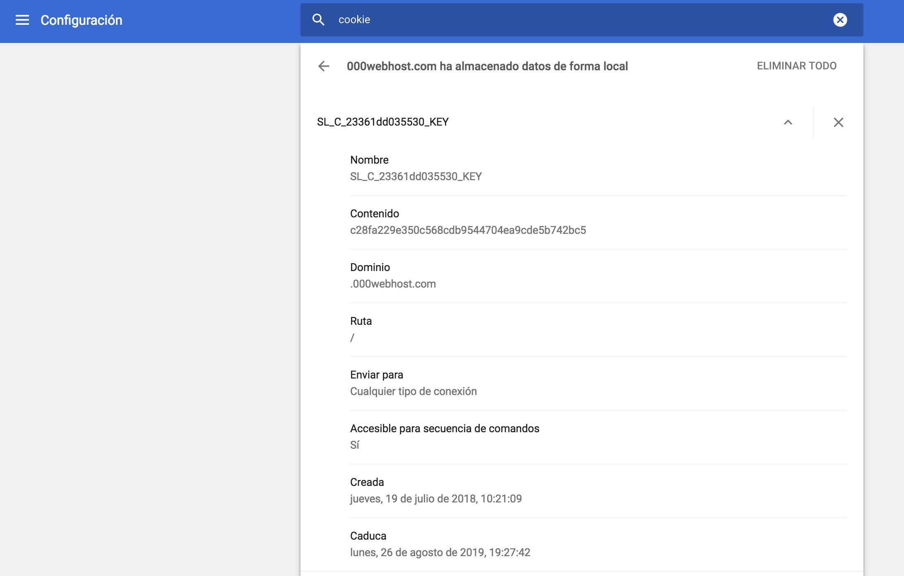
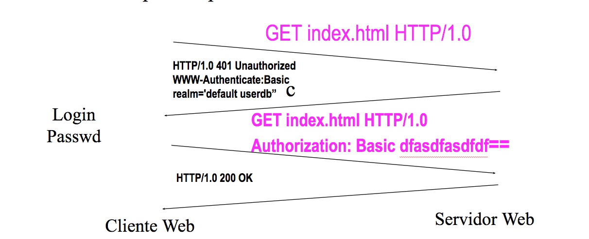
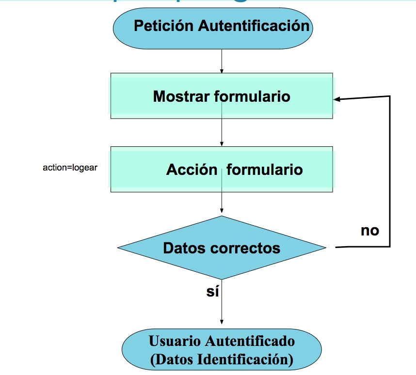
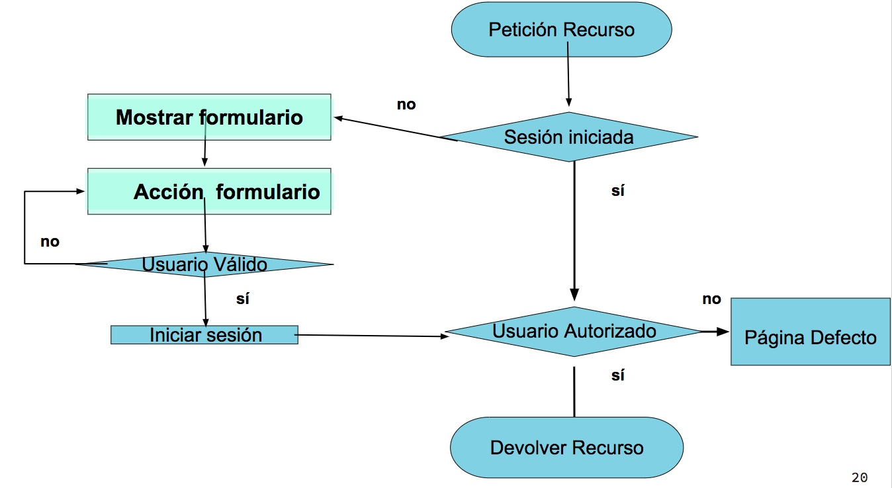
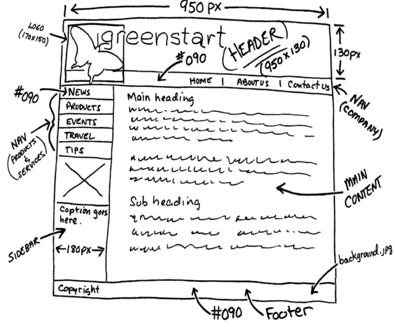

# TEMA 1

## Introducción a la WWW y PHP

#### EI1042 - Tecnologías y Aplicaciones Web

#### EI1036- Tecnologías WEB para los Sistemas de Información (2022/2023)

##### Profesorado: Dra. Dolores María Llidó Escrivá


[Universitat Jaume I](https://www.uji.es/).

---

## Tabla de contenidos

Tabla de contenidos
1. Arquitectura Cliente Servidor Web
2. El protocolo HTTP
3. URL: Uniform Resource Locator
4. Introducción al PHP
5. Servidor WEB con PHP
6. Formularios
7. Sesión
8. WEB: Autenticación de usuarios
9. Autorizar recursos a los usuarios
10. Proceso de Producción de un Proyecto Web


---


# 1. Arquitectura Cliente Servidor Web


--

### HTML


```<!DOCTYPE html >``` 

``` <li id="section-3" class="section main clearfix" role="region" aria-label="Laboratorio">```

--


## Clientes WEB CURL/GET

- Descargar un documento html.
<small>curl http://www.pekegifs.com/  -o pp.html
</small>


 - Descargar todos los ficheros MP3 de un subdirectorio.  
<small> wget ‐‐level=1 ‐‐recursive ‐‐no-parent ‐‐accept mp3,MP3 http://example.com/mp3/
</small>


--

## Servidor WEB 

- Servidor WEB [Apache ](https://es.wikipedia.org/wiki/Servidor_HTTP_Apache): [LAMP](https://es.wikipedia.org/wiki/LAMP)
- Servidor WEB local php: '''php -S localhost'''

---

## 2. El protocolo HTTP

Cliente

```txt
 GET /un/ejemplo.html HTTP/1.0 CRLF
 User Agent: Mozilla CRLF
 (..)
 Referer:http://anubis.uji.es/index.html
 CRLF
```

Servidor

```txt
 HTTP/1.1 200 OK CRLF
 Date: Mon, 27 Sep 199 21:23:20 GMT CRLF
 Server: Apache/1.3.3 (Unix) CRLF
 Last-Modified: Sun, 26 Sep 1999 ... CRLF
 Content-Length: 5654 CRLF
 Content-Type: text/html CRLF
 CRLF
 <PAGE HTML>
```

--


--

### Métodos

 GET|HEAD|POST|PUT|DELETE |OPTIONS|TRACE

- HEAD: recupera las cabeceras HTTP de respuesta.
  - obtener meta-información sobre el recurso.
  - comprobar la validez de hiperenlaces.
  - comprobar la accesibilidad, actualización, etc.
- POST: ejecuta el recurso con los datos del cuerpo de la petición.
  - Envío de un mensaje a un grupo de noticias.
  - Insertar un nuevo registro en una base de datos.
  - Formularios.
  

--

### Códigos de estado HTTP

- 2xx: la petición se realizó con éxito.
- 200 OK.
- 3xx: redireccion.
- 301 Moved Permanently.
- 302 Moved Temporarily
- 4xx: error del cliente
- 400 Bad Request
- 403 Forbidden
- 404 Not Found
- 5xx: error del servidor
- 500 Internal Server Error
- 501 Not Implemented


---

# 3. URL: Uniform Resource Locator

Són cadenas de caracteres con un formato que identifica recursos indicando su dirección electrónica


```<esquema>://<user>:<password>@<host>:<port>/<url-path>```

esquema=protocolo sistema:
  
- http://host[:port][abs_path]

- http://anubis.uji.es/index.html

- ftp://al007@anubis.uji.es/un/ejemplo.txt
  

  https://aulavirtual.uji.es/course/view.php?id=64297#section-3


--


### Ejemplo URL HTTP

- [http://www.milanuncios.com/informaticos-en-almeria/pp.htm?dias=1&demanda=n](http://www.milanuncios.com/informaticos-en-almeria/pp.htm?dias=1&demanda=n)
- https://duckduckgo.com/?q=pp&t=ffab&ia=about
- https://www.google.es/search?q=llido&as_sitesearch=uji.es&gfe_rd=ssl&ei=pRDx
- [http://dllido.al.nisu.org/EI1036_1042/PortalJson.php?action=modificarAlumnoJson](http://dllido.al.nisu.org/EI1036_1042/PortalJson.php?action=modificarAlumnoJson)
- https://aulavirtual.uji.es/course/view.php?id=64297#section-3


--

## Caracteres especiales:

- /: Indica path del recurso
- #: indica una etiqueta que tiene el id referenciado 
 (< id==section-3>)
- &,=: El cliente WEB los datos del formulario cuando se usa el método get los envia como pares nombre=valor unidos por &

```
<?php
echo '<a href="mycgi?foo=', urlencode($userinput), '">';
?>
```
urlencode() - Codifica una cadena cifrada como URL
urldecode() - Decodifica una cadena cifrada como URL

--

## URL amigables

[http://www.example.com/camaras/reflex/canon-eos-5d-mark-2/](http://www.example.com/camaras/reflex/canon-eos-5d-mark-2/)

- Mejora el SEO
- El servidor http  manipula la URL para redirigir esta url  a los recursos internos correctamente.

--

#### Ejemplos URL amigables
 
- Página de entradas de la categoría correspondiente a la primera sesión del curso:
 https://cursoswp.educacion.navarra.es/cursowp2018/categoria/sesion-1/. La “Sesión 1” es una categoría de entradas, que agrupa todos los elementos de contenido que se tratarán en dicha sesión.
- Página de las entradas que han sido marcadas con la etiqueta “widgets”: https://cursoswp.educacion.navarra.es/cursowp2018/etiqueta/widgets/. La etiqueta “widgets” es un marcador semántico que sirve para poder agrupar todos los artículos que contengan dicho concepto.

--

#### Cuestión


¿Que envia el servidor si el recurso es un directorio? 

1. Nada 
2. index.html
3. index.php
4. Listado directorios
5. Error

---

# 4. Introducción al PHP

- Creado por Rasmus Lerdorf para uso personal en 1994 
- PHP es un lenguaje de script del lado del servidor.
- PHP: Hypertext Preprocessor
- Versión actual: PHP 7
- Es potente, fácil de aprender, de libre
  distribución, permite el acceso a bases de datos y otras
  funcionalidades orientadas a la red
- Dispone de abundante soporte en la Web

Manual PHP: http://php.net/manual/es/

--

## 4. Sintaxis básica PHP

- PHP es sensible a mayúsculas/minúsculas **solo para las variables**.
- Las instrucciones se separan con ";"
- Espacios en blanco y cambios de línea no se tienen en cuenta.
- PHP interpreta entre comillas dobles pero no entre comillas
  simples.
- Se utiliza codificación UTF-8.
- Comprobar que el editor no ha generado un BOM ( _byte order mark_ de unicode en la primera línea)

Guia Estilos: https://www.php-fig.org/psr/psr-12/

--

 YodaStyle


Comparaciones al revés para evitar equivocarnos.

--

### Ejecución PHP

- Consola

```php
php.exe "./bienvenidos.php"
```

- Entorno PHP 

```php
>>php -a
$hola="Adios";
$echo $hola
```

- Servidor WEB:
 http://piruleta.atwebpages.com/PHP/T1/holaMundo.php

- Servidor WEB local:

```php
php [options] -S <addr>:<port> [-t docroot]
php -S localhost:8080
```

--

### Ejemplo fichero PHP

```PHP
<?php
$var = "test";
echo "$var"; // Salida:"test“
echo "\$var"; // Salida:" "$var"
echo '$var'; // Salida:" "test"
# otro comentario hasta el final de la línea
// este también es de línea
/* comento
varias líneas */
?>
```


--


##  Salida estándar

¿Cómo enviar mensajes a la salida estándar?

- echo — Muestra una o más cadenas separada por ','.
- print — Mostrar solo una cadena.
- printf — Imprimir una cadena con formato.
- print_r — Imprime información legible para humanos.
- var_dump— Vuelca información sobre una variable. La información y su tipo

--

### Diferencias echo o print

- **Void** echo (string argument1[,...string argumentN])
- **Int** print (argument)
  - print solo tiene un argumento (echo puede tener varios)
  - si print devuelve 1 (significa que ha generado la salida)

No es obligatorio el uso de paréntesis ya que no son
realmente una función.

```PHP
echo "Hola mundo";
echo "Hola ", "mundo"; //dos argumentos
print "Hola mundo";
print "Hola ". "mundo"; // el operador '.' concatena cadenas
print ("Hola mundo");
```

--

## 4.2. Tipos de datos

- Tipos escalares: boolean, integer, double, string
- Tipos compuestos: array, object
- Tipos especiales: resource, NULL
- Las variables no declaradas se asocian a NULL y se imprimen como cadenas vacías.
- El tipo resource no lo veremos este curso por ser un tópico avanzado

--

### Array Asociativo

Sintaxis:
array ([clave =>] valor, ...)

```PHP
$medidas = array (10, 25, 15);
echo $medidas[0];

$color = array ('rojo'=>101, 'verde'=>51, 'azul'=>255);

#Acceso:
echo $color['rojo']; // No olvidar las comillas
echo array_keys($color);

foreach($color as $val => $n)
    {echo $val,"-",$n,"\n";}


```

--

## Variables

- No se declara el tipo de las variables.
- Las variables se pueden asignar
  - Por valor
  - Por referencia (con &)
  - Creación de nombres de variables dinámico.

```PHP
$x='equis';
$_x = &$x; //referencia a $x
$_x ='x';
echo $x; //salida: x
echo $_x; //salida: x
$a = "hola";
$$a = "mundo"; //nombrar una variable con otra variable
print "$a $hola\n"; //salida: hola mundo
print "$a ${a}s\n"; //salida: hola hola 
//utilizaremos ${} para evitar errores
print "$a ${$a}";  //salida: hola mundo 
//podemos acceder al valor de una variable ($mundo) nombrada en otra ($a)

$lista=array(1,2,3,4,5);
for ($i=0;$i<count($lista);$i++)
 echo $lista[$i];
```

--

### ¿De qué tipo es la variable?

- gettype() devuelve el tipo de una variable
- is_type() comprueba si una variable es de un tipo dado:

```php
is_array(), is_bool(), is_null(), is_object(), is_resource(),
is_scalar(),is_string(),is_float(), is_integer(), is_numeric(),is_nan()
```

--

### Ámbito de variables

- Local: Variable definida en una función
  - Está limitada a dicha función.
  - Se elimina al acabar la ejecución de la función
  - Salvo si la variable se declara como **static** .
- Global:
  - No se puede definir dentro de las funciones a menos que :
    - se declare en la función con la palabra clave 'global'
    - O que se acceda con el array $GLOBALS[indice]
  - Existen durante todo el tiempo de proceso del fichero
  - Al acabar de procesar el fichero se eliminan las variables globales

--

## Funciones

```PHP
function suma ($x, $y)
{
   $s = $x + $y;
   return $s;
}
```

Salida:

```
$a=1;
$b=2;
$c=suma ($a, $b);
print $c;
```

--

### Paso parámetros

- Por defecto paso parámetros por valor
- Paso por referencia:

```PHP
function incrementa (&$a)
{
  $a = $a + 1;
}
$a=1;
incrementa ($a);
print $a; // Muestra un 2
```

--

### Argumentos por defecto

- Los argumentos con valores por defecto deben ser siempre
  los últimos:

```PHP
function muestranombre ($nombre, $titulo= "Sr.")
{
  print "Estimado $titulo $nombre:\n";
}
muestranombre (“Fernández”);
muestranombre (“Fernández”, "Prof.");
```

Salida:

```
Estimado Sr. Fernández:
Estimado Prof. Fernández:
```


--

### Manejo errores
```
try {
    echo inverse(5) . "\n";
    echo inverse(0) . "\n";
} catch (Exception $e) {
    echo 'Caught exception: ',  $e->getMessage(), "\n";
}

```
---

## 5. Servidor WEB con PHP

¿Cómo funciona el intérprete de PHP?

 

  El cliente no ve el código PHP sino los resultados que produce en la salida estándar.

--

- El servidor http pone por defecto algunas  cabeceras del mensaje http.


El servidor http Apache ejecuta PHP no como un [CGI](https://httpd.apache.org/docs/trunk/es/howto/cgi.html) sino como un módulo.

Version PHP S.O. != Servidor http


Seguridad: Ficheros sensibles estar fuera de la raíz (docroot-httpdocs) del servidor Web.

--

### Cuestión 

http://piruleta.atwebpages.com/PHP/P0/partials/portal0.php?action=listar

Analiza la URL.

- ¿Cual es el nombre servidor?
- ¿Cual es el recurso?
- ¿Que parámetros requiere el programa php?

--

Fichero con HTML con PHP 

bienvenido.php

```HTML
<body>
<p>Inicio</p>
<?php
$nombre = "Ana";
print(" <P>Hola, $nombre</P>");
 ?>
<p>Fin</p>
```

--

### Cuestión

```php
>>php -S localhost:8080
```

- ¿Cuál es el doc_root del servidor Web?
- ¿Dónde ponemos el fichero tutoPhp.php en el servidor para acceder desde http://localhost/teoria/T1/tutoPHP.php?


--

### Servidor WEB en Producción

- Servidor WEB Apache (http://www.apache.org) con el módulo PHP (http://www.php.net)
- Base de datos MySQL (http://www.mysql.com) si se desea crear páginas dinámicas
- Herramientas para la gestión de MySQL, como PHPMyAdmin
  (http://www.phpmyadmin.net)

[Apache http://httpd.apache.org/docs/current/es/](http://httpd.apache.org/docs/current/es/)

--

## Servidor WEB en desarrollo: XAMPP

https://geekflare.com/es/lamp-lemp-mean-xampp-stack-intro/

- XAMPP es una distribución de Apache que incluye MySQL, PHP y phpMyAdmin
- XAMPP es gratuito y fácil de instalar
- XAMPP es multiplataforma
- Precaución: la configuración por defecto no es segura, ni para un entorno de producción.


--

### Cabeceras HTTP

- Php puede poner datos en la cabecera http.
- Cuando PHP envia algo a la salida estándar (print/echo) 
  comienza el cuerpo del http, ya no se puede enviar nada a la cabecera.

#### Ejemplo de envio de cabeceras en PHP 
```
header('Location: http://www.example.com/');
print( <html><body><p>Holamundo</p></body></html>)
```

--


## Variables en el servidor WEB con PHP 

- Variables predefinidas en PHP
- Están disponibles en todos los ámbitos.

- $GLOBALS — Array con todas las variables  en el ámbito global. 
  - $\_SERVER — Información del entorno del servidor y de ejecución
  - $\_GET(POST) — Variables HTTP GET(POST)
  - $\_FILES — Variables de Carga de Archivos HTTP
  - $\_REQUEST — Variables HTTP Request: GET+POTS+COOKIE
  - $\_SESSION — Variables de sesión
  - $\_COOKIE— Variables con datos de la cookie
  - $\_ENV— Variables del entorno
  
```$ GLOBALS[$_REQUEST]  === $_REQUEST```

---


## 6. Formularios

### Ejemplo: radio

```HTML
<form action="procesar.php" method="post">
Sexo:
  <INPUT TYPE="radio" NAME="sexo" VALUE="M" CHECKED >Mujer
  <INPUT TYPE="radio" NAME="sexo" VALUE="H">Hombre
  <INPUT TYPE="submit">
</form>

```

```PHP
#Procesar.php
<?PHP
$sexo = $_REQUEST["sexo"];
print ($sexo);
?>
```
#### Ejercicio
  Añade el nombre de la persona en el formulario y  en Procesar.php haz que se muestren  todos los datos del formulario .

--

### Cuestiones:

- ¿Cuál es la petición al servidor al pulsar submit/enviar?
- ¿Diferencia entre post y get?
- ¿Cómo probar que funciona el código PHP ?

Simulando PETICIONES POST con parámetros

```
curl --data "param1=value1&param2=value2" http://hostname/resource
```

--

### CHECKBOX

```HTML
<INPUT TYPE="checkbox" NAME="extras[]" VALUE="garaje" CHECKED>Garaje
<INPUT TYPE="checkbox" NAME="extras[]" VALUE="piscina">Piscina
<INPUT TYPE="checkbox" NAME="extras[]" VALUE="jardin">Jardín
```

```PHP
<?php
$extras = $_REQUEST["extras"];
foreach ($extras as $extra)
    print ("$extra<BR>\n");
?>
```

--

### BUTTON

```HTML
<INPUT TYPE="button" NAME="actualizar" VALUE="Actualizar datos">
```

```PHP
<?php
$actualizar = $_REQUEST["actualizar"];
if ($actualizar)
  print ("Se han actualizado los datos");
?>
```

--

### SELECT múltiple

```HTML
Idiomas:
<SELECT MULTIPLE SIZE="3" NAME="idiomas[]">
  <OPTION VALUE="ingles" SELECTED>Inglés
  <OPTION VALUE="francés">Francés
  <OPTION VALUE="alemán">Alemán
  <OPTION VALUE="holandés">Holandés
</SELECT>
```

```PHP
<?php
$idiomas = $_REQUEST["idiomas"];
foreach ($idiomas as $idioma)
   print ("$idioma<BR>\n");
?>
```


---

## 7. Sesión

HTTP es un protocolo sin sesión.

- ¿Cómo evitamos que pida reiteradamente la autentificación?
- ¿Cómo recordamos el carrito de la compra?
  

--

### Simulación de la Sesión

- A partir de controles HTML ocultos.
<small>```<INPUT type="hidden" name="session" value="1234">```</small>
- URL rewriting.
- Uso cookies.
- Una combinación de cookie y bases de datos. (WP)
- Usar el objeto **SESSION**  provisto por los entornos de programación como PHP, ASP o J2EE

--

### URL REWRITING

Consiste en incluir la información del estado en la propio URL

http://www.pekegifs.com/pekemundo/dibujos//comprar.asp?paso=3&producto1=01992CX&producto2=ZZ112230&

--


### Cookies

Una cookie es información que un servidor puede enviar en la cabecera al cliente para que la almacene en un fichero y se reenvíe en posteriores accesos (header).

Permiten:

- Recordar preferencias de un cliente para generar contenido personalizado
- Para almacenar información de sesión
- En general: para “simular” sesiones
- No para almacenar información privada. claves, cuentas...


--

#### Variables de las  Cookies

fichero con pares nombre=valor de tamaño limitado.

- name= nombre de la cookie
- expires=DD-Month-YY HH:MM:SS GMT fecha caducidad.
- secure=tipo de seguridad (sólo en HTTPS)
- path= ruta específica a los recursos a los que se envía la - cookie. Por defecto lo añade el servidor.
- domain=ámbito con el cual el cliente identifica si debe enviar la cookie al servidor

--

#### Ejemplo de cookies  en Chrome



--

##### Ejemplo Json de cookies:
```
[{
    "domain": ".uji.es",
    "expirationDate": 1697718905.752635,
    "hostOnly": false,
    "httpOnly": false,
    "name": "_ga",
    "path": "/",
    "sameSite": "unspecified",
    "secure": false,
    "session": false,
    "storeId": "0",
    "value": "GA1.2.173852503.1662999830",
    "id": 1
},{
    "domain": ".uji.es",
    "expirationDate": 1663245305,
    "hostOnly": false,
    "httpOnly": false,
    "name": "_gid",
    "path": "/",
    "sameSite": "unspecified",
    "secure": false,
    "session": false,
    "storeId": "0",
    "value": "GA1.2.478223246.1663088416",
    "id": 2
},]
```

--

#### Contras Cookies

- Privacidad: Otros servidores podrían pueden leer información de las cookies del cliente.
- Los datos pueden ser alterados: Un usuario podría modificar el fichero de una cookie.
- Implementación compleja: Mantener “a mano” el estado en el cliente es complicado si queremos hacerlo de manera robusta.
- Tamaño de datos limitado: Tanto el tamaño máximo permitido por las cookies como la longitud máxima de una URL pueden darnos problemas.

--

### Uso de cookies

- las cookies se envían del cliente al servidor en cada petición http en la cabecera y se guarda en la variable $_COOKIE que es un array.
- Las cookies las envia el programa PHP al servidor en la cabecera con la directiva setcookie. (Antes de cualquier envio de texto a la salida estándar)

--

```
<?php
print "<p>Cookies:</p>";
print_r($_COOKIE);
setcookie("TestCookie0", 'PruebaALXXXX', time()+10);  
/* expira en 10 segundos */
setcookie("TestCookieEterna", 'Prueba');  
/* no expira */
print "<p>Cookies:</p>";
print_r($_COOKIE);
?>
```
[demo](http://piruleta.atwebpages.com/PHP/T1/cookies.php)
##### Cuestión:
- ¿Hay algún error?¿Cual?
- ¿Que muestra por la pantalla?¿por que?
- ¿Que hace esta sentencia?
  ``` setcookie("TestCookie0", "PruebaALXXXX", time()-10); ```
- ¿Como borramos una cookie?


--

## Objeto Session en PHP.

- Php provee un sistema de gestión de sesiones mediante el objeto SESSION.

- Este se inicializa con la función  "session_start()" .
  -  Esta función generalmente busca en la cookie con un session_id, y entonces carga el fichero correspondiente a dicha sesión que tiene el nombre "sessionName", y los datos al diccionario $_SESSION. 
  -  Si no existe la sesión, genera el session_name, envia la cookie y crea el fichero para almacenar los datos en el servidor y almacena sus valores.
  -  "session_start()" ejecutar antes de cualquier envio de datos a la salida estándar, ya que se envía en la cabecera del HTTP.

- "sessionName()" Nos devuelve el nombre de la sesión.


--


Ejemplo Sesiones

```<?php
session_start();
print "<p>Cookies:</p>";
var_dump($_COOKIE);
print ("<p>Session:".session_name()."</p>");
var_dump($_SESSION);
if (!isset($_SESSION["activo"])) {
    $_SESSION = array();
    $_SESSION["activo"] = 1;
    print "<h2>Hola</h2>";
    $_SESSION["usuario"] = "visitante";
} else {
    
    echo "<H2>bienvenido de nuevo ", $_SESSION["usuario"],"</H2>";
}
print "<p>SessionF:</p>";
var_dump($_SESSION);
?>
```
[demo](http://piruleta.atwebpages.com/PHP/T1/session0.php)

--

## Eliminar sesiones después de un rato de inactividad:
```
$secondsInactive = time() - $_SESSION['last_action'];
if($secondsInactive >= $expireAfterSeconds){
        //User has been inactive for too long.
        //Kill their session.
        session_unset();
        session_destroy();
        print "<h2>Reactivamos tu sesión</H2>";
    }
```
[demo](http://piruleta.atwebpages.com/PHP/T1/session01.php)

--

### Ejercicios 

- Hacer un programa que elimine la sessión después de 5 minutos.
- Hacer un programa que  pida el nombre de usuario y lo guarde en la sessión.
- Hacer un programa que muestre  "bienvenido" nombre de usuario. 


---

## 8. WEB: Autenticación de usuarios

- Autentificación requiere credenciales o pruebas de identidad.
- La autentificación de usuarios puede realizarse:
    - Autentificación en el Servidor: En Apache los ficheros ```.htacacces```.
    - Autentificación en el Cliente: Firma Digital.
    - Autentificación por Programa: Escribir un programa para controlar el acceso de los usuarios.

--

## Proceso autentificación básica en Servidor: 

Autentificación básica: Solicita al cliente un usuario y contraseña, que viajan encriptadas con codificación base 64 bits

 

--

## Autentificación  Programa


  

---

## 9. Autorizar recursos a los usuarios

Una cuestión frecuente en un sitio WEB es controlar el acceso de los usuarios a una zona determinada del mismo (autorización), para ello se requiere solicitar generalmente la Autentificación previamente.

 

--

### Cuestiones:

- ¿Hay que pedir autorización a todos los recursos que se soliciten?
- ¿La acción “redirect” es propia de PHP o del protocolo http?
- ¿Qué entiendes por usuario cliente, visitante, gestor,administrador?
- ¿Qué permite el definir roles de usuario usuario?


--

#### Proceso de redirección

 


---

## 10. Proceso de Producción de un Proyecto Web

- Planificación
- Diseño
- Prototipado
- Desarrollo
- Implementación
- Evaluación
- Mantenimiento


--

### Arquitectura de la informació: Thumbnail
 

--

### Diseño WEB:  WireFrame


--

### Prototipado: Mockup

 


--

### Definición de la interfaz de cada servicio

| Title                | Título                                   |
| -------------------- | ----------------------------------------- |
| URL             | URL                                         |
| Method          | GET/POST                                    |
| URL Params | Parámetros en la URL                        |
| Data Params   | Parámetros que requiere/envía el formulario |
| Success  | Respuesta si el registro es correctamente   |
| Error    | Respuesta si hay algún error                |
| Notes           | Precondiciones/postcondiciones              |

--

| Title                | R01 Name:​Registro                                   |
| -------------------- | ----------------------------------------- |
| URL             | Portal.php​?action=registro      |
| Method          | GET                                    |
| URL Params | action                        |
| Description     | ​El usuario quiere registrarse en el portal. |
| Data Params   | Nombre, Email, Clave |
| Success  | Portal.php​?action= registrar    |
| Error  | Indica errores y vuelve cargar la misma página |
| Notes           |  - Poner un enlace en portal en el menú pero ocultar al autentificar. |
| | - Al  hacer click  se muestra formulario. |
| | - Tras rellenar campos el usuario debe dar a enviar. |

---

## ¿Dudas?

 
## Webgrafía:

- Guía referencia HTML https://html.spec.whatwg.org/multipage/indices.html
- Guía general php: https://www.php.net/manual/es/index.php