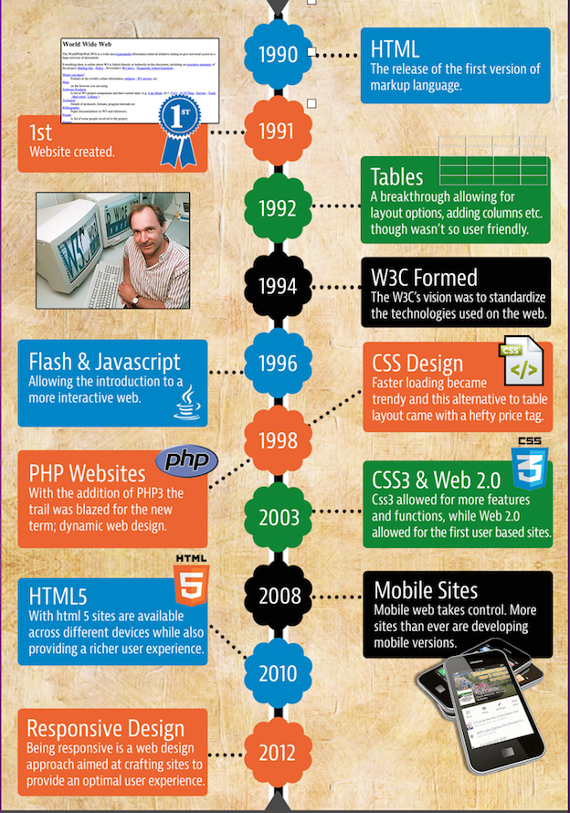
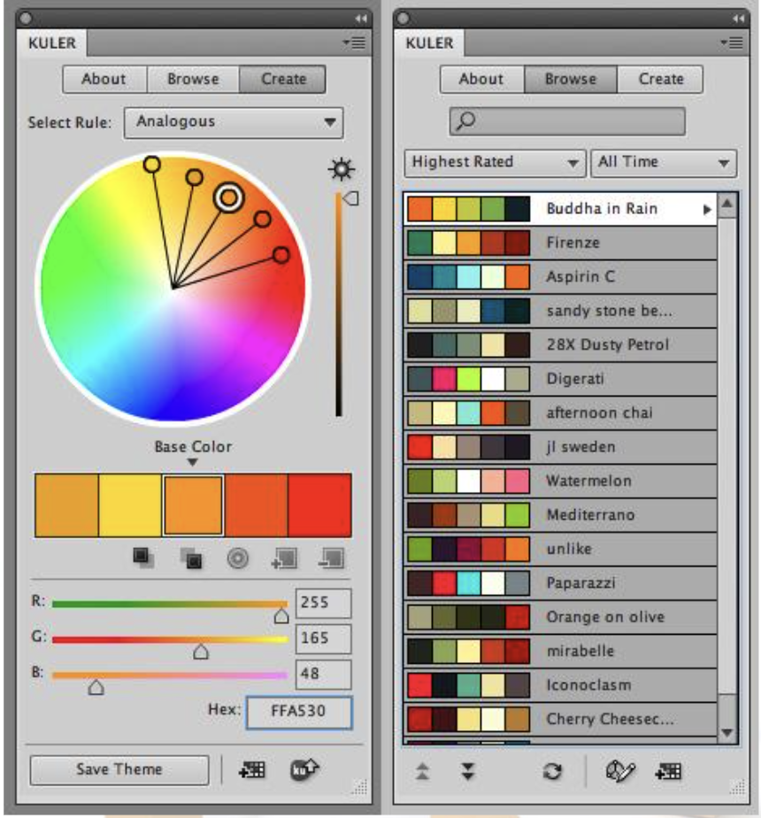
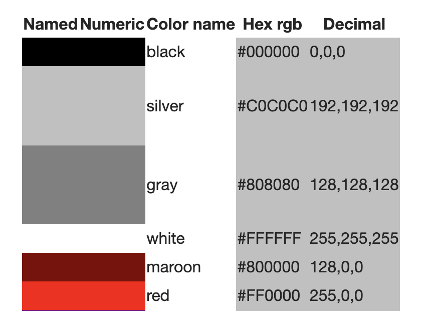
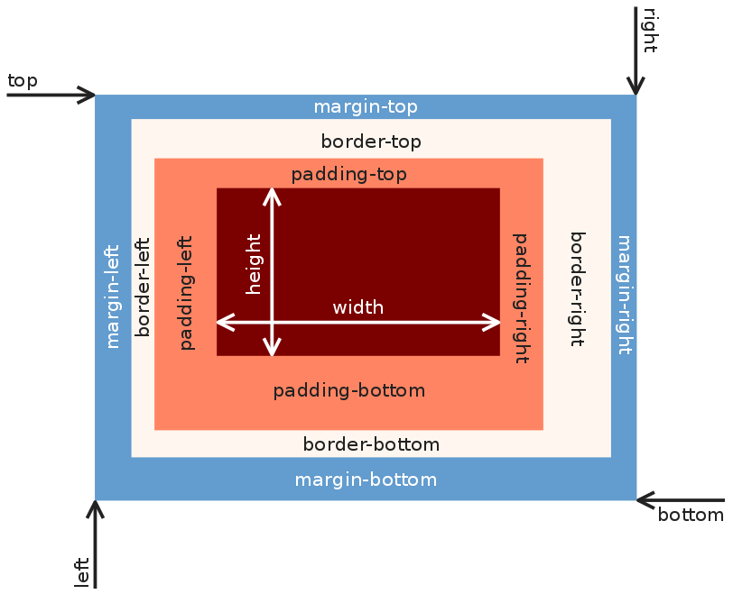
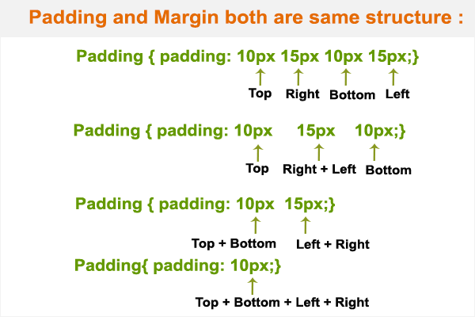

# Tema 1: Lenguajes de la Web

# (HTML5, CSS3)

  *EI1042 - Tecnologías y Aplicaciones Web*

**EI1036- Tecnologías Web para los Sistemas de Información (2023/2024)**

Professora: Dra. Dolores Mª Llidó Escrivá 


[Universitat Jaume I](https://www.uji.es/).


---

# Índice

1. HTML: HyperText Markup Language
2. Renderizado HTML
3. Accesibilidad/usabilidad
4. HTML5 
5. Estructura Semántica
6. Formularios
7. CSS: Sintaxis CSS
8.  Tipos selectores
9.   Medidas/Unidades
10. CSS3
11. Modelo de Cajas: flotantes/flexibles
12. Discriminación por dispositivos.
    - Media-Type
    - Media-Queries
13. Bibliografía


---

# 1 HTML: HyperText Markup Language

* Lenguaje de marcas para publicar documentos multimedia
hipertexto.
* Los documentos HTML son ficheros de texto con marcas de formato
que son independientes del SO, lenguaje de programación y
programas.
* Las marcas o etiquetas indican cómo representar los
contenidos de los documentos.
    - Elemento con contenido:  ```<html>...</html>``` 
    - Elemento vacío: ``` <br/> ``` o ```<br></br>``` 
    - Etiqueta con atributos:  
    ```<body class="principal">...</body>```
* Extensiones de fichero: .html o .htm
* Cuestiones de estilo: etiquetas en minúsculas y atributos entre comillas dobles (XML).

--

<a href="https://ontargetwebsolutions.com/insights/wp-content/uploads/2014/11/evolution-of-web-design-ok.jpg"> </a>

---

# 2. Renderizado HTML

¿Qué es el renderizado(Presentación)?
* Los documentos HTML pueden ser renderizados en pantallas, sintetizadores de habla y dispositivos
de Braille.

* Para indicar cómo aparece el renderizado se ha definido el *CSS*    
(Cascade Style Sheet).

* Cuando un documento HTML se renderiza se guarda en la memoria como un árbol *DOM* (Document Object
Model).

--

## Renderizado básico en el navegador: Block/Inline

 Los elementos HTML se dividen en dos grandes tipos:
- ```block```: tienden a ocupar todo el espacio disponible a lo ancho y, en
caso de existir varios elementos, se sitúan unos debajo de otros (p, aside,
footer, div, table, etc.).
- ```inline```: ocupan el espacio necesario dentro de una línea y en caso
de existir varios elementos se sitúan uno junto a otro en la misma línea
siempre que haya espacio (span, a, etc.)

https://developer.mozilla.org/es/docs/Web/HTML/Element

--

### Elementos en linea:
- b, big, i, small, tt
- abbr, acronym, cite, code, dfn, em, kbd, strong, samp, time, var
- a, bdo, br, img, map, object, q, script, span, sub, sup
- button, input, label, select, textarea


---

# 3 Recomendaciones: Accesibilidad y Usabilidad

* Etiquetas y atributos en minúsculas.
* Organización lógica del documento según estándar: h1, h2, h3, ...
* No usar tablas (```<table>```) para estructurar la página.
* Intentar que sin el estilo *CSS* se pueda entender el contenido.
* Resaltar los textos tanto con forma y color distintos.
* No utilizar espacios en blanco consecutivos, mejor usa ``` css: margin, padding, span```
* Uso preferente de etiquetas semánticas ```header, article....``` frente a ```div```

---

# 4. HTML 5:


https://html.spec.whatwg.org/


* Comienza con la definición del Doctype ```<!DOCTYPE html>```.
  (```<?xml version="1.0" encoding="utf-8"?> ```si es valido XML)
* Elementos obligatorios: ```html, head, title y body```
* Validadores: [http://validator.w3.org](http://validator.w3.org) o
[http://validator.w3.org/nu/](http://validator.w3.org/nu/)
* [http://caniuse.com](http://caniuse.com) ¿Qué etiquetas puedo usar en los
navegadores?

--

## Elementos HTML5 multimedia

* Audio: ```<audio src=" ... " ></audio>```
* Vídeo: ```<video src=" ... "></video>```
* Animación: ```<canvas></canvas> ```(+ JavaScript)
* Soporte Imágenes vectoriales: SVG (scalable vector graphics)

### Cuestión

¿Diferencia href y src?

---

# 5. Estructura Semántica

```html
<header> <hgroup>
<h1>Page title</h1>
<h2>Page subtitle<h2>
</hgroup> </header>
<nav>
   <ul>
     <li> Navigation...
   </ul>
</nav>
<section> <article>
   <header><h1>Title<h1> </header>
   Content...
   </article>
   <article>
     ....
   </article>
</section>
<aside>
   Top links...
   <figure> 
   <figcaption>Chart</figcaption> </figure>
</aside>
<footer>
   Copyright © <time datetime="2010-11-08">2010</time>.
</footer>
```

--

## HTML5: Estructura Semántica
* ```<p>```: Mínimo bloque en HTML.
* ```<div>```: Une bloques de distintos tipos, cuando no podemos asociar significado
semántico a este conjunto.
* ```<header>``` : Encabezado de la página.
* ```<footer>```: Pie de página.
* ```<nav>```: Menú de navegación.
* ```<hgroup>```: Agrupación titulares (Hn).
* ```<article>```: Elementos con significado propio.Puede contener :
    - ```<header>, <section>, <aside> y <footer>```.
    - Puede ser un documento entero.
* ```<section>```:  conjunto de etiquetas tiene un contenido relacionado.
* ```<aside>:``` bloque que es que no es de la temática de la página. Publicidad. 

---

# 6. Formularios: HTML DINÁMICO

- ¿Qué es una página dinámica?
- ¿Cómo se cra una  páginas dinámica?
- ¿Cómo funciona el formulario?
- ¿alguna alternativa a los formularios?
  
  Programación cliente: JAvascript+eventos+asíncrono
  Programación servidor: Php/java/javascript+BD

--

## Atributos  Form
```<form id="identificador" action="programa" method="post" enctype="multipart/form-data">```

* ```method``` : get(defecto)/post
* ```action``` (obligatorio) : Indica la URL o función JS que procesará la
información del formulario.
* ```enctype```: El tipo mime empleado para codificar el contenido del
formulario.
https://developer.mozilla.org/es/docs/Web/HTTP/Basics_of_HTTP/MIME_types

```html
<form action="javascript:console.log(this.fname.value);">
  <label for="fname">First name:</label>
  <input type="text" id="fname" name="fname"><br><br>
  <label for="lname">Last name:</label>
  <input type="text" id="lname" name="lname"><br><br>
  <input type="submit" value="Submit">
</form>
```

--

## Etiquetas de los formularios

* Input

* Select

* Textarea

* Button

 http://www.w3.org/TR/html5/forms.html

--

## Ejercicio 1

- Crea un pequeño formulario para registrarse en una academi que utilice:

   * campos *nombre* y *DNI* con ```input type="text"```  

   * campo *sexo* con ```input type=radio```

   * campo *fecha*  con un  ```input type="date"```

   * campo *curso* con ```select multiple```. 


Trata de encontrar una solución  para poner otros  atributos a estos campos además de los vistos en clase.

¿Que parámetros se envían al servidor? 

---

# 7. CSS: Cascade Style Sheets

* HTML utiliza un conjunto de etiquetas predefinidas, cuyo
significado es bien conocido. Un navegador sabe cómo debe
mostrar estos elementos al usuario.    
```h2 {color:blue;}```
* Las CSS (Cascade Style Sheets): son un conjunto de distintas
reglas de estilo unidas a un documento que permiten definir
estilos para mostrar a los elementos de HTML
  
   [https://www.w3c.es/Divulgacion/GuiasReferencia/CSS21]

--

## CSS: En navegadores

¿Por qué no son iguales los documentos HTML en todos los
navegadores?
- Los navegadores tienen su propio conjunto de reglas de
estilo.
- Los navegadores no soportan el estándar CSS 100%

--

## CSS: Ventajas

* Separar el contenido del formato.
* Reducir el tiempo de descarga.
* Dar más control sobre el renderizado de HTML.
* Utilizar un mismo estilo para todo el portal web para que tenga una apariencia uniforme  y consistente.
* Cada usuario pueden aplicar sus propias reglas de estilo.
* Las reglas se aplican de forma jerárquica o en cascada.
* Se combinan reglas del navegador con las del diseñador 

--

## CSS: Sintaxis

Una regla de estilo se compone de:

* Selector: enlace entre el documento HTML y el estilo    
* Declaración: describe el efecto de la regla

```selector1, selector2 {prop1:value1; prop2:value2;...}```

```css
   h1 {color:red} 
   h1,h2,h3 {color:blue; tex-align:center}
```


--

## ¿Cómo se enlaza CSS con HTML?

* Dentro de la definición de etiquetas en el HTML (No abusar) 
* En HTML dentro de la cabecera: etiqueta ```<style>```   
* En ficheros externos .css e importarlos:```<link>/@import```

```html
<b style="font-size:14pt;color:red">...</b> 
<style type="text/css">
  body { color: purple; background-color: #d8da3d}
</style>
<link rel="stylesheet" type="text/css"  href="splash.css">
<style type="text/css">
  @import url(externo.css);
  h1 {color: gray;}
</style>
```

---

# 8. Tipos de selectores
```html
<h1>Directorio1</h1>
<div id="directorio">
   <h2>Directorio1.2</h2>
   <h2>Directorio1.3</h2>
   <p class="cita negrita">En en lugar de la mancha...</p>
   <aside class="cita"> Referencia Miguel </aside>
</div>
 ```
* Etiquetas:
```css 
h1 {color:blue}
```

--

* Identificador de elemento (atributo ```id```):
```css
#directorio {
position: absolute;
left: 0px;
top: 70px;
background: red;
width: 20%; 
}
```
* Clases de elementos (atributo ```class```):
```css
.cita {font-family: "Times New Roman", Times, serif; color: red;}
p.cita {background-color: red;}
.negrita {font-weight: bold;}
```
Class puede tener multiples clases asociadas, separándolos por espacios. 

* selector de atributo:  attr=value
```css
 [lang="es"] {
  background: red;
  color: white;
  padding: 5px;
}
```

--

## Tipos de selectores
* Pseudo-Clases :
    - :link cualquier enlace no visitado de la página.
    - :visited cualquier enlace ya visitado de la página.
    - :active enlace en el que estamos en este momento.

```css
a:visited  {color: gray;}
```
* Pseudo-Elementos

```css
p:first-letter {color: red;}
p:first-line {color: gray;}
```

--

* En función del contexto

```css
td b {color:green} #descendiente
ul > b {color:#074A} #hijo
ul ~ b {color:#red} #hermano
```

https://developer.mozilla.org/es/docs/Web/CSS/CSS_selectors


--


### ¿Prioridad de las reglas?
- Orden Declaración
- Especificidad del selector
- !important: Esto prioriza una regla

```css
td{
font-size: 16pt !important;
font-size: 8px;
}
```

--

### Colores CSS

Paleta de colores

--

CSS

- Por nombres de colores
- Como valores RGB
- Como valores hexadecimales
- Con la palabra clave currentcolor



https://www.w3.org/wiki/CSS/Properties/color/keywords#Color_keywords
https://www.w3schools.com/colors/

---

# 9. Unidades CSS

* Medidas relativas:
    - ```em``` (ems, "font-size" o tamaño de la fuente 12px)
    - ```ex``` (x-height, altura de la letra "x" minúscula de la fuente actual)
    - ```px``` (pixels, relativa a la resolución de pantalla)
* Medidas absolutas:
    - ```in``` (pulgadas; 1in=2.54cm)
    - ```mm``` (milímetros)
    - ```pt``` (puntos tipográficos; 1pt=1/72in)
* Unidades de medida relativas:
    - Porcentajes : margin-left:20%
Margen izquierdo de un 20% del ancho del elemento contenedor
    - Proporcionales: margin-left:3*
Margen izquierdo de ¾ partes del elemento contenedor

--

## Tamaño de la fuente: Font-size

* Absolutos:
[ xx-small | x-small | small |medium |large | x-large
| xx-large ]
* Relativos: 
[larger | smaller]

--

#### Ejemplo kbd
https://www.w3schools.com/tags/tryit.asp?filename=tryhtml_phrase_kbd_css

--

## Ejercicio 2

Convierte un elemento "span" en un botón con una clase enlaceBoton. Usando las reglas de background y border.


¿Qué pasa si un elemento "a" le pones también la clase enlaceBoton.

---

# 10. CSS3

* Transformaciones
* Transiciones
* Animaciones
* Fuentes propias
* Columnas
* Transparencia
* Degradados
* Bordes redondeados

--

## Ejemplos CSS3

```html
<style>
  #gira:hover {
  transform:rotate(-30deg); }
</style>

<p id="gira" >Esto hace algo 
<a href="#"> Acción CSS3Transform</a>Se ve o no se ve.</p> 
```

<style>
  #gira:hover {
  transform:rotate(-30deg); }
</style>
<p id="gira" >Esto hace algo   <a href="#"> Acción CSS3Transform</a>
 Se ve o no se ve.<p>

Más ejemplos: 
http://estelle.github.io/animation/30.html#slide1


---

# 11. Modelo de Cajas

* Los elementos HTML son de 2 tipos: block e inline.
* La propiedad ```display``` altera el tipo de caja de un elemento.
   - ```inline```: el elemento no es un bloque, se renderiza en linea con otros elementos de ese tipo.
   - ```block``` : el elemento se comporta como un bloque, podemos poner márgenes y bordes..   
   - ```none``` : el elemento no se muestra; el efecto es como si no existiera, por lo que su espacio será ocupado por otros.
   - ```inherit``` : se heredan las características del elemento padre.
   - ```flex``` : el elemento es flexible en posición horizontal y vertical.
   - ```inline-block``` : el elemento de bloque pero que se renderiza en línea con otros elementos.

--

## Ejemplo

```html
<p> El <span style="background:#ffeebb";> SPAN </span> por defecto es inline. 
<span href="aqui" style="display:block;background:#ffeebb;"> 
Span que  ya no es inline, es block.</span></p>
<p style=" display:inline-block;background:#ffeebb;" > 
Ahora este párrafo no es block</p>
<p  style="background:#ffeebb;">Y no ocupa toda la extension como este.</p>
```

<p> El <span style="background : #ffeebb ";> SPAN </span> por defecto es inline. 
<span href="aqui" style="display:block;border: solid 4px rgb(204, 0, 0) ; background : #ffeebb ; "> 
Span que  ya no es inline, es block.</span></p>
<p style=" display:inline-block;border: solid 4px rgb(204, 0, 0) ; background : #ffeebb ; " > Ahora este párrafo no es block</p>
<p  style="background : #ffeebb ; ">Y no ocupa toda la extension como este.</p>

--

## Propiedades de las cajas



--

```css
header, footer {
   display: block;
   margin: 4px;
   padding: 5px;
   min-height: 100px;
   border: 1px solid #eebb55;
   border-radius: 7pt;
   background: #ffeebb;
}
```

--

#### marging/padding: top right bottom left




---

## Propiedad overflow 

Propiedad que especifica que hacer con el contenido excedente en un elemento a nivel de bloque

- ```visible``` (por defecto): Contenido no  recortado, podría ser dibujado fuera de la caja contenedora.
- ```hidden```: Contenido  recortado. 
- ```scroll```: Contenido  recortado y el Navegador, usa  barras de desplazamiento.
- ```auto```: Depende del Navegador.

--

## Elipsis texto

```html
<div id="container">
  <p class="truncate" >This is a text that should be truncated because it's too long.  The dreams of yesterday are the hopes of today and the reality of tomorrow. Many say exploration is part of our destiny, but it’s actually our duty to future generations and their quest to ensure the survival of the human species. Curious that we spend more time congratulating people who have succeeded than encouraging people who have not. If you could see the earth illuminated when you were in a place as dark as night, it would look to you more splendid than the moon. Buy why, some say, the moon? Why choose this as our goal? And they may as well ask why climb the highest </p></div>
 ```

```css
.truncate {
  white-space: nowrap;
  overflow: hidden;
  text-overflow: ellipsis;
}

.truncate:hover {
  white-space: normal;
  overflow:visible;

   }
```

--

### Modelo de cajas: ```Position```

* ```Static:``` Posición predeterminada en HTML.
* ```Relative:``` La posición de la caja se ajusta en relación a su posición
normal dentro de la página. La caja siguiente se sitúa como si esta
no se hubiera desplazado.
* ```Absolute:``` Las cajas son quitadas del flujo normal, su posición se
especifica con las propiedades 'left', 'right', 'top', y 'bottom'. No
tienen ninguna influencia sobre la posición de las cajas siguientes.
* ```Fixed:``` Como el anterior, pero se posiciona en función de la ventana
del navegador. Esta caja no se mueve de posición al hacer scroll.

```css
#dos{
display:block;
position: absolute;
top: 15px;
padding: 5px 5px 5px 5px;
margin-left: 0px; /*poner izquierda*/
border:  solid 4px green;
}
<div id="uno">uno</div>
<div id="dos">dos</div>
```

<style>
#dos {
display:block;
position: absolute;
top: 15px;
padding: 5px 5px 5px 5px;
margin-left: 0px; /*poner izquierda*/
border:  solid 4px green; }
</style>
<div id="uno">uno</div>
<div id="dos">dos</div>

--

### Cajas Flotantes: ```Float```

* ```Left``` : la caja se desplaza todo lo posible a la izquierda de la posición en la que se encontraba. El resto de elementos de la página se adaptan para mostrarse a su derecha 
* ```Right``` : Lo mismo a la izquierda
* ```None``` : No deja elementos flotantes.

```css
<style>
#dos0 {float:right; border:  solid 4px green;}
#uno0 {float: left; border:  dotted 4px blue;
</style>
<div id="uno0">uno1</div>
<div id="dos0">dos1</div>
```

Si al lado ponemos un párrafo este se alinea
a la derecha de la imagen.

<style>
#dos0 {float:right; border:  solid 4px green;}
#uno0 {float: left; border:  dotted 4px blue;}
</style>
<div id="uno0">uno1</div>
<div id="dos0">dos1</div>

--

### Cajas flexibles: Diseño Flexible

Un diseño flexible permite para alterar el ancho y alto de sus
elementos para ajustarse lo mejor posible al espacio disponible
en cualquier dispositivo. Un contenedor flexible expande sus
elementos para rellenar el espacio libre, o los comprime para
evitar que rebasen el área prevista.
- Un contenedor flexible (Flex container) se define usando los valores flex o inline-flex en la propiedad display del contenedor o elemento "padre" que contiene los elementos flexibles.
- Cada hijo de un contenedor flex se convierte en un elemento flexible (Flex item), que permite cajas a su derecha o izquierda.

https://developer.mozilla.org/es/docs/Web/CSS/flex

--

### Flex

```
<style>
   .flex
   {
      display: flex;
      flex-direction: row-reverse;
   }
<
 .flex > div
   {
      flex: 1 1 auto;
      width: 300px; 
   }
   </style>
  <p>Usando Flex</p>
  <div class="flex">
    <div>uno</div>
    <div>due</div>
    <div>tre</div>
  </div>
```

<style>
   .flex
   {
      display: flex;
      flex-direction: row-reverse;
   }

 .flex > div
   {
      flex: 1 1 auto;
      width: 300px; 
     border:  solid 4px green;
   }
   </style>
  <h3>Ejemplo Usando Flex</h3>
  <div class="flex">
    <div>uno</div>
    <div>due</div>
    <div>tre</div>
  </div>


--

### Columns

```  
<style>
   div.content-box {
    columns: 3 auto;
}
div {border:  solid 4px black}
</style>
<p>Usando Columns</p>
  <div class="content-box">
    <div>uno</div>
    <div>due</div>
    <div>tre</div>
  </div>
```

<style>
   .content-box {
    columns: 3 auto;
    border:  solid 4px green
    }
    div.negro {border:  solid 4px black}
</style>
<h3>Ejemplo usando Columns</h3>
  <div class="content-box negro">
    <div>uno</div>
    <div>due</div>
    <div>tre</div>
  </div>


---

# 12. CSS: Discriminación por dispositivos  
## Media-Type

- Permite categorizar los dispositivos de usuario

-  Se usaron originalmente para seleccionar en HTML4 distintos CSS en
función del dispositivo del usuario.
- Pero son insuficientes como una manera de discriminar entre dispositivos con
diferentes
- *Media Types*:
all, braille, embossed, handheld, print, projection, screen, speech,
tty, tv.

```html
<link rel="stylesheet" type="text/css" 
href="st1.css" media="print">

<link rel="stylesheet" type="text/css"
href="st2.css" media="screen">
```

--

## CSS3: Media queries

* Las consultas de medios ( media queries ) son simples filtros que pueden aplicarse a
los estilos CSS. 
* Facilitan el cambio de estilos según el tipo de dispositivo
( media-type ) o las características del dispositivo ( media-feature ), como el tipo
de pantalla, el ancho, el alto, la orientación e incluso la resolución.

```css
@media screen and (min-width:600px) {
    nav {
    float: left;
    width: 25%;
    }
    section {
    margin-left: 25%;
}}
```

```css
@media (query) 
{
 //CSS Rules used when__query matches 
}
```


--

## Ejemplo Media-QuerIes

``` html
<link rel="stylesheet" media="(max-width: 640px)" 
href="max-640px.css">
<link rel="stylesheet" media="(min-width: 640px)" 
href="min-640px.css">
<link rel="stylesheet" media="(orientation: portrait)"
 href="portrait.css">
<link rel="stylesheet" media="(orientation: landscape)"
 href="landscape.css">
<style>
  @media (min-width: 500px) and (max-width: 600px) {
  h1 { color: fuchsia;}
  .desc:after {
    content:" In fact, it's between 500px and 600px wide.";
  }
}
</style>
```

--

### Media Feature

* ```min-width``` :Reglas aplicadas a cualquier ancho de ventana de
navegador que supere el valor definido en la consulta.
* ```max-width``` :Reglas aplicadas a cualquier ancho de ventana de
navegador que sea inferior al valor definido en la consulta.
* ```min-height``` : Reglas aplicadas a cualquier alto de ventana de
navegador que supere el valor definido en la consulta.
* ```max-height``` : Reglas aplicadas a cualquier alto de ventana de
navegador que sea inferior al valor definido en la consulta.
* ```orientation=portrait``` : Reglas aplicadas a cualquier navegador
cuyo alto de ventana sea superior o igual al ancho.
* ```orientation=landscape``` : Reglas aplicadas a cualquier navegador
cuyo ancho sea superior al alto.

---

# Recursos recomendados
- Guía HTML y CSS : https://developer.mozilla.org/en-US/docs/Web
- Guía referencia HTML https://html.spec.whatwg.org/multipage/indices.html
- Guía general CSS: [http://www.w3.org/community/webed/wiki/CSS](http://www.w3.org/community/webed/wiki/CSS)
- Guia de etiquetes y regles css actives en els navegadors:[http://caniuse.com](http://caniuse.com)
- Guía Accesibilidad:[http://w3c.es/Divulgacion/GuiasBreves/Accesibilidad](http://w3c.es/Divulgacion/GuiasBreves/Accesibilidad)
  
* Bibliografía:
    - Head first web design. O'reilly. Ethan Watrall & Jeff
Siarto.
    - HTML5 y CSS3. Editor: ENI (Septiembre 2011) Autor : Luc VAN
LANCKER ISBN : 978-2-7460-6816-2

---

## Prácticas: 
- https://www3.uji.es/~dllido/EI1036_42/EjemplosTeo/T1/html5_Lola.html
- https://www.digitallearning.es/tests/test-css.html
- https://www.w3schools.com/css/css_quiz.asp


### ¿Dudas?
  


