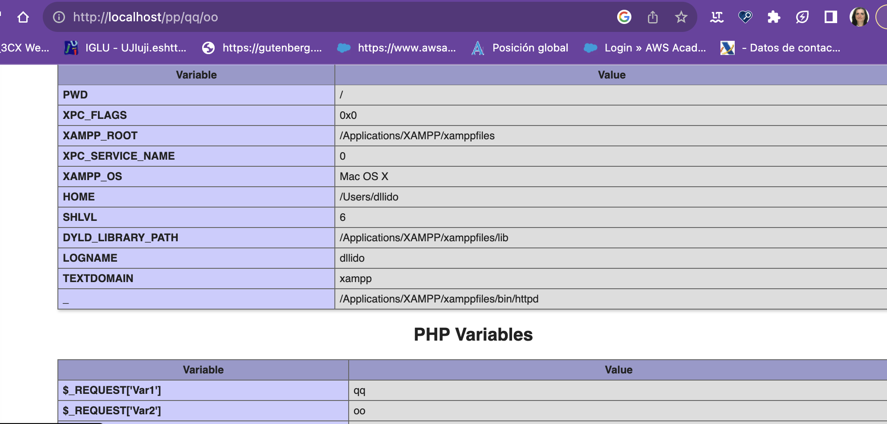
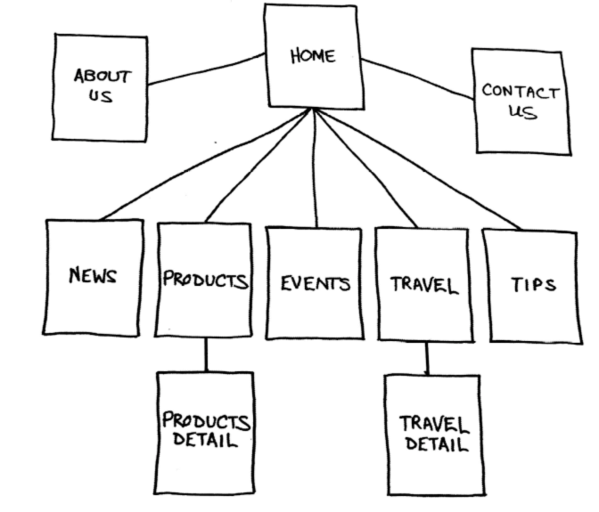

# TEMA 2

## Accesibilidad,  diseño Web y configuración Apache.

#### EI1042 - Tecnologías y Aplicaciones Web

#### EI1036- Tecnologías WEB para los Sistemas de Información (2023/2024)

##### Profesorado: Dra. Dolores María Llidó Escrivá


[Universitat Jaume I](https://www.uji.es/).

---

# Tabla de contenidos


1. Accesibilidad
2. Configuración Apache
3. Rastreo Robots
4. Proyecto Web

---


# 1. Accesibilidad


- UAAG: User Agent Accessibility Guidelines (for developers of Web browser).WCAG 3 https://w3c.github.io/silver/guidelines/
- WCAG: Web Content Accessibility Guidelines (site designers) 
- ATAG : Authoring Tool Accessibility Guidelines (HTML editors)
- WAI-ARIA : Accessible Rich Internet Applications.


--

## Normativas accesibilidad Europea

- Norma UNE 139803:2012 (PDF) , es equivalente a las WCAG 2.0
- La publicación de la Directiva (UE) 2016/2102 del Parlamento Europeo y del Consejo, de 26 de octubre de 2016,
  sobre la accesibilidad de los sitios web y aplicaciones para dispositivos móviles de los organismos del sector
  público, que deberá ser transpuesta a la legislación española antes de septiembre de 2018, y que establece los
  requisitos de accesibilidad de los sitios web y apps del sector público.
  Esta norma es el estándar europeo que especifica los requisitos funcionales de accesibilidad de los productos y
  servicios TIC: los requisitos de accesibilidad de los sitios web (equivalentes al nivel **AA de las WCAG 2.0** ), del
  hardware, del software, de los documentos, etc.

--

## Legislación Española

- Ley 34/2002, de 11 de julio, de Servicios de la Sociedad de la Información y de Comercio Electrónico. LSSI
  (B.O.E. de 12-7-02). : Se fijaba por primera vez la obligación de que las páginas web de la Administración Pública
  española fueran accesibles
- Ley 9/2017, de 8 de noviembre, de Contratos del Sector Público, por la que se transponen al ordenamiento jurídico
  español las Directivas del Parlamento Europeo y del Consejo 2014/23/UE y 2014/24/UE, de 26 de febrero de 2014.
  se incluyen requisitos de _accesibilidad universal y diseño universal o diseño para todas las personas_.


--

## Principios de accesibilidad:

- Perceptible: la información y los componentes de la interfaz de usuario deben ser presentados a los usuarios de modo que ellos puedan percibirlos.[Info](https://atenciociutadana.gencat.cat/web/.content/02_CATALEG_SERVEIS/ACCESSIBILITAT/avaluacions/IRA/Guia-Tecnica-Principio-Perceptible-1.pdf)

- Operable: los componentes de la interfaz de usuario y la navegación deben ser operables.[info](https://atenciociutadana.gencat.cat/web/.content/02_CATALEG_SERVEIS/ACCESSIBILITAT/avaluacions/IRA/Guia-Tecnica-Principio-Operable-1.pdf))

- Comprensible: la información y el manejo de la interfaz de usuario deben ser comprensibles.[Info](https://atenciociutadana.gencat.cat/web/.content/02_CATALEG_SERVEIS/ACCESSIBILITAT/avaluacions/IRA/Guia-Tecnica-Principio-Comprensible-1.pdf)
  

- Robusto: el contenido debe ser suficientemente robusto como para ser interpretado de forma fiable por una amplia variedad de aplicaciones de usuario, incluyendo las ayudas técnicas.
Tabla de verificación A, AA. [Info:]() https://atenciociutadana.gencat.cat/web/.content/02_CATALEG_SERVEIS/ACCESSIBILITAT/avaluacions/IRA/Guia-Tecnica-Principio-Robusto-1.pdf)


--

## Componentes

- *Contenido Web* – hace referencia a cualquier parte de un sitio web, incluyendo texto, imágenes, formularios y multimedia, así como a cualquier código de marcado, scripts, aplicaciones y demás.
- Agentes de usuario – software que las personas utilizan para acceder al contenido web, incluyendo navegadores gráficos de escritorio, navegadores de voz, navegadores de teléfono móvil, reproductores multimedia, plug-ins y algunas tecnologías de apoyo (en Inglés).
-Herramientas de autor – software o servicios que las personas utilizan para producir contenido web, incluyendo editores de código, herramientas de conversión de documentos, sistemas de gestión de contenido, blogs, scripts de base de datos y otras herramientas.

--

## Herramientas:

- Audit Tool WCAG 2.1, archivo excel (.xlsx) de 1.5 MB, en español
https://www.usableyaccesible.com/archivos/audit_tool_wcag21_v4_es.xlsx

- https://www.tawdis.net/ Validador URL de accesibilidad WCA2


---

#### Ejercicios: 


1. Usando la hoja de cálculo anterior y https://www.w3.org/WAI/WCAG21/quickref/?showtechniques=412#principle1 anota para cada principio de accesibilidad 2 problemas y su solución.

2. Utiliza https://www.tawdis.net/ con la pagina web de la Uji e indica 2 problemas de cada tipo que existen.

---

# Tips útilies:
 

### TabIndex
Por defecto  podemos navegar con el tabulador de una etiqueta a otra.  Esta etiqueta debe ser de tipo: enlaces, botones, elementos y etiquetas de formulario de manera adecuada.

Se puede modificar comportamiento con el atributo : 

- tabindex = "0": este valor permite que los elementos que normalmente no se pueden tabular se conviertan en tabulables. 
- tabindex = "- 1": esto permite que los elementos que normalmente son tabulables no se pueda acceder con el tabulador. 

--

#### AccessKey (Teclas de acceso rápido)


Hacer uso de  teclas de acceso para navegar con una combinacion de teclas a una seccion y hacer como clic ahi.
```
<div id="cab_blog"><a href="http://www.uji.es" accesskey="K" >.Prueba AccessKey </div>

```
<div id="cab_blog"><a href="http://www.uji.es" accesskey="K" >Prueba AccessKey control+option+k </div>

https://developer.mozilla.org/es/docs/Web/HTML/Global_attributes/accesskey

http://localhost/EI1036_42_Teo/PHP/B_1/portal1.php

--

## Cómo hacer tu sitio web accesible
https://solublestudio.com/es/solublabla/articulos/como-hacer-tu-sitio-web-accesible/

El diseñador también es responsable de muchos otros factores:

- Asegurarse de que el contenido sigue una estructura lógica y ordenada
- Usar tamaños de fuente adecuados, siempre por encima de 10px.
- Diferenciar los links del resto de elementos (subrayado/estilo).
- Mantener un espacio suficiente entre contenidos clickables(problema en dispositivos móviles).
- Estilar, si es necesario, un indicador de foco sobre los elementos que lo requieran.
- Controlar el uso de mayúsculas, que pueden ser un problema en los screen readers.
- Gestionar con cuidado las animaciones y transiciones de la web que pueden resultar contraproducentes para la accesibilidad.

--


### Otras normas de accesibilidad

- Buena semántica: etiquetas semanticas html5 y de Formularios
- Controles de interfaz de usuario: Que se puedan acceder con el tabulador (botones, enlaces y controles de formulario).
* Si se requiere otro elemento que sea accesible utilizar atributo tabindex.
* Usar etiquetas de texto significativas
- Tablas acccesibles: Usando cabeceras(<th>) y titulo tabla (<caption>)
- Alternativas de texto recursos multimedia:
* utilizar el atributo "alt" para describir el elemento.
* Mas información contextual con atributo title. 
* Si son decorativas y no tienen relación, mejor ponerlas como fondo en la posición que se desee con CSS, o usar alt=""
* Se puede utilizar tambien el atributo <figcaption>
* Enlace a un recurso que no es HTML
```
<a target="_blank" href="2017-annual-report.ppt"
  >Informe anual de 2017 (PowerPoint)</a>
```


---

# 2. Configuración Servidor Apache 

https://httpd.apache.org/docs/2.4/configuring.html

- http.conf

- .htaccess (personalizado en directorios)

Más Info:
- [http://httpd.apache.org/docs/2.4/es/](http://httpd.apache.org/docs/2.4/es/)

- [http://php.net/manual/es/](http://php.net/manual/es/)

--

 #### Ejemplos:

```txt
#Prohibir el acceso  a todos a 
#la url http://servidor/ZendServer
excepto a una ip.
<Location /ZendServer>
 Order Allow,Deny
 Allow from 127.0.0.1
</Location>
```
```txt
# listar directorios con información ficheros 
# y permitir enlaces simbólicos
<Directory /usr/local/httpd/htdocs>
Options Indexes FollowSymLinks
IndexOptions -FancyIndexing 
<Directory />
```

--

```txt
#Permitir según expresion regular acceder a un recurso
#url amigables

RewriteEngine on
RewriteBase /
RewriteRule pp/(.*)/(.*)$   phpInfo.php?Val1=$1&Val2=$

```
https://httpd.apache.org/docs/2.4/mod/mod_rewrite.html


--


Ejemplo rewrite url: http://localhost/pp/1/2


--

### Redirección en servidor:

```txt
#With Redirect
Redirect "/docs/" "http://new.example.com/docs/"
```
 
```php 
#Redireccion en PHP
header('Location: '.$nuevaURL);

```

---

# 3. Rastreo Arañas/Robots
- Metatag:
  
 ``` <meta name="robots"  content="noindex" />```
- robots.txt
```txt
#Para desactivar todas la arañas:
User-agent: *
Disallow: /
```

A nivel de rastreo por arañas no hay diferencia.

Si a nivel de indexación: A pesar de que una directiva «disallow» en el archivo robots.txt evitará que Google acceda a una URL concreta desde un enlace en nuestra propia Web, aún es posible que Google «descubra» y rastree dicha URL si encuentra un enlace apuntando a ella desde un sitio Web distinto, es decir, un enlace externo. Esta es la razón por la que podemos descubrir URLs para las que Google no muestra ninguna descripción al hacer una búsqueda con site:dominio.com.

--

## Directivas Metatag Name Robots:
Principales directivas de la meta robots:
- index / noindex: con la que indicaremos a los crawlers si deseamos indexar o no la página web en sus motores de búsqueda para que aparezca o no en los resultados de búsqueda de los mismos. Si no queremos indexarla, con noindex le diremos que no muestre esta página en sus resultados.
- follow / nofollow: indica a la araña si debe rastrear y seguir, o no, los enlaces que contiene la página en cuestión.
- archive / noarchive, señala si queremos que el robot pueda almacenar o no el contenido de la página web en la memoria caché interna del buscador.
- noimageindex: para no indexar las imágenes de la página.
unavailable_after [RFC-850 date/time]: cuando no queremos que se muestre la página en los resultados de búsqueda a partir de la fecha y hora señaladas.
...

--

## Robots.txt

- Fichero donde indicar el comportamiento que tienen que tener los buscadores y los programas de descargas sobre el servidor.

- Se supone que todos los
programas de descarga deben
respetarlo, aunque no siempre es
así.

- Se utilizan 2 directivas:
  - User-agent:
  - Disallow:
  

--


### Ejemplos:

```txt
#Para desactivar todas la arañas:
User-agent: *
Disallow: /

#Prohibimos que las arañas carguen los directorios /cgi-bin/ y /imágenes/
User-agent: *
Disallow: /cgi-bin/
Disallow: /imagenes/

#Prohibimos que emailspider lea cualquier página
User-agent: emailspider
Disallow: /
```


---

# 4. Proceso de Producción de un Proyecto Web

- Planificación: Arquitectura del sistema,casos uso, tiempo,coste,recursos
- Diseño: Análisis de requisitos casos uso, colores, fuentes, software 
- Prototipado: Arquitectura de la información, boceto portal
- Desarrollo e Implementación: Creación páginas y Servicios 
- Evaluación: Testeo,  unitest, validación,
- Mantenimiento: Mejoras, actualizar software, adaptar nuevos requisitos...


--

### Arquitectura del sistema 

 

--

 Arquitectura de la información: Mapa del sitio 
 

--

### Analisis de requisitos

- Requisitos Casos de uso
- Requisitos de seguridad: sistema de autetificación, Autorización,Sesiones.
- Requisitos de accesibilidad


--

### Definición de la interfaz de cada servicio


| Title       | Título                                      |
| ----------- | ------------------------------------------- |
| URL         | URL                                         |
| Method      | GET/POST                                    |
| URL Params  | Parámetros en la URL                        |
| Data Params | Parámetros que requiere/envía el formulario |
| Success     | Respuesta si el registro es correctamente   |
| Error       | Respuesta si hay algún error                |
| Notes       | Precondiciones/postcondiciones              |

--

Ejemplo servicio registro

| Title       | R01 Name:​Registro                                          |
| ----------- | ----------------------------------------------------------- |
| URL         | Portal.php​?action=registro                                 |
| Method      | GET                                                         |
| URL Params  | action                                                      |
| Description | ​El usuario quiere registrarse en el portal.                |
| Data Params | Nombre, Email, Clave                                        |
| Success     | Portal.php​?action= registrar                               |
| Error       | Indica errores y vuelve cargar la misma página              |
| Notes       | - Poner en  menú pero ocultar si autentificado. |
|             | - Al  hacer click  se muestra formulario.                   |
|             | - Tras rellenar campos el usuario debe dar a enviar.        |
|             | - Tras envio volver  página principal y enviar correo.  |
|             | - El usuario no debe estar autentifiado  para registrar.    |

