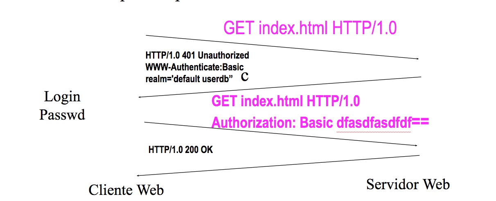

# TEMA 2

## Introducción a la WWW. Seguridad/Accesibilidad web.

#### EI1042 - Tecnologías y Aplicaciones Web

#### EI1036- Tecnologías WEB para los Sistemas de Información (2022/2023)

##### Profesorado: Dra. Dolores María Llidó Escrivá


[Universitat Jaume I](https://www.uji.es/).

---

## Tabla de contenidos

Tabla de contenidos
1. Arquitectura Cliente Servidor Web
2. El protocolo HTTP
3. URL: Uniform Resource Locator
4. Introducción al PHP
5. Servidor WEB con PHP
6. Formularios
7. Sesión
8. WEB: Autenticación de usuarios
9. Autorizar recursos a los usuarios
10. Proceso de Producción de un Proyecto Web


---

## 1. Proceso de Producción de un Proyecto Web

- Planificación
- Diseño
- Prototipado
- Desarrollo
- Implementación
- Evaluación
- Mantenimiento


---

### Arquitectura del sistema 

 

-- 
### Arquitectura de la informació: Thumbnail 

 


--


## 8. WEB: Autenticación de usuarios

- Autentificación requiere credenciales o pruebas de identidad.
- La autentificación de usuarios puede realizarse:
    - Autentificación en el Servidor: En Apache los ficheros ```.htacacces```.
    - Autentificación en el Cliente: Firma Digital.
    - Autentificación por Programa: Escribir un programa para controlar el acceso de los usuarios.

--

## Proceso autentificación básica en Servidor: 

Autentificación básica: Solicita al cliente un usuario y contraseña, que viajan encriptadas con codificación base 64 bits

 

--

## Autentificación  Programa


  

---

## 9. Autorizar recursos a los usuarios

Una cuestión frecuente en un sitio WEB es controlar el acceso de los usuarios a una zona determinada del mismo (autorización), para ello se requiere solicitar generalmente la Autentificación previamente.

 

--

### Cuestiones:

- ¿Hay que pedir autorización a todos los recursos que se soliciten?
- ¿La acción “redirect” es propia de PHP o del protocolo http?
- ¿Qué entiendes por usuario cliente, visitante, gestor,administrador?
- ¿Qué permite el definir roles de usuario usuario?


--

#### Proceso de redirección

 


--

### Definición de la interfaz de cada servicio

| Title                | Título                                   |
| -------------------- | ----------------------------------------- |
| URL             | URL                                         |
| Method          | GET/POST                                    |
| URL Params | Parámetros en la URL                        |
| Data Params   | Parámetros que requiere/envía el formulario |
| Success  | Respuesta si el registro es correctamente   |
| Error    | Respuesta si hay algún error                |
| Notes           | Precondiciones/postcondiciones              |

--

| Title                | R01 Name:​Registro                                   |
| -------------------- | ----------------------------------------- |
| URL             | Portal.php​?action=registro      |
| Method          | GET                                    |
| URL Params | action                        |
| Description     | ​El usuario quiere registrarse en el portal. |
| Data Params   | Nombre, Email, Clave |
| Success  | Portal.php​?action= registrar    |
| Error  | Indica errores y vuelve cargar la misma página |
| Notes           |  - Poner un enlace en portal en el menú pero ocultar al autentificar. |
| | - Al  hacer click  se muestra formulario. |
| | - Tras rellenar campos el usuario debe dar a enviar. |
| | - Tras envio volver a página principal y envirar un correo de confirmación del registro. |
| | - Cualquier rol de usuario puede registrar.|

---


#### Cuestión

¿Que envia el servidor si el recurso es un directorio? 

1. Nada 
2. index.html
3. index.php
4. Listado directorios
5. Error

---

# 3. URL: Uniform Resource Locator

Són cadenas de caracteres con un formato que identifica recursos indicando su dirección electrónica


```<esquema>://<user>:<password>@<host>:<port>/<url-path>```

esquema=protocolo sistema:
  
- http://host[:port][abs_path]

- http://anubis.uji.es/index.html

- ftp://al007@anubis.uji.es/un/ejemplo.txt
  

  https://aulavirtual.uji.es/course/view.php?id=64297#section-3


--

## URL amigables

[http://www.example.com/camaras/reflex/canon-eos-5d-mark-2/](http://www.example.com/camaras/reflex/canon-eos-5d-mark-2/)

- Mejora el SEO
- El servidor http  manipula la URL para redirigir esta url  a los recursos internos correctamente.

--

#### Ejemplos apache url amigable.
 


---
#### Roborts:
- Metatag:
  <meta name="robots"  content="noindex" />
- robots.txt

- A nivel de rastreo por arañas no hay diferencia.
- Si a nivel de indexación: A pesar de que una directiva «disallow» en el archivo robots.txt evitará que Google acceda a una URL concreta desde un enlace en nuestra propia Web, aún es posible que Google «descubra» y rastree dicha URL si encuentra un enlace apuntando a ella desde un sitio Web distinto, es decir, un enlace externo. Esta es la razón por la que podemos descubrir URLs para las que Google no muestra ninguna descripción al hacer una búsqueda con site:dominio.com.
- 
-- 
#### Directivas:
Principales directivas de la meta robots:
- index / noindex: con la que indicaremos a los crawlers si deseamos indexar o no la página web en sus motores de búsqueda para que aparezca o no en los resultados de búsqueda de los mismos. Si no queremos indexarla, con noindex le diremos que no muestre esta página en sus resultados.
- follow / nofollow: indica a la araña si debe rastrear y seguir, o no, los enlaces que contiene la página en cuestión.
- archive / noarchive, señala si queremos que el robot pueda almacenar o no el contenido de la página web en la memoria caché interna del buscador.
- snippet  / nosnippet: para que sólo muestre el título y no la descripción en los resultados de búsqueda.
- odp / noodp: cuando no queremos que los buscadores extraigan metadatos del Open Project Directory, en los títulos o descripciones de la página que muestran en los resultados. (En general, se entiende que esta directiva es obsoleta debido a que el Directorio Open Directory Project ha caído en desuso).
- ydir / noydir, similar a la anterior, pero para el directorio de Yahoo!. (En general, se entiende que esta directiva es obsoleta debido a que el Directorio Yahoo! ha caído en desuso).
- translate / notranslate: para ofrecer o no la traducción de la página en los resultados de búsqueda.
- noimageindex: para no indexar las imágenes de la página.
unavailable_after [RFC-850 date/time]: cuando no queremos que se muestre la página en los resultados de búsqueda a partir de la fecha y hora señaladas.

### Robots.txt

- Fichero donde indicar el comportamiento que tienen que tener los buscadores y los programas de descargas sobre el servidor.

- Se supone que todos los
programas de descarga deben
respetarlo, aunque no siempre es
así.

- Se utilizan 2 directivas:
  - User-agent:
  - Disallow:
---


### Ejemplos:

```txt
#Para desactivar todas la arañas:
User-agent: *
Disallow: /

#Prohibimos que las arañas carguen los directorios /cgi-bin/ y /imágenes/
User-agent: *
Disallow: /cgi-bin/
Disallow: /imagenes/

#Prohibimos que emailspider lea cualquier página
User-agent: emailspider
Disallow: /
```


---

## Configuración Servidor apache: 
- http.conf

- .htaccess (personalizado en directorios)

Más Info:
- [http://httpd.apache.org/docs/2.2/es/](http://httpd.apache.org/docs/2.2/es/)

- [http://php.net/manual/es/](http://php.net/manual/es/)

```txt
#.htaccess
Options +Indexes
RewriteEngine on
RewriteBase /Lab2017/T
RewriteRule pp/(.*)/(.*)$   phpInfo.php?Val1=$1&Val2=$

```
https://httpd.apache.org/docs/2.4/mod/mod_rewrite.html

**Continua ↓**

--

### Ejemplos .htaccess

```txt
#  listar directorios
Options +Indexes
IndexOptions -FancyIndexing
```


```txt
# No listar directorios
Options -Indexes
```


---


# 4. Guias accesibilidad

- UAAG: User Agent Accessibility Guidelines (for developers of Web browser,)
- WCAG: Web Content Accessibility Guidelines (site designers)
- ATAG : Authoring Tool Accessibility Guidelines (HTML editors)
- WAI-ARIA : Accessible Rich Internet Applications.

https://w3c.github.io/silver/guidelines/#relationship-to-other-w3c-guidelines WCAG3

https://olgacarreras.blogspot.com/2021/01/wcag-30-novedades-del-ultimo-borrador.html

https://www.usableyaccesible.com/recurso_misvalidadores.php

https://www.tawdis.net/ Validador URL de accesibilidad WCA2

--

# Normativas accesibilidad Europea

Norma UNE 139803:2012 (PDF) , es equivalente a las WCAG 2.0

--

# Legislación Española

- Ley 34/2002, de 11 de julio, de Servicios de la Sociedad de la Información y de Comercio Electrónico. LSSI
  (B.O.E. de 12-7-02). : Se fijaba por primera vez la obligación de que las páginas web de la Administración Pública
  española fueran accesibles
  Ley 9/2017, de 8 de noviembre, de Contratos del Sector Público, por la que se transponen al ordenamiento jurídico
  español las Directivas del Parlamento Europeo y del Consejo 2014/23/UE y 2014/24/UE, de 26 de febrero de 2014.
  se incluyen requisitos de _accesibilidad universal y diseño universal o diseño para todas las personas_.

- La publicación de la Directiva (UE) 2016/2102 del Parlamento Europeo y del Consejo, de 26 de octubre de 2016,
  sobre la accesibilidad de los sitios web y aplicaciones para dispositivos móviles de los organismos del sector
  público, que deberá ser transpuesta a la legislación española antes de septiembre de 2018, y que establece los
  requisitos de accesibilidad de los sitios web y apps del sector público.
  Esta norma es el estándar europeo que especifica los requisitos funcionales de accesibilidad de los productos y
  servicios TIC: los requisitos de accesibilidad de los sitios web (equivalentes al nivel **AA de las WCAG 2.0** ), del
  hardware, del software, de los documentos, etc.

--
https://solublestudio.com/es/solublabla/articulos/como-hacer-tu-sitio-web-accesible/

El diseñador también es responsable de muchos otros factores:

Asegurarse de que el contenido sigue una estructura lógica y ordenada
Usar tamaños de fuente adecuados, siempre por encima de 10px.
Diferenciar los links del resto de elementos, ya sea con subrayado u otro estilo.
Mantener un espacio suficiente entre contenidos clickables, ya que necesitan estar distanciados lo suficiente para no suponer un problema en dispositivos móviles.
Estilar, si es necesario, un indicador de foco sobre los elementos que lo requieran.
Controlar el uso de mayúsculas, que pueden ser un problema en los screen readers.
Gestionar con cuidado las animaciones y transiciones de la web que pueden resultar contraproducentes para la accesibilidad.


# 5. Seguridad

La seguridad supone un coste económico y de
eficiencia.

- El riesgo cero no es práctico
- Hay diversas formas de mitigar el riesgo
- No se puede gastar un millón para proteger un
  céntimo

--

## Tipos de seguridad:

1.Seguridad en el Cliente:

- Aparece incrustado en un documento HTML. Un cliente de correo o un navegador que cargue el documento lo ejecutará en la máquina cliente.

2.Seguridad en el Servidor

- Revisar periódicamente los ficheros de log (access_log y error_log en Apache) para detectar posibles ataques.

3.Seguridad en la Comunicación:

- conectar con un sitio web protegido con SSL

4.Seguridad en la Aplicación:

- Almacenar los datos sensibles de forma encriptada

--

## Seguridad: Top 10

###### https://www.owasp.org
https://owasp.org/Top10/es/


A01 Pérdida de Control de Acceso
A02 Fallas Criptográficas
A03 Inyección
A04 Diseño Inseguro
A05 Configuración de Seguridad Incorrecta
A06 Componentes Vulnerables y Desactualizados
A07 Fallas de Identificación y Autenticación
A08 Fallas en el Software y en la Integridad de los Datos
A09 Fallas en el Registro y Monitoreo
A10 Falsificación de Solicitud del Lado del Servidor (SSRF)

--

### A01 Pérdida de Control de Acceso

El control de acceso se implementa en el servidor y debe  implementar el cumplimiento de política de modo que los usuarios no pueden actuar fuera de los permisos que le fueron asignados. Las fallas generalmente conducen a la divulgación de información no autorizada, la modificación o la destrucción de todos los datos o la ejecución de una función de negocio fuera de los límites del usuario. 
#### Prevencion:

- A excepción de los recursos públicos, denegar por defecto.
- Implemente mecanismos de control de acceso una única vez y reutilícelos en toda la aplicación, incluyendo la minimización del uso de CORS.
- El control de acceso debe implementar su cumplimiento a nivel de dato y no permitir que el usuario pueda crear, leer, actulizar o borrar cualquier dato.


--

### A03:2021 – Inyección

Una aplicación es vulnerable a estos tipos de ataque cuando:

- Los datos proporcionados por el usuario no son validados, filtrados ni sanitizados por la aplicación.

-Se invocan consultas dinámicas o no parametrizadas, sin codificar los parámetros de forma acorde al contexto.

-Se utilizan datos dañinos dentro de los parámetros de búsqueda en consultas Object-Relational Mapping (ORM), para extraer registros adicionales sensibles.

- Se utilizan datos dañinos directamente o se concatenan, de modo que el SQL o comando resultante contiene datos y estructuras con consultas dinámicas, comandos o procedimientos almacenados.

## Prevención

- Uso de api segura: PDO para consultas a BD.
- Implemente validaciones de entradas de datos en el servido.
- Escape caracteres especiales utilizando la sintaxis de caracteres específica para el intérprete que se trate.

--


### A04:2021-Insecure Design 
#### Descripción
El diseño inseguro es una categoría amplia que representa diferentes debilidades, expresadas como "diseño de control faltante o ineficaz". El diseño inseguro no es la fuente de las otras 10 categorías. Existe una diferencia entre un diseño inseguro y una implementación insegura. Distinguimos entre fallas de diseño y defectos de implementación por un motivo, difieren en la causa raíz y remediaciones. Incluso un diseño seguro puede tener defectos de implementación que conduzcan a vulnerabilidades que pueden explotarse. Un diseño inseguro no se puede arreglar con una implementación perfecta, ya que, por definición, los controles de seguridad necesarios nunca se crearon para defenderse de ataques específicos. Uno de los factores que contribuyen al diseño inseguro es la falta de perfiles de riesgo empresarial inherentes al software o sistema que se está desarrollando y, por lo tanto, la falta de determinación del nivel de diseño de seguridad que se requiere.
## Prevención

- Establezca y use un ciclo de desarrollo seguro apoyado en Profesionales en Seguridad de Aplicaciones para ayudarlo a evaluar y diseñar la seguridad y controles relacionados con la privacidad.

- Establezca y utilice un catálogo de patrones de diseño seguros o componentes de "camino pavimentado" listos para ser utilizados.

- Utilice el modelado de amenazas para flujos críticos de autenticación, control de acceso, lógica de negocio y todo clave.

- Integre el lenguaje y los controles de seguridad en las historias de usuario.

. Integre verificaciones de viabilidad en cada capa de su aplicación (desde el frontend al backend).

- Escriba pruebas unitarias y de integración para validar que todos los flujos críticos son resistentes al modelo de amenazas. Recopile casos de uso y casos de mal uso para cada capa de la aplicación.

- Separe las capas del sistema y las capas de red según las necesidades de exposición y protección.

- Separe a los tenants de manera robusta por diseño en todos los niveles.

- Limitar el consumo de recursos por usuario o servicio.

--

### A06:2021 – Componentes Vulnerables y Desactualizados


Si no conoce las versiones de todos los componentes que utiliza (tanto en el cliente como en el servidor). Esto incluye los componentes que usa directamente, así como las dependencias anidadas.

Si el software es vulnerable, carece de soporte o no está actualizado. Esto incluye el sistema operativo, el servidor web/de aplicaciones, el sistema de administración de bases de datos (DBMS), las aplicaciones, las API y todos los componentes, los entornos de ejecución y las bibliotecas.

Si no analiza en búsqueda de vulnerabilidades de forma regular y no se suscribe a los boletines de seguridad relacionados con los componentes que utiliza.

Si no repara o actualiza la plataforma subyacente, frameworks y dependencias de manera oportuna y basada en el riesgo. Esto suele ocurrir en entornos en los que la aplicación de parches de seguridad es una tarea mensual o trimestral bajo control de cambios, lo que deja a las organizaciones abiertas a días o meses de exposición innecesaria a vulnerabilidades con soluciones disponibles.

Si los desarrolladores de software no testean la compatibilidad de las bibliotecas actualizadas, actualizadas o parcheadas.

Si no asegura las configuraciones de los componentes (consulte A05:2021 – Configuración de Seguridad Incorrecta).


#### Cómo se previene
Debe existir un proceso de administración de parches que:

- Elimine las dependencias que no son utilizadas, funcionalidades, componentes, archivos y documentación innecesarios.

- Realice un inventario continuo de las versiones de los componentes en el cliente y en el servidor (por ejemplo, frameworks, bibliotecas) y sus dependencias utilizando herramientas como: versions, OWASP Dependency Check, retire.js, etc. Supervise continuamente fuentes como Common Vulnerability and Exposures (CVE) y National Vulnerability Database (NVD) para detectar vulnerabilidades en los componentes. Utilice herramientas de análisis de composición de software para automatizar el proceso. Suscríbase para recibir alertas por correo electrónico sobre vulnerabilidades de seguridad relacionadas con los componentes que utiliza.

- Solo obtenga componentes de fuentes oficiales a través de enlaces seguros. Prefiera los paquetes firmados para reducir la posibilidad de incluir un componente malicioso modificado (consulte A08:2021 – Fallas en el Software y en la Integridad de los Datos).

- Supervise las bibliotecas y los componentes que no sea mantenidos o no generen parches de seguridad para versiones anteriores. Si la aplicación de parches no es posible, considere implementar un parche virtual para monitorear, detectar o protegerse contra el problema descubierto.

--

### A07:2021 – Fallas de Identificación y Autenticación

La confirmación de la identidad, la autenticación y la gestión de sesiones del usuario son fundamentales para protegerse contra ataques relacionados con la autenticación.

## Prevención:

Cómo se previene
Cuando sea posible, implemente la autenticación multi-factor para evitar ataques automatizados de reutilización de credenciales conocidas, fuerza bruta y reúso de credenciales robadas.

No incluya o implemente en su software credenciales por defecto, particularmente para usuarios administradores.

Implemente un control contra contraseñas débiles, tal como verificar que una nueva contraseña o la utilizada en el cambio de contraseña no esté incluida en la lista de las 10,000 peores contraseñas.

Alinear las políticas de largo, complejidad y rotación de las contraseñas con las pautas de la sección 5.1.1 para Secretos Memorizados de la guía del NIST 800-63b u otras políticas de contraseñas modernas, basadas en evidencias.

Asegúrese que el registro, la recuperación de las credenciales y el uso de APIs, no permiten los ataques de enumeración de usuarios, mediante la utilización de los mismos mensajes genéricos en todas las salidas.

Limite o incremente el tiempo de espera entre intentos fallidos de inicio de sesión, pero tenga cuidado de no crear un escenario de denegación de servicio. Registre todos los fallos y avise a los administradores cuando se detecten ataques de rellenos automatizados de credenciales, fuerza bruta u otros.

Utilice un gestor de sesión en el servidor, integrado, seguro y que genere un nuevo ID de sesión aleatorio con alta entropía después de iniciar sesión. Los identificadores de sesión no deben incluirse en la URL, deben almacenarse de forma segura y deben ser invalidados después del cierre de sesión, luego de un tiempo de inactividad o por un tiempo de espera absoluto.
