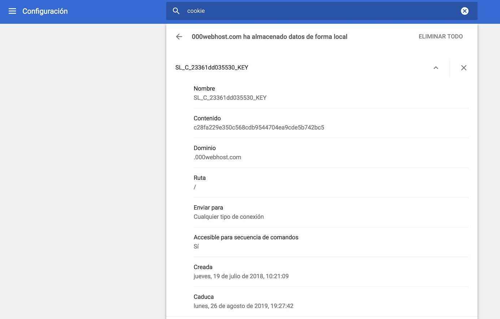
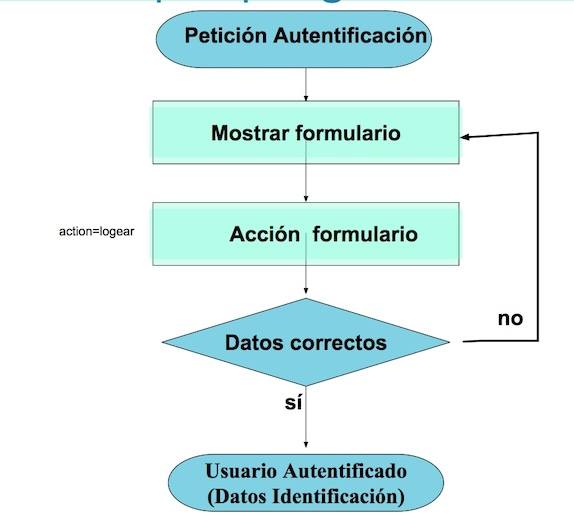
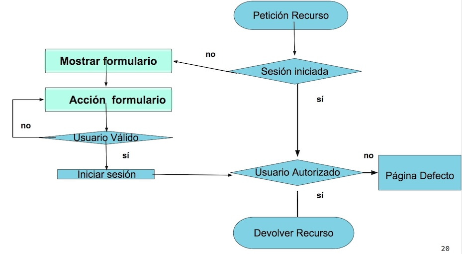

# TEMA 3

## Introducción a la WWW. PHP, Seguridad/Accesibilidad web.

#### EI1042 - Tecnologías y Aplicaciones Web

#### EI1036- Tecnologías WEB para los Sistemas de Información (2023/2024)

##### Profesorado: Dra. Dolores María Llidó Escrivá


[Universitat Jaume I](https://www.uji.es/).

---

## Tabla de contenidos

Tabla de contenidos
1. Ambito Variables en  PHP
2. Servidor WEB con PHP
3. Formularios
4. Cookies
5. Sesión
6. WEB: Autenticación de usuarios
7. Autorizar recursos a los usuarios


---

# 1. PHP: variables y su ámbito

### ¿De qué tipo es la variable?

- gettype() devuelve el tipo de una variable
- is_type() comprueba si una variable es de un tipo dado:

```php
is_array(), is_bool(), is_null(), is_object(), is_resource(),
is_scalar(),is_string(),is_float(), is_integer(), is_numeric(),is_nan()
```

Un error no es una excepción en php.
```php
$b=5+$a;
print(gettype($b));
$b=$b+"asfad";
```

--

### Ámbito de variables

- Local: Variable definida en una función
  - Está limitada a dicha función.
  - Se elimina al acabar la ejecución de la función
  - Salvo si la variable se declara como **static** .
- Global:
  - No se puede definir dentro de las funciones a menos que :
    - se declare en la función con la palabra clave 'global'
    - O que se acceda con el array $GLOBALS[clave]
  - Existen durante todo el tiempo de proceso del fichero
  - Al acabar de procesar el fichero se eliminan las variables globales

--

```php

ini_set('display_errors', 1); //para que aparezcan los errores
function prueba1()
{
   global $a; // no recomendamos
   try {
      echo ("5+$a") . "\n";
      $GLOBALS['b'] = 5 * $a;

   } catch (Exception $e) {
      print("ddd");
   }
   print "2222";
}
$a = 'Hola';
$b = " Adios";
print_r($GLOBALS);
//prueba1();
print_r($GLOBALS);

$GLOBALS['b'] = "Fin";
print($b);

$a = '12345';

// This works:
echo "qwe{$a}rty";
// This fails:
echo "qwe$arty";
```
https://piruletas3.000webhostapp.com/PHP/ejTeo/T3/variables.php

---

# 2. PHP en el servidor

## Cabeceras HTTP
- El servidor pone sus propias cabeceras en las respuestas.
- Php puede poner datos en la cabecera http (header).
- Cuando PHP envia algo a la salida estándar (print) 
  comienza el cuerpo del http, ya no se pueden enviar cabeceras.

#### Ejemplo de envio de cabeceras en PHP 
```
header('Location: http://www.example.com/');
print( <html><body><p>Holamundo</p></body></html>)
```

--

## Variables del  servidor WEB con PHP : $GLOBALS

  - $\_SERVER — Información del entorno del servidor y de ejecución
  - $\_GET(POST) — Variables HTTP GET(POST)
  - $\_FILES — Variables de Carga de Archivos HTTP
  - $\_REQUEST — Variables HTTP Request: GET+POTS+COOKIE
  - $\_SESSION — Variables de sesión
  - $\_COOKIE— Variables con datos de la cookie
  - $\_ENV— Variables del entorno
  
```$ GLOBALS[$_REQUEST]  === $_REQUEST```

--

## Caracteres especiales de las URLs:

- /: Indica path del recurso
- #: indica una etiqueta que tiene el id referenciado 
 (< id==section-3>)
- &,=: El cliente WEB los datos del formulario cuando se usa el método get los envia como pares nombre=valor unidos por &

```
<?php
echo '<a href="mycgi?foo=', urlencode($userinput), '">';
?>
```
urlencode() - Codifica una cadena y la cifra como URL
urldecode() - Decodifica una cadena cifrada como URL

---

# 3. Formularios
```html
<form action="./procesar.php" method="post">
	<fieldset>
			<legend>checbox de selección múltiple</legend>
		<input type="checkbox"  name="extras[]" value="garaje" id="g" checked><label for="g">garaje</label>
		<input type="checkbox"  name="extras[]" value="piscina" id="p"><label for="p">piscina</label>
		<input type="checkbox" name="extra[]" value="jardin" id="j"><label for="j">jardin</label>
		</fieldset>
  <input type="submit" value="enviar">
</form>
```

#### Ejercicio: ¿Qué errores hay en este código?

```HTML
			<label for="pais">País</label>
			<select multiple size="2" id="pais" name="pais">
				<option value="es" selected>españa
				<option value="fr">francia
				<option value="gr">inglaterra
			</select>
```
--

### Ejercicio: ¿Qu´ mostraria este código?
```PHP
<?php
print $_REQUEST["pais"];
print $_REQUEST["name"];
foreach ($idiomas as $idioma)
   print ("$idioma<BR>\n");
?>
```
https://piruletas3.000webhostapp.com/PHP/ejTeo/T3/form.html

### Cuestiones:

- ¿Cuál es la petición al servidor al pulsar submit/enviar?
- ¿Diferencia entre post y get?


Simulando PETICIONES POST con parámetros

```
curl --data "param1=value1&param2=value2" http://hostname/resource
```

---

# 4. Cookies

Una cookie es información que el servidor puede enviar en la cabecera al cliente para que la almacene en un fichero del cliente y que el cliente reenvia en posteriores accesos al servidor.

Permiten:

- Recordar preferencias de un cliente para generar contenido personalizado.
- Almacenar información de sesión.
- En general: para “simular” sesiones.
- NO PARA ALMACENAR información privada. claves, cuentas...


--

#### fichero cookies

fichero  texto con pares nombre=valor de tamaño limitado.

- name= nombre de la cookie
- expires=DD-Month-YY HH:MM:SS GMT fecha caducidad.
- secure=tipo de seguridad (sólo en HTTPS)
- path= ruta específica a los recursos a los que se envía la - cookie. Por defecto lo añade el servidor.
- domain=ámbito con el cual el cliente identifica si debe enviar la cookie al servidor

--

#### Ejemplo de cookies  en Chrome



Se puede descargar como un json  con la extension de chrome *editThisCookie*.

--

##### Ejemplo Json de cookies:
```
[{
    "domain": ".uji.es",
    "expirationDate": 1697718905.752635,
    "hostOnly": false,
    "httpOnly": false,
    "name": "_ga",
    "path": "/",
    "sameSite": "unspecified",
    "secure": false,
    "session": false,
    "storeId": "0",
    "value": "GA1.2.173852503.1662999830",
    "id": 1
},{
    "domain": ".uji.es",
    "expirationDate": 1663245305,
    "hostOnly": false,
    "httpOnly": false,
    "name": "_gid",
    "path": "/",
    "sameSite": "unspecified",
    "secure": false,
    "session": false,
    "storeId": "0",
    "value": "GA1.2.478223246.1663088416",
    "id": 2
},]
```

--

#### Contras Cookies

- Privacidad: Otros servidores podrían pueden leer información de las cookies del cliente.
- Los datos pueden ser alterados: Un usuario podría modificar el fichero de una cookie.
- Implementación compleja: Mantener “a mano” el estado en el cliente es complicado si queremos hacerlo de manera robusta.
- Tamaño de datos limitado: Tanto el tamaño máximo permitido por las cookies como la longitud máxima de una URL pueden darnos problemas.

--

### Uso de cookies

- las cookies  en el servidor están en la variable $_COOKIE.
- Las cookies se envia al cliente con la función setcookie. 
- Las cookies viajan en la cabecera de los mensajes http

--

```
<?php
setcookie("TestCookie0", 'PruebaALXXXX', time()+10); 
setcookie("TestCookieEterna", 'Prueba'); 
print "<p>Cookies:</p>";
print_r($_COOKIE);
?>
```
[demo](https://piruletas3.000webhostapp.com/PHP/ejTeo/T3/cookiesE.php)

##### Cuestión:

- ¿Que muestra por la pantalla?¿por que?
- ¿Que hace esta sentencia?
  ``` setcookie("TestCookie0", "PruebaALXXXX", time()-10); ```
- ¿Como borramos una cookie?


---

# 5. Sessión

HTTP es un protocolo sin sesión.

- ¿Cómo evitamos que pida reiteradamente que nos logueemos?
- ¿Cómo recordamos el carrito de la compra?
  

--

## Simulación de la Sesión

- A partir de controles HTML ocultos.
<small>```<INPUT type="hidden" name="session" value="1234">```</small>
- URL rewriting.
- Uso cookies.
- Una combinación de cookie y bases de datos. (WP)
- Usar el objeto **SESSION**  provisto por los entornos de programación como PHP, ASP o J2EE

--

### URL REWRITING

Consiste en incluir la información del estado en la propio URL

http://www.pekegifs.com/pekemundo/dibujos/comprar.asp?paso=3&producto1=01992CX&producto2=ZZ112230&


--

#### Objeto Session en PHP.

- Php provee un sistema de gestión de sesiones mediante el objeto SESSION.

- Este se inicializa con la función  "session_start()" .
  -  Esta función generalmente busca en la cookie con un session_id, y entonces carga el fichero correspondiente a dicha sesión que tiene el nombre "sessionName", y los datos al diccionario $_SESSION. 
  -  Si no existe la sesión, genera el session_name, envia la cookie y crea el fichero para almacenar los datos en el servidor y almacena sus valores.
  -  "session_start()" ejecutar antes de cualquier envio de datos a la salida estándar, ya que se envía en la cabecera del HTTP.

- "sessionName()" Nos devuelve el nombre de la sesión.


--


Ejemplo Sesiones

```<?php
session_start();
print "<p>Cookies:</p>";
var_dump($_COOKIE);
print ("<p>Session:".session_name()."</p>");
var_dump($_SESSION);
if (!isset($_SESSION["activo"])) {
    $_SESSION = array();
    $_SESSION["activo"] = 1;
    print "<h2>Hola</h2>";
    $_SESSION["usuario"] = "visitante";
} else {
    
    echo "<H2>bienvenido de nuevo ", $_SESSION["usuario"],"</H2>";
}
print "<p>SessionF:</p>";
var_dump($_SESSION);
?>
```
[demo](https://piruletas3.000webhostapp.com/PHP/ejTeo/T3/session0.php)

--

## Eliminar sesiones después de un rato de inactividad:
```
$secondsInactive = time() - $_SESSION['last_action'];
if($secondsInactive >= $expireAfterSeconds){
        //User has been inactive for too long.
        //Kill their session.
        session_unset();
        session_destroy();
        print "<h2>Reactivamos tu sesión</H2>";
    }
```
[demo](http://piruleta.atwebpages.com/PHP/T3/session01.php)

---

# 6. Autenticación de usuarios

- Autentificación requiere credenciales o pruebas de identidad.
- La autentificación de usuarios puede realizarse:
    - Autentificación en el Servidor: En Apache los ficheros ```.htacacces```.
    - Autentificación en el Cliente: Firma Digital.
    - Autentificación por Programa: Escribir un programa para controlar el acceso de los usuarios.

--

## Proceso autentificación básica en Servidor: 

Autentificación básica: Solicita al cliente un usuario y contraseña, que viajan encriptadas con codificación base 64 bits


https://piruletas3.000webhostapp.com/PHP/ejTeo/T3/phpInfo.php

--

## Autentificación  Programa


  

https://piruletas3.000webhostapp.com/PHP/ejTeo/T3/basicAuth.php


--


## Doble Autentificación/Factor


---

# 7. Autorización: Autorizar recursos a los usuarios

Proceso que controlar el acceso de los usuarios a una zona determinada del mismo. Generalmente se requiere la Autentificación previamente.
Y como no hay sessiones se suelen utilizar las cookies para saber que el usuario ya està autentificado.





--

## OAuth

En las API para gestionar esto en vez de tener que compartir el usuario/contraseña(credential sharing) API Keys o JWT (json web token) .

https://www.returngis.net/2019/04/oauth-2-0-openid-connect-y-json-web-tokens-jwt-que-es-que/

OAuth se construyó específicamente para acceder a APIs a través de HTTP. El usuario delega en la aplicación la capacidad de realizar ciertas acciones en su nombre. Es importante recalcar que OAuth es un framework para la autorización, que no la autenticación.
[https://docs.moodle.org/402/en/OAuth_2_authentication]

--

 


--

## El control de acceso basado en roles (RBAC)

Mecanismo de control de acceso que define los roles y los privilegios para determinar si a un usuario se le debe dar acceso a un recurso. Los roles se definen en función de características como la ubicación, el departamento, la antigüedad o las funciones de un usuario. Los permisos se asignan según el acceso (lo que el usuario puede ver), las operaciones (lo que el usuario puede hacer) y las sesiones (cuánto tiempo puede hacerlo el usuario).


---


### Cuestiones:

- ¿Hay que pedir autorización a todos los recursos que se soliciten?
- ¿La acción “redirect” es propia de PHP o del protocolo http?
- ¿Qué entiendes por usuario cliente, visitante, gestor,administrador?
- ¿Cómo podemos  definir roles de usuario usuario? ¿En que proceso se requiere?
- ¿Que envía el servidor si el recurso es un directorio? 

1. Nada 
2. index.html
3. index.php
4. Listado directorios
5. Error

--

### ¿Dudas?
  