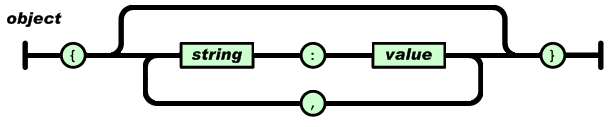
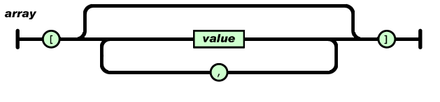

# Tema 4

## Programaciò en el Client : "Java_script".

### EI1042 - Tecnologías y Aplicaciones Web

**EI1036- Tecnologías Web para  Sistemas de Información (2023/2024)**

### Profesorado: Dra. Dolores María Llidó Escrivá 


[Universitat Jaume I](https://www.uji.es/).

---

## Tabla de contenidos

  1. Evolución JS
  2. Introducción EMACScript: 
  3. JavaScript
    - Objetos
    - Variables
    - Tipos de datos
    - Funciones
  4. Document Object Model (DOM)
  5. Componentes de los navegadores
  6. DHTML
  7. CSSOM y RenderTree
  8. JavaScript Navegador
  9. Api HTMLDOM
    - HTML DOM
    - Window y Document
    - el objeto ```this```
  10. Gestión Eventos (Event Target)
  11. CORS

---

## 0 [Evolución  Java_Script](https://carlosazaustre.es/ecmascript6):

El estándar para JavaScript es ECMAScript (ECMA-262) y la especificación de la API para la Internacionalización de ECMAScript (ECMA-402)


- En 1995 (hace más de 20 años!) Brendan Eich  crea un lenguaje llamado Mocha cuando trabajaba en Netscape. En Septiembre de ese año lo renombra a LiveScript hasta que le cambiaron el nombre a JavaScript  en diciembre por que  Netscape fue adquirida por Sun Microsystems, propietaria del lenguaje Java.
- En 1997 se crea un comité (TC39) para estandarizar JavaScript por la European Computer Manufacturers' Association, [ECMA](https://www.ecma-international.org/publications-and-standards/standards/). Se diseña el estándar del DOM (Document Object Model) para evitar incompatibilidades entre navegadores. A partir de entonces los estándares de JavaScript se rigen por ECMAScript.
  

*Ecma no tiene relacion con gnu emacs ni xemacs(”Editor de MACroS”).
*ECMAScript® es el nombre de la marca   EMAC
*JavaScriptTM es el nombre de la marca  Oracle.

---

## 1. Introducción EMACScript

- EMACScript es el estándar para un  lenguaje con muchos usos y plataformas:
- Una **plataforma** puede ser un cliente web (Chrome) o un
servidor web (Node.js) u otro anfitrión.
- El interprete de JavaScript o  **Script Engine** es el
programa que ejecuta código en un dialecto del lenguaje de
script (JavaScript) proporciona
además del núcleo del
lenguaje, los objetos y
funciones específicas de la
plataforma. Cada  navegador tiene su propia implementación


(webkit->safari, v8->Chrome, Node.js).

--

### Dialectos/API

- JavaScript, JScript(asp, ahora jscript.net) y ActionScript (Flash) son  dialectos de ECMAScript.
- Los **dialectos**  incluyen extensiones al lenguaje y **APIs**.
- Una aplicación escrita en un dialecto puede ser incompatible con otra, si no utilizan un subconjunto común de características  **APIs compatibles**

---

## 2. JavaScript

- Lenguaje interpretado, dialecto de ECMAScript.
- La sintaxis es semejante al C pero las variables no están tipificadas y no distingue entre mayúsculas y minúsculas.
- No existe un cuerpo principal del programa (main), todo lo que no esté dentro de una función es ejecutado.
- En JavaScript todo son objetos.
- Declarar las variables y funciones  antes de usarse.
- No es obligado usar ; al final de las sentencias
- El sangrado es para mejorar la lectura.
- Un grupo de sentencias multiples se agrupan con {}

--

<!--

### Editores en línea

http://jsfiddle.net/

https://codepen.io/
-->


### Herramientas en Javascript

- JavaScript: Integrado en navegador o Node.
- API del navegador/Servidor: construcciones integradas en el navegador/servidor que se asientan sobre el lenguaje JavaScript y le permiten implementar la funcionalidad más fácilmente. (API DOM)
- API de terceros: construcciones integradas en plataformas de terceros (por ejemplo, Twitter, Facebook) que le permiten usar algunas de las funciones de esas plataformas en sus propias páginas web (por ejemplo, mostrar sus últimos Tweets en su página web).
-  JavaScript Library: por lo general, uno o más archivos de JavaScript que contienen funciones personalizadas que puede adjuntar a su página web para acelerar o permitir la escritura de funciones comunes. Los ejemplos incluyen jQuery, Mootools y React .
- Frameworks de JavaScript:  (por ejemplo, Angular y Ember - Expres,Koa.js..) tienden a ser paquetes de HTML, CSS, JavaScript y otras tecnologías que instala y luego se usa para escribir una aplicación completa desde cero. 

--

### Objetos

- Una lista es en realidad una clase de objeto.
- Un objeto de JavaScript es un array asociativo formado por sus propiedades y sus métodos.
- Objetos predefinidos en el núcleo de JavaScript:
  - Date: objeto genérico para representar fechas (por defecto es la fecha actual).
  ```let fin = Date.now();```
  - Math: objeto quer incorpora las funciones matemáticas y constantes. 
  ```var pi = Math.pi;```
  - console: objeto para comunicarnos con la consola
  ```console.log('Hola');```.

--

#### Creación de Objetos

- Instancia directa formato breve.

```js
personObj = {nombre: "Carlos Sempere", apodo:"Doe", edad:50};
```

- Instancia directa con creando objeto "vacío".

```js
var  Autor = new Object();
Autor.nombre = "Carlos Sempere";
Autor.apodo = "Doe" ;
Autor.edad = 50;
//objeto 'Autor' con atributos
```

- Con un constructor.

```js
function Persona(nombre, apodo, edad){
    this.nombre = nombre;
    this.apodo = apodo;
    this.age = edad;
}
var Autor = new Persona("Anas Sempere", "Doe", 50);
```

--

Objeto JS vs Diccionario Python
```python
dict={'Name':'Ram',
      'Occupation': 'Scientist',
      'salary': '50000'}
for i in dict:
    print(i, dict[i])
"""
Name Ram
Occupation Scientist
salary 50000
"""
```

```javascript
dict={Name:'Ram',
      Occupation: 'Scientist',
      salary: '50000'
      }
for(i in dict){
  console.log(`${i}, ${dict[i]}`)}
/*
"Name, Ram"
"Occupation, Scientist"
"salary, 50000"
*/
```

- En Python hay que definir las claves como cadenas de texto, en Js pueden ser variables.
- En JS permite objeto.clave como un alias de objeto['clave'].

--

### Declaración Variables /Ámbitos

- ```var```: permite definir una variable **local** en una función o **global** si está fuera de una función.
- ```let```: declara una variable local al ámbito en el que esté definida.
- ```const```: Declara una constante de solo lectura en un ámbito.

--

#### Ejemplo JS

```js
var z; // sin inicializarla (vale undefined)
var x = 42;
y = 42 // sin declarar variable
let y = 13;
const PI = 3.14;
let arr = [ 3 , 5 , 7 ];
arr.foo = "hola";
```

--

### Tipos de datos

- Number : `  let x = 5;`
- String : `  let cad = '32'; `
- Boolean:` let b1 = x > 0;`
- Date   :`   let fin = Date.now();`
- RegExp :   ` var re = /\w+/;`
- **null**  :  ` foo = null` // definida no inicialiada
- **undefined**:   ` typeof(y)` //no definida no inicializada

--

#### Listas
En JS las listas son dinámicas.
- Uso de un array:

```js 
//Directamente con elementos
let colors = ["red", "green", "blue"];
//Crear un array vacio y luego poner los elementos:
let colors = new Array();
colors[0] = "red"; colors[2] = "blue"; 
colors[1]="green";
//Crear un array con sus elementos:
let colors = new Array(3,2,1,0);
```

- Recorrido arrays
  
```js
const numeros = [1, 2, 3, 4, 5];
for (let i = 0; i < numeros.length; i++) {
  console.log(i,numeros[i]);
}
numeros.push(7);
for (let i in numeros) {
   console.log(numeros[i]); 
}
for (let i of numeros) {
   console.log(i); 
}
```

--

### Funciones

```js
function NombreFuncion (parametro1, ..., parámetro N )
{...
   return valor;
}
```

- Algunas Funciones Predefinidas:
  - Tipo de una variable: *typeof(variable)*;
  - Evalúa un código JavaScript : *eval(“Primera(p1, p2)”*)

--


Las funciones son un objeto por ello podemos:

- asignar funciones a variables, y referenciarlas utilizando la variable
- pasar funciones como parámetros a otras funciones
- obtener funciones como resultados de la ejecución de la función.

```JS
function grado() {
function titulo(name) {
  return "Dr. " + name; }  
return titulo; //una funcion!
}
let phd = grado();
phd("Turing"); //Dr Tuning
```


--

#### Ejemplos: Try-Throw-cath

```JS
function getMonthName(mo) {
  mo = mo - 1 ; // Adjust month number for array index (1 = Jan, 12 = Dec)
  var months = ["Jan","Feb","Mar","Apr","May","Jun","Jul",
  "Aug","Sep","Oct","Nov","Dec"];
  if (months[mo]) { return months[mo]; }
  else { throw "InvalidMonth"; // Lanzamos una excepción.}
}
myMonth=5;
try { // statements to try
  monthName = getMonthName(myMonth); // function could throw exception
}catch (e) {
    monthName = "unknown";
    console.log(e); // pass exception object to error handler -> your own function
} 
```

--

#### Ejemplos

```JS
function Primera(p1, p2) {
  p1(p2);
}
// Función Literal
var Segunda = function (m1) {
  console.log(m1 / 10 );
}
// Pasando la Función Segunda como parámetro de Primera
Primera(Segunda, 20 );

```
¿Que devuelve la llamada ```Primera(Segunda, 20 )```?

--

#### Función Anónima


```js
function (parametro1, ..., parametro N )
{ ...
return valor;
}
```

¿Cómo la ejecutamos si no la podemos llamar?

- Poniendo la definición de la función anónima entre
paréntesis **()**, y pasándole parámetros

```
/* funcion anónima sin parámetros*/
(function() { alert("hola mundo") })()
/* funcion anonima como un parametro*/
(function(quien) {alert("hola “+quien)})("mundo")
```
- O bien con return

```
return function(quien) {alert("hola " + quien)} ('mundo')
```

--

#### Ejemplos JavaScript

```js
 const f1 = function(x,y)
 {
    var s=x+y;
    return s;
 }
 console.log(f1( 4 , 6 ));
 let f2 = f1;
 console.log(f2( 3 , 3 ));
```

 ¿Que aparece en la pantalla al ejecutar el código anterior?

--


<!-- https://developer.wordpress.org/themes/basics/including-css-javascript/ -->


## Función Flecha => (arrow functions)

Forma de definir funciones anónimas más cortas.

`([param] [, param]) => {instrucciones}`

`param => expresión` (Un parámetro)


```js
(function(quien){alert("hola" + quien)})("mundo");
(quien => alert("hola" + quien))("mundo");

```

--

El método *array.map()* crea un array como resultado de aplicar función que se pasa por parámetro a cada elemento del array del método. Es una función *callback*.


Ejemplo:
```JS
var elementos = [ "Hidrógeno","Helio","Litio"];
a = elementos.map(function(elemento){
      return elemento.length;
});

b = elementos.map((elemento) => {
  return elemento.length;
});

c = elementos.map( elementos => elementos.length );
console.log(a);

--

```javascript
var data = [{...}, {...}, {...}, ...];
data.forEach(function(elem){
	// Tratamos el elemento
    console.log(elem)
});
```

```javascript
var data = [{...}, {...}, {...}, ...];
data.forEach(elem => {
	console.log(elem);
});
```


--

#### Ejemplos: Recorrido arrays
```javascript
const numeros = [1, 2, 3, 4, 5];
numeros[5]=6
//Usando un callback
numeros.forEach(function(numero) {
    console.log(numero);
});
numeros.push(7);
//funcion flecha
numeros.forEach(element => console.log(element));
numeros.append(8);
numeros.forEach((numero, index) => {
    console.log('Indice: ' + index + ' Valor: ' + numero);
)}
numeros.pop();
//mapeo se genera un nuevo objeto iterador. Pero este no ocupa una nueva memoria.
nums=numeros.map(function (num) { return (num) })
console.log(nums)
```


---

## 3. DOM (Document Object Model)


- Interfaz de programación para documentos HTML,SVG o XML. 
- Conecta documentos ( HTML, SVG o XML ) con lenguajes de programación, modelado los documentos como objetos.
- Interfaz de lenguaje neutral independiente de plataforma que permite a los programas y scripts el acceso dinámico y la actualización del contenido, la estructura o estilo de documentos.
- Proporciona una representación estructurada del documento como una estructura lógica que es muy parecida a un árbol. Cada elemento es un  nodo  (document, head, frame, body, p,
div) los cuales contienen propiedades, métodos y eventos asociados a los mismos.

<div> <ul style="float:right;width:45%;">
<li>https://dom.spec.whatwg.org/ </li><li>https://www.w3.org/DOM/DOMTR</li> </ul></div></div>

--

<!--
```svg
<svg viewBox="-1 -1 650 42" preserveAspectRatio="xMinYMin meet">
  <a style="text-decoration: none;" href="/en-US/docs/Web/API/EventTarget">
    <rect x="0" y="0" width="88" height="25" fill="#fff" stroke="#D4DDE4" stroke-width="2px"></rect>
    <text x="44" y="16" font-size="10px" fill="#4D4E53" text-anchor="middle">
      EventTarget
    </text>
  </a>
  <line x1="88" y1="14" x2="118" y2="14" stroke="#D4DDE4"></line>
  <polyline points="88,14 98,9 98,19 88,14" stroke="#D4DDE4" fill="#fff"></polyline>
  <a style="text-decoration: none;" href="https://developer.mozilla.org/en-US/docs/Web/API/Node">
    <rect x="118" y="0" width="75" height="25" fill="#fff" stroke="#D4DDE4" stroke-width="2px"></rect>
    <text x="155.5" y="16" font-size="10px" fill="#4D4E53" text-anchor="middle">
      Node
    </text>
  </a>
  <line x1="193" y1="14" x2="223" y2="14" stroke="#D4DDE4"></line>
  <polyline points="193,14 203,9 203,19 193,14" stroke="#D4DDE4" fill="#fff"></polyline>
  <a style="text-decoration: none;" href="https://developer.mozilla.org/en-US/docs/Web/API/Element">
    <rect x="223" y="0" width="75" height="25" fill="#fff" stroke="#D4DDE4" stroke-width="2px"></rect>
    <text x="260.5" y="16" font-size="10px" fill="#4D4E53" text-anchor="middle">
      Element
    </text>
  </a>
  <line x1="298" y1="14" x2="328" y2="14" stroke="#D4DDE4"></line>
  <polyline points="298,14 308,9 308,19 298,14" stroke="#D4DDE4" fill="#fff"></polyline>
  <a style="text-decoration: none;" href="https://developer.mozilla.org/en-US/docs/Web/API/SVGElement" aria-current="page">
    <rect x="328" y="0" width="80" height="25" fill="#F4F7F8" stroke="#D4DDE4" stroke-width="2px"></rect>
    <text x="368" y="16" font-size="10px" fill="#4D4E53" text-anchor="middle">
      SVGElement
    </text>
  </a></svg>
  ```

<svg viewBox="-1 -1 650 42" preserveAspectRatio="xMinYMin meet">
  <a style="text-decoration: none;" href="/en-US/docs/Web/API/EventTarget">
    <rect x="0" y="0" width="88" height="25" fill="#fff" stroke="#D4DDE4" stroke-width="2px"></rect>
    <text x="44" y="16" font-size="10px" fill="#4D4E53" text-anchor="middle">
      EventTarget
    </text>
  </a>
  <line x1="88" y1="14" x2="118" y2="14" stroke="#D4DDE4"></line>
  <polyline points="88,14 98,9 98,19 88,14" stroke="#D4DDE4" fill="#fff"></polyline>
  <a style="text-decoration: none;" href="https://developer.mozilla.org/en-US/docs/Web/API/Node">
    <rect x="118" y="0" width="75" height="25" fill="#fff" stroke="#D4DDE4" stroke-width="2px"></rect>
    <text x="155.5" y="16" font-size="10px" fill="#4D4E53" text-anchor="middle">
      Node
    </text>
  </a>
  <line x1="193" y1="14" x2="223" y2="14" stroke="#D4DDE4"></line>
  <polyline points="193,14 203,9 203,19 193,14" stroke="#D4DDE4" fill="#fff"></polyline>
  <a style="text-decoration: none;" href="https://developer.mozilla.org/en-US/docs/Web/API/Element">
    <rect x="223" y="0" width="75" height="25" fill="#fff" stroke="#D4DDE4" stroke-width="2px"></rect>
    <text x="260.5" y="16" font-size="10px" fill="#4D4E53" text-anchor="middle">
      Element
    </text>
  </a>
  <line x1="298" y1="14" x2="328" y2="14" stroke="#D4DDE4"></line>
  <polyline points="298,14 308,9 308,19 298,14" stroke="#D4DDE4" fill="#fff"></polyline>
  <a style="text-decoration: none;" href="https://developer.mozilla.org/en-US/docs/Web/API/SVGElement" aria-current="page">
    <rect x="328" y="0" width="80" height="25" fill="#F4F7F8" stroke="#D4DDE4" stroke-width="2px"></rect>
    <text x="368" y="16" font-size="10px" fill="#4D4E53" text-anchor="middle">
      SVGElement
    </text>
  </a></svg>


### Niveles de DOM:
  
-  Document Object Model (DOM) Level 1Specification. http://www.w3.org/TR/REC-DOM-Level-1/ : El Modelo de Objetos del Documento proporciona un conjunto estándar de objetos para representar documentos.
-  Document Object Model (DOM) Level 2 : Crear y manipular la estructura y el contenido del documento (http://www.w3.org/TR/DOM-Level-2-HTML/). 
 
- Document Object Model (DOM) Level 3. Añade la posibilidad de adjuntar información del usuario a los nodos DOM, ofreciendo mecanismos para resolver los prefijos de los espacios de nombre o para manipular atributos.
-->


### Árbol del DOM: Core DOM

- **root node:** Nodo raíz (no tiene padre).
- **father node:** Todos los nodos (excepto raíz) tienen padre.
- **child node:** Un nodo puede tener varios hijos.
- **leaf node:** Un nodo hoja es un nodo sin hijos.
- **sibling nodes:** Los nodos hermanos comparten el mismo padre.
  
Ejemplos de métodos: 
  - *x*.appendChild(*y*): añade un hijo *y* al nodo *x*
  - *x*.removeChild(*y*): elimina el hijo *y* del nodo *x*
  - *x*.replaceChild(*y*, *z*): cambia el hijo *y* por *z* en el nodo *x*

--

#### Tipos de Nodos


- DOCUMENT_NODE: Representa el documento entero.
- ELEMENT_NODE: Las tiquetas son nodos tipo elemento.
- ATTR_NODE: Los atributos de las etiquetas. Se asocia a un nodo elemento.
- TEXT_NODE: Contiene el texto entre las etiquetas de un
elemento.
- COMMENT_NODE: Representa un comentario.
- DOCUMENT_TYPE_NODE: Contiene el docType del
documento.
- DOCUMENT_FRAGMENT_NODE: Representa un fragmento
de documento que debe estar bien formado (“template”).

--

#### Atributos de los nodos

  - ```x.nodeName```  – nombre del nodo *x*
  - ```x.nodeValue``` – valor del nodo *x*
  - ```x.nodeType```  – tipo del nodo *x*
  - ```x.parentNode``` – nodo padre
  - ```x.firstchild``` - primer hijo
  - ```x.lastchild``` - último hijo
  - ```x.previousSibling``` - anterior nodo hermano
  - ```x.nextSibling``` - siguiente nodo hermano
  - ```x.childNodes``` – lista de los nodos hijos.
  - ```x.textContent``` – contenido textual del nodo.

--

#### Document/Element Node

- ```X.createAttribute(att_name)```: crea un nodo de tipo atributo con nombre *att_name*
- ```X.createElement(tag_name)```: crea un elemento con nombre *tag_name*
- ```document.createTextNode(text_as_string)```: crea un nodo de tipo texto
- ```X.getElementsByTagName(tag_name)```
- ```X.getElementsByClassName(class_name)``` List of elements
- ```X.getElementById(element_id)```
- ```x.getAttribute(att)```: valor del atributo *att*
- ```x.setAttributeNode(att_node)```, asigna el atributo correspondiente a *att_node*
- ```x.setAttribute(att, value)```, asigna *value* al atributo *att*.

--

### PHP DOM

Biblioteca libxml (Parser DOM):
  - Core DOM
  - No incluye la etiqueta Doctype.
  - Compatible con DOM level 3 core.

--

### Ejemplo de DOM en PHP

```php
<?php
$doc = new DOMDocument();
$root = $doc->createElement('html');
$doc->appendChild($root);
$head = $doc->createElement('head');
$root->appendChild($head);

$title = $doc->createElement('title');
$title->appendChild ($doc->createTextNode('Este es el título'));
$head->appendChild($title);
$body = $doc->createElement('body');
$root->appendChild($body);
$h1 = $doc->createElement('h1');
$root->appendChild($h1);
$h1->appendChild($doc->createTextNode('Esto es el cuerpo'));
$doctype="<!DOCTYPE html >";
echo $doctype.$doc->saveHTML();
?>
```

[https://piruletas3.000webhostapp.com/PHP/ejTeo/T4/HTMLDOM.php](https://piruletas3.000webhostapp.com/PHP/ejTeo/T4/HTMLDOM.php)

--

### Ejemplo de DOM con PHP (load from String)

```php

<?php
$html='<html><head> <meta
charset="utf-8"><title>PHP_WEB</title></head><body>
<div><h1>Web page parsing</h1>
<p>This is an example Webpage.</p></div></body></html>';
$doc = new DOMDocument();
$doc->loadHTML ($html);
$h2 = $doc->createElement('h2');
$h1= $doc->getElementsByTagName("h1")[ 0 ];
$h1->parentNode->appendChild($h2);
$h2->appendChild($doc->createTextNode('Esto es el H2'));

$doctype="<!DOCTYPE html >";
echo $doctype.$doc->saveHTML();
?>

```
[https://piruletas3.000webhostapp.com/PHP/ejTeo/T4/HTMLDOM_LOAD.php](https://piruletas3.000webhostapp.com/PHP/ejTeo/T4/HTMLDOM_LOAD.php)


--

### DOM JS Navegador

Ejemplo:

```JS
    var father, child;
    father = document.querySelector('head');
    child = document.createElement('title');
    child.textContent = 'HTMLDOM';
    father.appendChild(child);
    father = document.querySelector('body');
    child = document.createElement('h1');
    child.textContent = 'Bienvenido <span > Pepe </span>';
    child = document.createElement('h2');
    child.innerHTML = 'Adios <span > Pepe </span>';
    father.appendChild(child);
```

¿Qué hace este ejemplo?
Comprueba el funcionamiento en : https://piruletas3.000webhostapp.com/PHP/ejTeo/T4/HTMLDOM.html
¿Por qué se visualizan las etiquetas HTML?

¿Diferencia innerHTML, textContent?

--

#### Cuestión:

¿Qué error hay  en el codigo de esta página web?:

https://piruletas3.000webhostapp.com/PHP/ejTeo/T4/HTMLDOMError.html

##### Ejercicio: Crear una tabla utilizando el DOM


---

## 4. Componentes Navegador Web


- *Interfaz de usuario* : incluye la barra de direcciones, el botón de avance/retroceso...Todo excepto la ventana principal donde se muestra la página web.
- *Motor del Navegador* : coordina las acciones entre la interfaz y el motor de renderización. Carga URL, mensajes error, botón atrás. 
- *Motor de renderización* : responsable de mostrar el contenido.
- *Red* : responsable de las llamadas de red, como las solicitudes HTTP (Caché de documentos).

--


- *Intérprete de JavaScript* : permite analizar y ejecutar el código Javascript. El resultado se pasa al motor de renderización.
- *Almacenamiento de datos* : capa de persistencia. Gestiona los datos de usuario, tales como  cookies,indexDB, WebStorage.
- *Backend de interfaz de usuario*:  proporciona primitivas de dibujo, widgets de la interfaz  de usuario, fuentes, etc. (utiliza métodos  sistema operativo)

https://www.html5rocks.com/es/tutorials/internals/howbrowserswork/

--

### Motor de Renderizado

- Un motor de renderizado (**web browser engine**) es el software que toma
contenido marcado (como HTML, XML, archivos de imágenes, etc.) e
información de formateo (como CSS, XSL, etc.) y luego muestra el
contenido ya formateado en la pantalla.
  - Los motores de renderizado lo usan los navegadores web, clientes de
correo electrónico, u otras aplicaciones que deban mostrar
contenidos web.
  - Cada motor de renderizado del navegador suele tener su propio
intérprete Javascript (**script engine**).

--

### Componentes Navegadores


---

## DHTML: HTML Dinámico
-  DHTML (Dynamic HTML) designa el conjunto de técnicas que permiten crear sitios web interactivos utilizando HTML, JavaScript, CSS y la jerarquía de objetos del DOM.

-En una página DHTML, una vez ésta ha sido cargada completamente se ejecuta un código JavaScript que permite la  modificación en la información presentada o el aspecto visual de la página.
- No confundir con pàgina web dinámica, que indica que la página web se genera dinámicamente en el servidor.

--

```html
<!DOCTYPE html>
 <html lang="es">
   <head>
       <meta charset="utf-8">
       <title>Ejemplo DHTML</title>
   </head>
   <body>
       <div id="seccion"></div>
       <script type="text/javascript">
         var init = function () {
           miObjeto = document.getElementById("seccion");
           // ... manipulate miObjeto
         };
         window.onload = init;
       </script>
       <script src="mijavascript.js"></script>
   </body>
 </html>
```

---

## 5. Render Tree: DOM+CSSOM


--

### CSS Object Mode
- El Modelo de objetos CSS (CSS Object Model) es un conjunto de APIs que permite manipular CSS desde JavaScrip. Permite leer y modificar el estilo de CSS de forma dinámica. 
- Forma parte del DOM core3
- Por ejemplo para llamar a los objetos de  los estilos del documento se puede utilizar 
la propiedad **document.styleSheets** y acceder a los estilos por su índice
- Para cambiar el estilo de un elemento del dom se accede a **elem.style**

--

```html
<style>
      body {
        background-color: red;
      }
    </style>
<script>
      const stylesheet = document.styleSheets[0];
      stylesheet.cssRules[0].style.backgroundColor = "aqua";
      function alterStyle(elem) {
        elem.style.background = "green";
      }
      function resetStyle(elemId) {
        const elem = document.getElementById(elemId);
        elem.style.background = "white";
      }
</script>
```

--

## CSSOM API

[Ejemplos de CSSOM API:](https://developer.mozilla.org/en-US/docs/Web/API/CSS_Object_Model)

- CSS
- CSSCharsetRule
- CSSFontFaceRule
- CSSMediaRule
- CSSRule
- FontFace
- MediaList
- MediaQueryList
- MediaQueryListEvent
- Screen
- StyleSheet

--

### Flujo básico del motor de renderización


1. Los árboles DOM y CSSOM se combinan para formar el árbol de representación.
2. Render tree: El árbol de representación solo contiene los nodos necesarios para
    representar la página.
3. Layout: El diseño calcula la posición y el tamaño exactos de cada objeto.
4. Paint: El último paso es la pintura, que recibe el árbol de representación final y
    representa los píxels en la pantalla.

https://developers.google.com/web/fundamentals/performance/critical-rendering-path/render-tree-construction?hl=es-419

--

### CSS Render

- En https://developer.mozilla.org/en-US/docs/Web/CSS/Reference tenemos una guía de CSS estándar.

```css
div.error-label{
    color: #fff;
    background-color: #DA362A;
    -webkit-border-radius: 5px; 
    -moz-border-radius: 5px; 
    border-radius: 5px;
}
```

- Pero los motores de renderizado tienen ciertas extensiones de CSS que no son todavía estandares:
<ul>
	<li><a href="/en-US/docs/Web/CSS/Mozilla_Extensions">Mozilla CSS extensions</a> (prefixed  <code style="white-space: nowrap;">-moz-</code>)</li>
	<li><a href="/en-US/docs/Web/CSS/WebKit_Extensions">WebKit CSS extensions</a> (prefixed  <code style="white-space: nowrap;">-webkit-</code>)</li>
	<li><a href="/en-US/docs/Web/CSS/Microsoft_Extensions">Microsoft CSS extensions</a> (prefixed  <code style="white-space: nowrap;">-ms-</code>)</li>
</ul>


<!--

### CRP: critical-rendering-path (ruta de representación crítica)


https://hackernoon.com/optimising-the-front-end-for-the-browser-f2f51a29c572

Podemos ver el CRP con la línea de tiempo de las herramientas de
desarrolladores. 

-->

---

##  6. JAVASCRIPT EN EL NAVEGADOR: Ubicaciones JS


- Como valor de un atributo que es un evento. (No usar)

```html
<span onclick="return handleClick(event, this);"> ¡Pulsa aqui! </span>
```
- Dentro de la etiqueta *script* tanto en la cabecera como en el body.

```html
  <script> console.log(‘hola’); </script>
```

  - Importando un fichero externo

```html 
 <script src="mi_url" defer></script>
 <script src="mi_url2" defer></script>
```
Atributos de la  etiqueta script  para indicar como se ejecuta el fichero externo de src :
- async: Indica que los recursos del src se cargan asíncronamante y  se ejecutan cuando están preparados.
- defer: Los recursos se ejecutan cuando el DOM se ha cargado ejecutándose los scripts por orden.

--

Webs APIs en el Navegador

- Canvas API: Proporciona un medio para dibujar gráficos a través de JavaScript y el elemento HTML ```<canvas>```. Animación, gráficos de juegos, visualización de datos, manipulación de fotografías y procesamiento de video en tiempo real.
- Console API: permite a los desarrolladores realizar tareas de depuración, como registrar mensajes o los valores de las variables en puntos establecidos en su código. console.log(myString);
- HTML DOM API:  Es un DOM Level 3 extendido con las especificaciones de HTML. Por ejemplo :el elemento  ```<canvas>``` se representa por un  HTMLCanvasElement.
-  HTMLVideoElement Interfaz: Permite manipular objectos de videos. También, este interfaz hereda propiedades y métodos de HTMLMediaElement y HTMLElement.
-  SVGElement: Interfaces de los elementos del SVG DOM.
-  CSSOM (El Modelo de objetos CSS ) conjunto de APIs que permite manipular CSS desde JavaScript. 

--

### Diferencias Javascript/NodeJS

- JavaScript se ejecuta en el navegador, mientras que el uso de Node.js nos permite ejecutar JavaScript fuera del navegador (Script Engine V8).

- JavaScript puede manipular DOM o agregar HTML, mientras que Node.js no tiene la capacidad de agregar HTML.

- JavaScript se usa principalmente para crear aplicaciones web front-end  mientras que Node.js se usa en el desarrollo de back-end que es el desarrollo del lado del servidor.

--


La salida de JavaScript en el navegador puede ser: 

- HTML element: element.innerHTML().
- HTML output:  document.write().
- En un cuadro de alerta: window.alert().
- En la consola del navegador: console.log().

No tiene acceso a los dispositivos estándar de salida a excepción de :  window.print() que permite imprimir la página en la impresora.

--

### Cuestiones:
¿JavaScript tiene acceso a ficheros del cliente? ¿ y del servidor?

¿Node Js tiene acceso a ficheros del cliente?¿ y del servidor?


---

## 7. API HTML DOM 

La API HTML DOM: Definen la funcionalidad de cada uno de los elementos del HTML. Estas interfaces ofrecen acceso a la ventana  y al documento  HTML, así como al estado del navegador, los complementos disponibles.  
[http://www.cs.ucc.ie/~gavin/javascript/05_img01.gif](http://www.cs.ucc.ie/~gavin/javascript/05_img01.gif)


--

### Interfaz Window 

La interfaz Window representa una ventana que contiene un documento DOM HTML.  

- El objeto window es el de mayor nivel en la jerarquía de objetos de JavaScript en el navegador.
- Es un objeto global en JavaScript. Contiene todas las variables y funciones globales.
- Representa la "ventana del navegador" y proporciona los métodos para controlarlo.

Por tanto:
- *window* : OBJETO GLOBAL que contiene todas las variables.
- *window.document* o  *document* : objeto que tiene  el documento html cargado en el navegador, o sea el DOM del documento HTML.
  

--

### Document Object

- Es el Nodo raíz del HTML DOM
- Todos los nodos heredan los atributos del objeto eventTarget

- Atributos:
  - ```document.documentURI```: URI del documento
  - ```document.contentType```: tipo de contenido (html, imagen, etc.)
  - ```document.styleSheets```: node con las hojas de estilos
  - ```document.images``` : lista de imágenes 
  - ```document.anchors```: lista de hiperenlaces
  - ```document.body```: nodo del elemento body

--

#### Ejemplo crear nueva ventana en Navegador con un documento

```js
var ventana=window.open();
var father, child;
father = ventana.document.querySelector('head');
child = document.createElement('title');
child.textContent='HTMLDOM';
father.appendChild(child);
father = ventana.document.querySelector('body');
child = document.createElement('h1');
father.appendChild(child);
child.textContent='Bienvenido </br>';
child = document.createElement('h2');
child.innerHTML='Esto es el H2<br/>';
father.appendChild(child);
```

https://piruletas3.000webhostapp.com/PHP/ejTeo/T4/HTMLDOM_W.html

--

### Cuestiones


- ¿Cómo modifico un documento cargado en el navegador?
- ¿Por qué es diferente el manejo del DOM en PHP y HTML?
- Diferencia entre innerHTML, textContent e innerText.
- ¿Se carga primero el body o se ejecuta primero el script?

https://piruletas3.000webhostapp.com/PHP/ejTeo/T4/HTML_DOM_text.html


--


### Nodo Element y Document 

- Propiedades de un elemento x:
  - ```x.events```: lista de Eventos de x
  - ```x.methods```: lista de métodos de x
  - ```x.elements```: colección de nodos de tipo elementos de x
  - ```x.name```: lista de hijos de x con el nombre 'name'
  - ```x.innerHTML```: asigna o devuelve el contenido html del nodo elemento(Crítico).
  - ```x.style```: permite dar estilo a las etiquetas.
- Eventos:
  - ```x.blur()```:    Quita el foco en de un elemento.
  - ```x.click()```:    Realiza un click en un elemento.
  - ```x.focus()```:    Pone el foco en un elemento.
  - ```x.toString()```: Convierte el contenido en una cadena.

--

### Selección  de nodos con MediaQueries

Podemos utilizar la notación de los mediaqueries de las reglas CSS para seleccionar nodos document o element.

- ```x.querySelector(selector)```   // Recuperar el primer nodo que cumple la condición 
- ```x.querySelectorAll(selector)``` //Recuperar todos los nodos que cumplen la condición 
  
```js
x.querySelector("div");
x.querySelector("#form1");
x.querySelectorAll("div");
```

--

### Ejemplo carga imágenes

```js
Url2="http://www.bigfoto.com/themes/nature/animals/rhino.jpg";
document.querySelector("#animal").src=Url2;
```

--

### This object

- Cuando estamos dentro del atributo de una etiqueta **html**,
this se refiere a la **etiqueta** que contiene el atributo.

- Cuando estamos en un Objeto, **this.xxx** se llama dentro de
un método propiedad, refiere al **objeto** que lo contiene.
- En otro caso, **this**  se refiere a la variable global, **window** del documento HTML activo cargado en la ventana.Esto permite en objetos como alert o document, no referenciar al padre window.

https://developer.mozilla.org/es/docs/Web/JavaScript/Referencia/Operadores/this


---

### 8. Gestión  de Eventos: Event Target INTERFACE

Clase del para gestionar eventos.


- EventTarget permite detectar/recibir los eventos que se producen en el DOM o HTML DOM  
- Window, Document y Element  (SVGELEMENT)soportan definir detectores de eventos, “event handlers”.

--

1 onclick
2 oncontextmenu
3 ondblclick
4 onerror
5 onload
6 onmousedown
7 onmouseenter
8 onmouseleave
9 onmousemove
10 onmouseout
11 onmouseover
12 onmouseup
13 onscroll


Read more: https://html.com/javascript/events/#ixzz8I61z9q5j

--

#### Ejemplo

```html
<script type="text/javascript">
var Autor="";   var node0=null;
	
function borrar(val) { node0=val;
  console.info("nodo a borrar:"+node0.nodeName);
  console.info("val:"+val.nodeName);
  var node=val.parentNode;
  node.removeChild(node0);
  alert("¿Algo borrado ?");}
	
function recuperar(Id) {
  var node = document.getElementById(Id);
  node.appendChild(node0);
  alert("nodo recuperado:");}
</script>

<div>
<p id="borrar">Mueve ratón <span
onMouseOver="borrar(this) ;">AQUÍ</span>:</p>
<p><span onClick="recuperar('borrar');">PULSA
AQUI</span> para recuperar el original</p>
</div>
```

https://piruletas3.000webhostapp.com/PHP/ejTeo/T4/HTML_DOM.html


--

Cuestiones:

- ¿Qué hace el  código anterior?
- ¿Qué vale ```document.getElementById("id")```?
  - si el script se pone en el HEAD
  - si el script se pone al principio del BODY
  - si el script se pone al final del BODY
- ¿Qué referencia ```this```?

https://piruletas3.000webhostapp.com/PHP/ejTeo/T4/HTML_DOM.html

--


(https://developer.mozilla.org/es/docs/Web/Events)[lista de todos los eventos de un elemento 
]


windows.onload vs    window.DOMContentLoaded_event

windows.onload : Carga toda la página completa+recursos
window.DOMContentLoaded_event : Sólo la página html

  

--

### Ejercicio: Crea un carrusel de 5 fotos.

<!-- https://piruletas3.000webhostapp.com/PHP/ejTeo/T4/CarruselJs.html
-->

--

#### Registro Eventos
addEventListener(type, listener, useCapture)
addEventListener() Registra un evento a un objeto en específico( Window,Document,Element).
```x.addEventListener ("Evento", funcionEjecutar, useCapture)```
- **tipo** Una cadena representando el tipo de evento a escuchar.

- **listener**
El objeto que recibe una notificación cuando un evento de el tipo especificado ocurre. Debe ser un objeto implementando la interfaz EventListener o solo una function (en-US) en JavaScript.

This must be null, an object with a handleEvent() method, or a JavaScript function. See The event listener callback for details on the callback itself.


useCapture Opcional

- El **evento** es el nombre del evento “click”, “load”, etc.
- La **funcionEjecutar** se ejecuta cuando se produce el evento
- El **useCapture es opcional** especifica si el evento debe ser capturado
(true) o no (false,  valor  por defecto).

```js
addEventListener("load", (event) => {});

onload = (event) => {};
```
¿Como se todos los eventos de un elemento?

console.table(listAllEventListeners());

- Registrando un evento
addEventListener("input", (event) => {});
- Añadiendo una propiedad a un event handler.
oninput = (event) => {};

The addEventListener() method is the recommended way to register an event listener. The benefits are as follows:

It allows adding more than one handler for an event. This is particularly useful for libraries, JavaScript modules, or any other kind of code that needs to work well with other libraries or extensions.
In contrast to using an onXYZ property, it gives you finer-grained control of the phase when the listener is activated (capturing vs. bubbling).
It works on any event target, not just HTML or SVG elements.


The callback function itself has the same parameters and return value as the handleEvent() method; that is, the callback accepts a single parameter: an object based on Event describing the event that has occurred, and it returns nothing.

function eventHandler(event) {
  if (event.type === "fullscreenchange") {
    /* handle a full screen toggle */
  } else {
    /* handle a full screen toggle error */
  }
}

my_element.addEventListener("click", function (e) {
  console.log(this.className); // logs the className of my_element
  console.log(e.currentTarget === this); // logs `true`
});

--


function eventHandler(event) {
  if (event.type === "fullscreenchange") {
    /* handle a full screen toggle */
  } else {
    /* handle a full screen toggle error */
  }
}


omeElement.addEventListener(
  "mouseup",
  handleMouseUp,
  passiveSupported ? { passive: true } : false,
);


manejadores de eventos o event handlers
https://developer.mozilla.org/en-US/docs/Web/Events
Tipos de Eventos más comunes: CSS transition, DOM mutation, form, focus...
--

Capture Event (useCapture = true) vs Bubble Event (useCapture = false)
MDN Reference

- El evento de captura se enviará antes del evento de burbuja
- El orden de propagación de eventos es:
  * Captura de padres
  * Captura de hijos
  * Captura de objetivo y burbuja de objetivo
* Burbuja de niños
* Burbuja para padres
  
- stopPropagation() detendrá el flujo

<!--

### Ejemplo DOM Validación datos formularios

https://piruletas3.000webhostapp.com/PHP/ejTeo/T4/FormEventHandlerError.html

```js
function validar() {
  let r = true;
  let inputs = document.forms[0];
  inputs = inputs.getElementsByTagName('input');
  for(let i = 0; i < inputs.length; i++) {
    if (inputs[i].getAttribute('type')=='text' && 
                  inputs[i].value.length < 4){
      let a = document.querySelector("#errores");
      a.textContent = "4 caracteres en " + inputs[i].getAttribute('name');
      inputs[i].focus();
      return false; 
    }
  }
  return r;
}

function detectores(){
   let form = document.querySelector("#form_reg");
   form.addEventListener("submit", function (event) 
      {if (validar()==false){event.preventDefault()}});
}

detectores();

```

¿Funciona correctamente?¿ En firefox y Chrome?
Solución: https://piruletas3.000webhostapp.com/PHP/ejTeo/T4/FormEventHandlerType.html 


DOMContentLoaded o load ¿Cual es mejor?

https://developer.mozilla.org/en-US/docs/Web/API/Window/DOMContentLoaded_event
-->

---

### Gestión  de Eventos: Capture/bubbling


<p></a>http://www.thatjsdude.com/images/eventBubble.png</a></p>

--

#### Capture/Bubbling/Target

- **Capture** : Al realizar el cliente un evento, el navegador sabe que se ha producido un evento,y busca desde la raíz del DOM para
ver donde se ha producido (*event object*)
- **Target** : Una vez sabe en qué elemento se ha producido (*event target object*) el explorador comprueba si tiene algún controlador en ese elemento, si existe lo ejecuta. 
- **Bubbling** : Después de disparar el lanzador, busca hacia la raíz, si en los niveles padre del elemento hay algún otro controlador que se active con ese evento, en su caso lo lanzará. Esta etapa de su movimiento hacia arriba se llama la propagación de eventos 

Ejemplo
https://piruletas3.000webhostapp.com/PHP/ejTeo/T4/ejemCapture.html

Cuestión:

Diferencia: event.target  y currentTarget

--


--

<!--

## 9. Template - Document Fragment

### Document Fragment
- Es un nodo que representa un documento mínimo que no tiene padre.
- Este nodo no forma parte del DOM. Por tanto no se visualiza.

https://piruletas3.000webhostapp.com/PHP/ejTeo/T4/TemplateTable0.html


### Template Document

- Este nodo puede ser hijo de cualquier nodo elemento.
- El contenido del nodo *template* es un *document fragment*. (Un *document fragment* no tiene nodo padre.)

- Por ello su contenido no se renderiza en el DOM. Este se representa en un árbol del DOM distinto al documento HTML.

- Ponemos elegir los nodos  del template y colocarlos añadiendo contenido y luego posicionarlos donde nos interese.

https://developer.mozilla.org/es/docs/Web/HTML/Elemento/template


Template 

```html
<table id="producTable">
		<thead>
			<tr>
				<td>UPC_Code</td>
				<td>Product_Name</td>
			</tr>
		</thead>
		<tbody>
			
		</tbody>
	</table>
	<template id="productRow">
		<tr>
			<td class="record"></td>
			<td></td>
		</tr>
	</template>
```


### Ejemplo: Tabla con template

```js 
    var t = document.querySelector('#productRow');
    // Clone the new row and insert it into the table
    var tb = document.querySelector("tbody");
    var clone = document.importNode(t.content, true);
    td = clone.querySelectorAll("td");
    td[0].textContent = "1235646565";
    td[1].textContent = "Stuff";
    tb.appendChild(clone);
    // Clone the new row and insert it into the table
    var clone2 = document.importNode(t.content, true);
    td = clone2.querySelectorAll("td");
    td[0].textContent = "0384928528";
    td[1].textContent = "Acme Kidney Beans 2";
    tb.appendChild(clone2);
```

https://piruletas3.000webhostapp.com/PHP/ejTeo/T4/HTML_Table_DOM.html

https://piruletas3.000webhostapp.com/PHP/ejTeo/T4/TemplateTable.html


-->

---

## 10. JSON: Datos Estruturados para intercambio de datos
 
 JSON, acrónimo de **JavaScript Object Notation**, es un formato ligero para el intercambio de datos.

**Propiedades**:

- Ligero: Formato ligero para el intercambio de datos.
- Simple: Formato sencillo de leer por humanos y de parsear/analizar por máquinas.
- Funcional: Los objetos JSON están tipificados. 
- Abierto: Formato de texto independiente del lenguaje.
- Extensible: Formado por unas estructuras que pueden anidarse.

--

### Estructura Datos JSON

- JSON es una sintaxis para serializar objetos, listas, números, cadenas, booleanos y nulos. 
- La estructura de datos de JSON está basada en pares *nombre:valor*
- Las 2 estructuras principales son el objeto JSON y la lista JSON.





--

### Acceso elementos Objeto JSON
```js
JSONdata={"menu": {
"id": "file",
"value": "File",
"popup": {
"menuitem": [
{"value": "New", "onclick": "CreateNewDoc()"},
{"value": "Open", "onclick": "OpenDoc()"},
{"value": "Close", "onclick": "CloseDoc()"}
]
}
}}

var menu = JSONdata.menu; 
let fichero = menu.value;
var submenu = menu.menuitem;
var submenuVal = menu.popup.menuitem[ 0 ]["value"]

for (let campo in submenu)
  console.log(campo+":" +submenu[campo]);
```

--

### JSON en  HTTP

 En HTTP se transmite texto por ello :

- Envío
  - Definir un objeto  JSON
  - Convertir JSON a una cadena

- Recepción : Se recibe una cadena. Convertirla 
  - a objeto JSON en **JavaScript**.
  - a un diccionario o array en **PHP**.
	- ¿y  en NodeJS?

--

### Métodos del Objeto JSON

#### Javascript

- JSON .parse (): Analiza una cadena de texto con formato JSON  retornando un objeto JSON. Se puede añadir una función para la transformación como parámetro.
- JSON .stringify (): Devuelve un string a partir de un JSON. Se puede añadir una función para la transformación como parámetro.
JSON PHP

--

#### PHP

- **json_encode** (cadena):  A partir de una cadena con sintaxis JSON la función que devuelve una lista o un objeto.
- **json_decode** (dato): Función que devuelve un objeto o lista en formato cadena con sintaxis JSON.

--

### Ejercicio: Construir el JSON 
{"bar":"new property”,"baz":3}

```js
var foo = {};
foo.bar ="new property";
foo.baz = 3 ;
console.log (JSON.stringify(foo));
//{"bar":"new property","baz":3}
```

--

### Ejemplo PHP JSON

https://piruletas3.000webhostapp.com/PHP/ejTeo/T4/JsonPhp.php

```php
<?php
  $json ='[{"id_fruta":"1","nombre_fruta":"Manzana","cantidad":"5"},
    {"id_fruta":"2","nombre_fruta":"Platano","cantidad":"3"}]';
  $arrayF = json_decode($json);
  //OBTENER UN DATO DIRECTAMENTE DEL ARRAY.
  print_r($arrayF[0]->nombre_fruta);
  //RECORRER Y RECUPERAR VALORES JSON CON FOREACH.
  foreach($arrayF as $obj){
    $id_fruta = $obj->id_fruta;
    $nombre_fruta = $obj->nombre_fruta;
    $cantidad = $obj->cantidad;
    echo "<br>\n".$id_fruta." ".$nombre_fruta." ".$cantidad;
  }
    ?>
```
```
Manzana
1 Manzana 100
2 Plátano 167
3 Pera 820
```

--


### Ejemplo envío una tabla al cliente como un JSON

https://piruletas3.000webhostapp.com/PHP/ejTeo/T4/SendJSON.php


```php
header('Content-type: application/json');
$result = $pdo->prepare("SELECT * FROM A_GrupoCliente");
$result->execute();
$datos = $result->fetchAll(PDO::FETCH_ASSOC);
echo json_encode($datos);

```


<!--

### Ejemplo crear tabla con Template y JSON en JS

https://piruletas3.000webhostapp.com/PHP/ejTeo/T4/TemplateTableJson.html
## 10. Iframe Node

- Permite anidar un documento html dentro de otra página HTML.

- Cada elemento *iframe* tiene su propio historial de sesión y su propio objeto Document.

- El contexto de navegación de nivel superior del iframe es la ventana del navegador: *window*

- **window.frames** devuelve la lista de iframes del documento.


###### Sample Iframe

```html
<iframe width="400" height="215" frameborder="0"
	scrolling="no" marginheight="0" marginwidth="0"
	src="https://maps.google.com/maps?f=....">
</iframe>
```

https://piruletas3.000webhostapp.com/PHP/ejTeo/T4/webDOMIframe.html
-->

---

## 10. CORS

- Por seguridad JS no permite que una  aplicación que reside en un servidor  pueda  extraer datos de otro.
- El uso compartido de recursos de origen cruzado (CORS- introducido en HTML5) permite a las aplicaciones web de un dominio realizar solicitudes de dominio cruzado.
- Hay que habilitar estas llamadas tanto en el servidor como en el cliente.

http://www.w3.org/TR/cors/

http://enable-cors.org

--

### CORS en el servidor

Se puede que habilitar CORS de dos formas:
- Con un encabezado (header) para permitir solicitudes de example.com: 

```php
<?php header('Access-Control-Allow-Origin: *');?>
```
- o en el fichero .httacess
```
Header set Access-Control-Allow-Origin "*" 
```

--

<!--

### CORS en el cliente

En la etiqueta script añadir atributo **crossorigin**. Indica si la
petición hecha a un servidor externo debe presentar credenciales CORS o no.

- **crossorigin=anonymous** : las peticiones CORS para el elemento tendrán la etiqueta "omit credentials" establecida.
- **crossorigin=use-credentials** : las peticiones CORS para el elemento no tendrán la etiqueta "omit credentials" establecida.

-->

EJEMPLO Google maps con CORS y sin CORS

https://piruletas3.000webhostapp.com/PHP/ejTeo/T4/webDOMIframe.html


<!--
## 12. Generadores

Soluciones para utilizar código JS no compatible:

1- Transpiler(compilador): Transforma tu código reemplazando las secciones de código para que se puedan ejecutar con el JS nativo.

  - Babel: Permite transformar el código con las nuevas características de ES6, en un JS ES5 o inferior.
  - Traceur: Compila ES6, ES7, y más en el formato ES5

2- Código polyfill (Plugin): permite emular algunas APIs aunque no estén implementadas en el JS nativo. Se utiliza para que los navegadores soporten las últimas APIS que quieras utilizar.

Implementa el código js que los navegadores no soportan.


### babel

```javascript
<script src="https://unpkg.com/@babel/standalone/babel.min.js"></script>

<script type="text/babel">
const getMessage = () => "Hello World";
document.getElementById('output').innerHTML = getMessage();
</script>
```

### Polyfill

```<script src="https://cdn.polyfill.io/v2/polyfill.min.js"></script>```

-->


---

## Bibliografía


- https://dom.spec.whatwg.org/
- https://www.html5rocks.com/es/tutorials/internals/howbrowserswork/
- https://developer.mozilla.org/es/docs/Web/JavaScript

