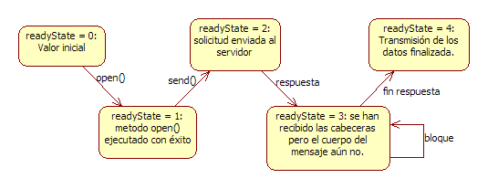

# Tema 5:

## Tecnologies web

### EI1042 - Tecnologías y Aplicaciones Web

### EI1036 - Tecnologías Web para los Sistemas de Información

# (2022/2023)

# Professora: Dra. Dolores Mª Llidó Escrivá


[Universitat Jaume I](https://www.uji.es/).

---

### Índice

1. HTTP Asíncrono
2. API FETCH
3. CORS
4. Servicios Web
5. Accesibilidad
6. Seguridad
  


https://blog.fergv.com/js/callback-hell/#callbacks

<!--


##  El elemento SCRIPT

Atributos:
 -  **src** : URI del recurso con los programas  a ser cargados.
 -  **type:**  por defecto **text/javascript**.
 -  **charset** : Por defecto utf-8. La codificación de caracteres.
 -  **async:** Boolean.  **true**  indica que el fichero del src debe ser cargados asincrónicamente.
 -  **defer:** Booleano. **true** el programa será recuperado en paralelo al
procesamiento del documento y evaluado sólo cuando se haya completado el
procesamiento del documento.


Recuerda  que para cargar un script o css en WordPress la mejor  forma es:

```php
function wpdocs_plugin_name_scripts() {
  wp_enqueue_script( 'script-name1',plugins_url('TemplateAsyncRestWP.js',__FILE__ ));
  wp_enqueue_style( 'style-name1', plugins_url('Template0.css', __FILE__ ) );
}

add_action( 'init', 'wpdocs_add_action' );

function wpdocs_add_action() {
  add_action( 'wp_enqueue_scripts', 'wpdocs_plugin_name_scripts' );

}
```


https://developer.wordpress.org/themes/basics/including-css-javascript/


## Función Flecha => (arrow functions)

Forma de definir funciones anónimas más cortas.

`([param] [, param]) => {instrucciones}`

`param => expresión` (Un parámetro)


```js
(function(quien){alert("hola" + quien)})("mundo");
(quien => alert("hola" + quien))("mundo");

["mundo"].map(quien => alert("hola" + quien))
```

El método *array.map()* crea un array como resultado de aplicar función que se pasa por parámetro a cada elemento del array del método. Es una función *callback*.


Ejemplo:
```JS
var elementos = [ "Hidrógeno","Helio","Litio"];
a = elementos.map(function(elemento){
      return elemento.length;
});

b = elementos.map((elemento) => {
  return elemento.length;
});

c = elementos.map( elementos => elementos.length );
console.log(a);

```


-->

---

# 1. HTTP Asíncrono
## Modelo Asíncrono

Asincronía: acción que no tiene lugar en total correspondencia temporal con otra acción. (Fuente: Wikipedia).

¿Ejemplo de asincronía?

--

## AJAX: Jesse James Garrett


</img>

- El término AJAX se presentó en 2005
  por primera vez en el artículo ["Ajax A New Approach to Web Applications"](http://adaptivepath.org/ideas/ajax-new-approach-web-applications/)

- AJAX es un acrónimo de **Asynchronous JavaScript + XML** , que se puede traducir como
  "JavaScript asíncrono + XML".

--

## Estados del motor de Ajax

API XMLHttpRequest



--

## Interacción

- AJAX mejora la interacción del usuario con la aplicación, evitando las recargas constantes de la página.

- En el **cliente** requiere un motor del Ajax que se conecta con el servidor de forma asíncrona,(API XMLHttpRequest).

- En el **servidor** no se requiere nada en particular, simplemente debe devolver el recurso que se le solicita.

<!--


##  API XMLHttpRequest: Métodos

```js
 new XMLHttpRequest();
 ```

- .open(método,URL,asincrono,usuario,clave)

   ( Métodos: get,post,put -  Asincrono: true(default)/false )

- .send(datos)

    ( datos: Vacía método get.)
-  .setRequestHeader()
-  .getResponseHeader()
-  .abort()


-->

--

### Ejemplo: Petición URL síncrona con Ajax

```js
var Ajax1=new XMLHttpRequest();
Ajax1.open(“GET”,” http://www.example.com”);
Ajax1.send();
node=document.getElementByID("central");
node.innerHTML=Ajax1.responseText;
```

- ¿Hay algun problema si es síncrono?
- ¿Y si es asíncrono?

--

### Ejemplo: Carga hiperenlaces de forma asíncrona

https://asociacionpiruleta.cloudaccess.host/PHP/T5/AsincroAjax.html

```js
function cargaAjax(src_url, l) {
  var Ajax1 = new XMLHttpRequest();
  Ajax1.addEventListener("readystatechange", function () {
    if (this.readyState === 4) {
      if (this.status < 400) {
        l.innerHTML = Ajax1.responseText;
      }
    }
  });
  Ajax1.open("GET", src_url);
  Ajax1.send();
}
function ready() {
  enlace = document.querySelector("nav a");
  src_url = enlace.getAttribute("href");
  enlace.addEventListener("click", function (event) {
    event.preventDefault();
    cargaAjax(event.target.src, event.target.parentElement);
  });
}
document.addEventListener("DOMContentLoaded", function () {
  ready();
});
```

--

## HTTP Asíncrono

Soluciones en Javascript:

- API XMLHttpRequest: Eventos. Motor AJAX
- API FETCH: Promesas.

---


## Promesas- Promise

- Las promesas son un Patrón de diseño para controlar la ejecución de un determinado cómputo del cual no sabemos: ni cómo, ni cuándo se nos va a devolver un determinado valor.
- Una promesa es un objeto que por medio de una máquina de estados podemos controlar cuándo un valor está disponible o no.
- Los métodos de las promesas devuelven promesas, permitiendo que las promesas se puedan encadenar.
- EmacScript 7
- Una promesa tiene 3 estados: Un Promise está en uno de estos estados:

pending (pendiente): estado inicial, ni cumplido ni rechazado.
fulfilled (cumplida): lo que significa que la operación se completó con éxito.
rejected (rechazada): lo que significa que la operación falló.

--

### Métodos Promesas

**promise = new Promise(function(resolve[, reject]) {});**

- promise.resolve (Obligatorio). Si la promesa devuelve el valor deseado , se ejecuta este método.
- promise.reject (Opcional). Método que se ejecuta cuando  la promesa no devuelve el valor deseado.

--

Para encadenar promesas en caso de éxito o fracaso tenemos estos métodos:

- promise.then(onFulfilled,onRejected) : Método para indicar que hacer
  cuando una promesa devuelve el valor deseado. **Resolve**
- promise.catch(onRejected): Método para indicar que hacer cuando una promesa devuelve el valor no deseado. **Reject**

--

## Ejemplo definición y uso de una función que es una promesa

```js
function isDinnerTime() {
  return new Promise(function (resolve, reject) {
    setTimeout(function () {
      const now = new Date();
      if (now.getHours() >= 22) {
        resolve("yes");
      } else {
        reject("no");
      }
    }, 1000);
  });
}
isDinnerTime()
  .then((data) => console.log("success: " + data))
  .catch((data) => console.log("error: " + data));
```

---

# 2. API FETCH

- es una API más simple y  limpia que XHTMLRequest.
- No envia ni recibe ninguna **cookie**.
- Utiliza las promesas de JavaScript. 
- El objeto **Fetch** permite  solicitar recursos definidos  y devuelve un objeto **Response** que es  una promesa.


**fetch(resource[, initRequest])***


--

## Fetch GET

```js
fetch("./api/some.json")
  .then(function (response) {
    if (response.status !== 200) {
      console.log(
        "Looks like there was a problem. Status Code: " + response.status
      );
      return;
    } // Examine the text in the response
    response.json().then(function (data) {
      console.log(data);
    });
  })
  .catch(function (err) {
    console.log("Fetch Error :", err);
  });
```

https://asociacionpiruleta.cloudaccess.host/PHP/T5/AsincroFetch.html

`response.status !== 200` Es un error. ¿no se debería recogerse con catch?

--

### Objeto fetch


- resource(recurso de la petición): 
  - una cadena con la **URL** .
  - o un objeto **Request**.  Objeto  que  contiene los datos para la solicitud de un recurso para la petición Fetch.   
- initRequest: Objeto JSON de inicialización de la petición, cuyos valores sobrescriben los que existen en el objeto Request. Es optativo. Estos parámetros pueden ser:
  - Cadena **method**: request HTTP method:Por defecto GET.
  - Objeto **headers**: request HTTP headers.
  - Objeto **body**: request HTTP body.
  - Cadena **mode**: cors, no-cors, same-origin, navigate.

--

### Objeto Request

request = new Request([recurso][,requestInit]])

```js
const request = new Request('https://www.mozilla.org/favicon.ico');

const url = request.url;
const method = request.method;
const credentials = request.credentials;
```

--

### Objeto Headers

- **Headers** : Objeto que Representa los encabezados de la respuesta/solicitud, lo que le permite consultar y tomar diferentes acciones en función de los resultados.

```
var myHeaders = new Headers();
myHeaders.append('Content-Type', 'text/xml');
myHeaders.get('Content-Type') // should return 'text/xml'

```

--

### Objeto Body

Objeto proporciona métodos relacionados con el contenido de la respuesta/solicitud, lo que le permite declarar cuál es su tipo y cómo debe manejarse.

```js
body: "foo=bar&lorem=ipsum";
```

--

### Response

- Representa la respuesta a una solicitud.
- Es la promesa que devuelve fetch.
- Devolverá un error sólo cuando hay un error de red. No el código de error HTTP como 404 o 500.

Métodos:

- response.ok : true (false) si el estado esta entre 200-299.
- response.status: Código HTTP de respuesta.

--

Tipos de respuesta:

- response.arrayBuffer(): El objeto ArrayBuffer se usa para representar un buffer genérico, de datos binarios crudos (raw) con una longitud específica
- response.blob():Un objeto Blob representa un objeto tipo fichero de datos planos inmutables
- response.json()
- response.text()

--

### Fetch: Request Get Blob

Ejemplo: Carga una imagen
https://asociacionpiruleta.cloudaccess.host/PHP/T5/ImageSend.html

```js
function asyncCall() {
  var myImage = document.querySelector("#mi_imagen");
  fetch("https://upload.wikimedia.org/wikipedia/commons/7/77/Delete_key1.jpg")
    .then(function (response) {
      if (!response.ok) {
        throw new Error(response.statusText);
      }
      response.blob().then(function (data) {
        var objectURL = URL.createObjectURL(data);
        myImage.src = objectURL;
      });
    })
    .catch(function (error) {
      console.log(error);
    });
}
```

- ver carga imagen asíncrona
- ver envio formulario asíncrono

<!--

### Ejemplo Template + Fetch + JSON

https://asociacionpiruleta.cloudaccess.host/PHP/T5/cargaTemplateFetch.html

```js
document
  .querySelector("#listar")
  .addEventListener("click", async function (event) {
    event.preventDefault();
    try {
      const response = await fetch(event.target.href, myInit);
      const respuestaJson = await response.json();
      if (response.status != 200) {
        throw new Error("Something went wrong on api server!");
      }
      llamarTemplate(respuestaJson.plantilla, respuestaJson.datos);
    } catch (error) {
      console.log(error);
    }
  });
```
-->

---

# 3. Servicio Web

Los Servicios Web son un conjunto de aplicaciones o de tecnologías con capacidad para interoperar en la Web y que intercambian datos entre sí con el objetivo de ofrecer servicios.

Podemos clasificar los servicios web en:

- Servicios Web **REST**, el propósito principal del servicio es manipular las representación de los recursos WEB (XML,JSON) usando un conjunto uniforme de operaciones sin estado(Métodos).
- Servicios Web **SOAP**: en el cual el servicio se expone con un conjunto arbitrario de operaciones.(XML)

--

## RESt API o servicio web rest

Transferencia de Estado Representacional

Los sistemas REST utilizan estos métodos para identificar operaciones sobre los distintos recursos

- GET (read): Se utiliza para consultar, leer y en definitiva acceder a un recurso
- POST (create): Envía datos para crear un recurso.
- PUT (update): Utilizado para editar un recurso.
- DELETE (delete): Es la opción para eliminar un recurso

--


(http://geek-and-poke.com/)

--

## Wordpress RestApi

http://v2.wp-api.org/
https://developer.wordpress.org/rest-api/

Existe un Endpoint especial, llamado wp-json, al que se accede mediante la ruta raíz o inicial y que devuelve toda la información relativa a la API REST

https://asociacionpiruleta.cloudaccess.host/wp-json/

Guia de referencia: http://v2.wp-api.org/reference/posts/

https://asociacionpiruleta.cloudaccess.host/wp-json/wp/v2/posts

https://asociacionpiruleta.cloudaccess.host/wp-json/wp/v2/posts/2

--

La api Rest de Wordpress permite realizar operaciones CRUD pueden afectar a cualquiera de los elementos de información de nuestro sitio WordPress:

- Entradas
- Páginas
- Usuarios
- Multimedia
- Taxonomías
- CustompostTypes

<!--

## Conceptos Wordpress RestApi

- ‘Rutas’ y ‘Puntos finales’(EndPoint): Las rutas te ayudan a navegar a través de los puntos finales, que son cuando un método HTTP específico está conectado a una ruta específica.
- Peticiones (Request). Estas se crean activando los puntos finales correctos y transmitiendo los datos.
- Respuestas (Responses: proporcionan los datos solicitados o devuelven un error .
- Esquemas (Schema). Estos son los modelos con que se dan las respuestas, así siempre sabrás exactamente dónde buscar los datos correctos.
- Clases de controlador(Controller Classes). En términos simples, te permiten construir tus propias rutas y puntos finales.

-->

## Rutas base

|       Elemento |     Ruta base     |
| -------------: | :---------------: |
|          Posts |   /wp/v2/posts    |
| Post Revisions | /wp/v2/revisions  |
|     Categories | /wp/v2/categories |
|           Tags |    /wp/v2/tags    |
|          Pages |   /wp/v2/pages    |
|       Comments |  /wp/v2/comments  |
|     Taxonomies | /wp/v2/taxonomies |
|          Media |   /wp/v2/media    |
|          Users |   /wp/v2/users    |
|     Post Types |   /wp/v2/types    |
|  Post Statuses |  /wp/v2/statuses  |
|       Settings |  /wp/v2/settings  |

<!--

curl -X GET --user username:password -i http://tudominio.com/wp-json/wp/v2/posts?status=draft


## Crear nuestras propias funcionalidades REST en WP

Hemos de registrar el servicio en wordpres

https://developer.wordpress.org/reference/functions/register_rest_route/

register_rest_route( string $namespace, string $route, array $args = array(), bool $override = false )

Necesitamos pasar tres cosas para register_rest_route: el espacio de nombres, la ruta que queremos y las opciones. Volveremos al espacio de nombres en un momento, pero por ahora, vamos a elegir myplugin / v1. Vamos a hacer que la ruta coincida con / author / {id}, donde {id} es un número entero.
-->

--

---
# 8. Seguridad

La seguridad supone un coste económico y de
eficiencia.

- El riesgo cero no es práctico
- Hay diversas formas de mitigar el riesgo
- No se puede gastar un millón para proteger un
  céntimo

--

## Tipos de seguridad:

1.Seguridad en el Cliente:

- Aparece incrustado en un documento HTML. Un cliente de correo o un navegador que cargue el documento lo ejecutará en la máquina cliente.

2.Seguridad en el Servidor

- Revisar periódicamente los ficheros de log (access_log y error_log en Apache) para detectar posibles ataques.

3.Seguridad en la Comunicación:

- conectar con un sitio web protegido con SSL

4.Seguridad en la Aplicación:

- Almacenar los datos sensibles de forma encriptada

--

## Seguridad: Top 10

###### https://www.owasp.org
https://owasp.org/Top10/es/


A01 Pérdida de Control de Acceso
A02 Fallas Criptográficas
A03 Inyección
A04 Diseño Inseguro
A05 Configuración de Seguridad Incorrecta
A06 Componentes Vulnerables y Desactualizados
A07 Fallas de Identificación y Autenticación
A08 Fallas en el Software y en la Integridad de los Datos
A09 Fallas en el Registro y Monitoreo
A10 Falsificación de Solicitud del Lado del Servidor (SSRF)

--

### A01 Pérdida de Control de Acceso

El control de acceso se implementa en el servidor y debe  implementar el cumplimiento de política de modo que los usuarios no pueden actuar fuera de los permisos que le fueron asignados. Las fallas generalmente conducen a la divulgación de información no autorizada, la modificación o la destrucción de todos los datos o la ejecución de una función de negocio fuera de los límites del usuario. 
#### Prevencion:

- A excepción de los recursos públicos, denegar por defecto.
- Implemente mecanismos de control de acceso una única vez y reutilícelos en toda la aplicación, incluyendo la minimización del uso de CORS.
- El control de acceso debe implementar su cumplimiento a nivel de dato y no permitir que el usuario pueda crear, leer, actulizar o borrar cualquier dato.


--

### A03:2021 – Inyección

Una aplicación es vulnerable a estos tipos de ataque cuando:

- Los datos proporcionados por el usuario no son validados, filtrados ni sanitizados por la aplicación.

-Se invocan consultas dinámicas o no parametrizadas, sin codificar los parámetros de forma acorde al contexto.

-Se utilizan datos dañinos dentro de los parámetros de búsqueda en consultas Object-Relational Mapping (ORM), para extraer registros adicionales sensibles.

- Se utilizan datos dañinos directamente o se concatenan, de modo que el SQL o comando resultante contiene datos y estructuras con consultas dinámicas, comandos o procedimientos almacenados.

## Prevención

- Uso de api segura: PDO para consultas a BD.
- Implemente validaciones de entradas de datos en el servido.
- Escape caracteres especiales utilizando la sintaxis de caracteres específica para el intérprete que se trate.

--


### A04:2021-Insecure Design 
#### Descripción
El diseño inseguro es una categoría amplia que representa diferentes debilidades, expresadas como "diseño de control faltante o ineficaz". El diseño inseguro no es la fuente de las otras 10 categorías. Existe una diferencia entre un diseño inseguro y una implementación insegura. Distinguimos entre fallas de diseño y defectos de implementación por un motivo, difieren en la causa raíz y remediaciones. Incluso un diseño seguro puede tener defectos de implementación que conduzcan a vulnerabilidades que pueden explotarse. Un diseño inseguro no se puede arreglar con una implementación perfecta, ya que, por definición, los controles de seguridad necesarios nunca se crearon para defenderse de ataques específicos. Uno de los factores que contribuyen al diseño inseguro es la falta de perfiles de riesgo empresarial inherentes al software o sistema que se está desarrollando y, por lo tanto, la falta de determinación del nivel de diseño de seguridad que se requiere.
## Prevención

- Establezca y use un ciclo de desarrollo seguro apoyado en Profesionales en Seguridad de Aplicaciones para ayudarlo a evaluar y diseñar la seguridad y controles relacionados con la privacidad.

- Establezca y utilice un catálogo de patrones de diseño seguros o componentes de "camino pavimentado" listos para ser utilizados.

- Utilice el modelado de amenazas para flujos críticos de autenticación, control de acceso, lógica de negocio y todo clave.

- Integre el lenguaje y los controles de seguridad en las historias de usuario.

. Integre verificaciones de viabilidad en cada capa de su aplicación (desde el frontend al backend).

- Escriba pruebas unitarias y de integración para validar que todos los flujos críticos son resistentes al modelo de amenazas. Recopile casos de uso y casos de mal uso para cada capa de la aplicación.

- Separe las capas del sistema y las capas de red según las necesidades de exposición y protección.

- Separe a los tenants de manera robusta por diseño en todos los niveles.

- Limitar el consumo de recursos por usuario o servicio.

--

### A06:2021 – Componentes Vulnerables y Desactualizados


Si no conoce las versiones de todos los componentes que utiliza (tanto en el cliente como en el servidor). Esto incluye los componentes que usa directamente, así como las dependencias anidadas.

Si el software es vulnerable, carece de soporte o no está actualizado. Esto incluye el sistema operativo, el servidor web/de aplicaciones, el sistema de administración de bases de datos (DBMS), las aplicaciones, las API y todos los componentes, los entornos de ejecución y las bibliotecas.

Si no analiza en búsqueda de vulnerabilidades de forma regular y no se suscribe a los boletines de seguridad relacionados con los componentes que utiliza.

Si no repara o actualiza la plataforma subyacente, frameworks y dependencias de manera oportuna y basada en el riesgo. Esto suele ocurrir en entornos en los que la aplicación de parches de seguridad es una tarea mensual o trimestral bajo control de cambios, lo que deja a las organizaciones abiertas a días o meses de exposición innecesaria a vulnerabilidades con soluciones disponibles.

Si los desarrolladores de software no testean la compatibilidad de las bibliotecas actualizadas, actualizadas o parcheadas.

Si no asegura las configuraciones de los componentes (consulte A05:2021 – Configuración de Seguridad Incorrecta).


#### Cómo se previene
Debe existir un proceso de administración de parches que:

- Elimine las dependencias que no son utilizadas, funcionalidades, componentes, archivos y documentación innecesarios.

- Realice un inventario continuo de las versiones de los componentes en el cliente y en el servidor (por ejemplo, frameworks, bibliotecas) y sus dependencias utilizando herramientas como: versions, OWASP Dependency Check, retire.js, etc. Supervise continuamente fuentes como Common Vulnerability and Exposures (CVE) y National Vulnerability Database (NVD) para detectar vulnerabilidades en los componentes. Utilice herramientas de análisis de composición de software para automatizar el proceso. Suscríbase para recibir alertas por correo electrónico sobre vulnerabilidades de seguridad relacionadas con los componentes que utiliza.

- Solo obtenga componentes de fuentes oficiales a través de enlaces seguros. Prefiera los paquetes firmados para reducir la posibilidad de incluir un componente malicioso modificado (consulte A08:2021 – Fallas en el Software y en la Integridad de los Datos).

- Supervise las bibliotecas y los componentes que no sea mantenidos o no generen parches de seguridad para versiones anteriores. Si la aplicación de parches no es posible, considere implementar un parche virtual para monitorear, detectar o protegerse contra el problema descubierto.

--

### A07:2021 – Fallas de Identificación y Autenticación

La confirmación de la identidad, la autenticación y la gestión de sesiones del usuario son fundamentales para protegerse contra ataques relacionados con la autenticación.

## Prevención:

Cómo se previene
Cuando sea posible, implemente la autenticación multi-factor para evitar ataques automatizados de reutilización de credenciales conocidas, fuerza bruta y reúso de credenciales robadas.

No incluya o implemente en su software credenciales por defecto, particularmente para usuarios administradores.

Implemente un control contra contraseñas débiles, tal como verificar que una nueva contraseña o la utilizada en el cambio de contraseña no esté incluida en la lista de las 10,000 peores contraseñas.

Alinear las políticas de largo, complejidad y rotación de las contraseñas con las pautas de la sección 5.1.1 para Secretos Memorizados de la guía del NIST 800-63b u otras políticas de contraseñas modernas, basadas en evidencias.

Asegúrese que el registro, la recuperación de las credenciales y el uso de APIs, no permiten los ataques de enumeración de usuarios, mediante la utilización de los mismos mensajes genéricos en todas las salidas.

Limite o incremente el tiempo de espera entre intentos fallidos de inicio de sesión, pero tenga cuidado de no crear un escenario de denegación de servicio. Registre todos los fallos y avise a los administradores cuando se detecten ataques de rellenos automatizados de credenciales, fuerza bruta u otros.

Utilice un gestor de sesión en el servidor, integrado, seguro y que genere un nuevo ID de sesión aleatorio con alta entropía después de iniciar sesión. Los identificadores de sesión no deben incluirse en la URL, deben almacenarse de forma segura y deben ser invalidados después del cierre de sesión, luego de un tiempo de inactividad o por un tiempo de espera absoluto.


---
VIEJO
# 4. Guias accesibilidad

- UAAG: User Agent Accessibility Guidelines (for developers of Web browser,)
- WCAG: Web Content Accessibility Guidelines (site designers)
- ATAG : Authoring Tool Accessibility Guidelines (HTML editors)
- WAI-ARIA : Accessible Rich Internet Applications.

https://w3c.github.io/silver/guidelines/#relationship-to-other-w3c-guidelines WCAG3

https://olgacarreras.blogspot.com/2021/01/wcag-30-novedades-del-ultimo-borrador.html

https://www.usableyaccesible.com/recurso_misvalidadores.php

https://www.tawdis.net/ Validador URL de accesibilidad WCA2

--

# Normativas accesibilidad Europea

Norma UNE 139803:2012 (PDF) , es equivalente a las WCAG 2.0

--

# Legislación Española

- Ley 34/2002, de 11 de julio, de Servicios de la Sociedad de la Información y de Comercio Electrónico. LSSI
  (B.O.E. de 12-7-02). : Se fijaba por primera vez la obligación de que las páginas web de la Administración Pública
  española fueran accesibles
  Ley 9/2017, de 8 de noviembre, de Contratos del Sector Público, por la que se transponen al ordenamiento jurídico
  español las Directivas del Parlamento Europeo y del Consejo 2014/23/UE y 2014/24/UE, de 26 de febrero de 2014.
  se incluyen requisitos de _accesibilidad universal y diseño universal o diseño para todas las personas_.

- La publicación de la Directiva (UE) 2016/2102 del Parlamento Europeo y del Consejo, de 26 de octubre de 2016,
  sobre la accesibilidad de los sitios web y aplicaciones para dispositivos móviles de los organismos del sector
  público, que deberá ser transpuesta a la legislación española antes de septiembre de 2018, y que establece los
  requisitos de accesibilidad de los sitios web y apps del sector público.
  Esta norma es el estándar europeo que especifica los requisitos funcionales de accesibilidad de los productos y
  servicios TIC: los requisitos de accesibilidad de los sitios web (equivalentes al nivel **AA de las WCAG 2.0** ), del
  hardware, del software, de los documentos, etc.

---

# 5. Seguridad

La seguridad supone un coste económico y de
eficiencia.

- El riesgo cero no es práctico
- Hay diversas formas de mitigar el riesgo
- No se puede gastar un millón para proteger un
  céntimo

--

## Tipos de seguridad:

1.Seguridad en el Cliente:

- Aparece incrustado en un documento HTML. Un cliente de correo o un navegador que cargue el documento lo ejecutará en la máquina cliente.

2.Seguridad en el Servidor

- Revisar periódicamente los ficheros de log (access_log y error_log en Apache) para detectar posibles ataques.

3.Seguridad en la Comunicación:

- conectar con un sitio web protegido con SSL

4.Seguridad en la Aplicación:

- Almacenar los datos sensibles de forma encriptada

--

## Seguridad: Top 10

###### https://www.owasp.org

#### The Open Web Application Security Project (OWASP).

- Informe2017 https://www.owasp.org/images/b/b0/OWASP_Top_10_2017_RC2_Final.pdf
- Top 10
- A1-Injection
- A2-Broken Authentication and Session Management
- A3-Cross-Site Scripting (XSS)
- A4-Broken Access Control
- A5-Security Misconfiguration
- A6-Sensitive Data Exposure
- A7-Insufficient Attack Protection
- A8-Cross-Site Request Forgery (CSRF)
- A9-Using Components with Known Vulnerabilities
- A10-Underprotected APIs

---

#### Enlaces de Interés

- http://www.w3.org/TR/XMLHttpRequest/
- https://developer.mozilla.org/es/docs/XMLHttpRequest/Using_XMLHttpRequest
- https://fetch.spec.whatwg.org/
- https://developer.mozilla.org/es/docs/Web/API/Fetch_API/Utilizando_Fetch
- http://www.etnassoft.com/2016/10/10/estudiando-la-nueva-api-fetch-la-evolucion-natural-de-xhr-en-el-nuevo-javascript/
- https://developer.mozilla.org/es/docs/Web/JavaScript/Referencia/Funciones/Arrow_functions


---
Nueva 


## 10. CORS

- Por seguridad JS no permite que una  aplicación que reside en un servidor  pueda  extraer datos de otro.
- El uso compartido de recursos de origen cruzado (CORS- introducido en HTML5) permite a las aplicaciones web de un dominio realizar solicitudes de dominio cruzado.
- Hay que habilitar estas llamadas tanto en el servidor como en el cliente.

http://www.w3.org/TR/cors/

http://enable-cors.org

--

### CORS en el servidor

Se puede que habilitar CORS de dos formas:
- Con un encabezado (header) para permitir solicitudes de example.com: 

```php
<?php header('Access-Control-Allow-Origin: *');?>
```
- o en el fichero .httacess
```
Header set Access-Control-Allow-Origin "*" 
```

--

<!--

### CORS en el cliente

En la etiqueta script añadir atributo **crossorigin**. Indica si la
petición hecha a un servidor externo debe presentar credenciales CORS o no.

- **crossorigin=anonymous** : las peticiones CORS para el elemento tendrán la etiqueta "omit credentials" establecida.
- **crossorigin=use-credentials** : las peticiones CORS para el elemento no tendrán la etiqueta "omit credentials" establecida.

-->

EJEMPLO Google maps con CORS y sin CORS

https://piruletas3.000webhostapp.com/PHP/ejTeo/T4/webDOMIframe.html

https://www.google.es/maps/@39.8466303,-0.4785588,15z
Referrer Policy: origin
https://cdn.jsdelivr.net/npm/chart.js
Referrer Policy:
strict-origin-when-cross-origin

<!--
## 12. Generadores

Soluciones para utilizar código JS no compatible:

1- Transpiler(compilador): Transforma tu código reemplazando las secciones de código para que se puedan ejecutar con el JS nativo.

  - Babel: Permite transformar el código con las nuevas características de ES6, en un JS ES5 o inferior.
  - Traceur: Compila ES6, ES7, y más en el formato ES5

2- Código polyfill (Plugin): permite emular algunas APIs aunque no estén implementadas en el JS nativo. Se utiliza para que los navegadores soporten las últimas APIS que quieras utilizar.

Implementa el código js que los navegadores no soportan.


### babel

```javascript
<script src="https://unpkg.com/@babel/standalone/babel.min.js"></script>

<script type="text/babel">
const getMessage = () => "Hello World";
document.getElementById('output').innerHTML = getMessage();
</script>
```

### Polyfill

```<script src="https://cdn.polyfill.io/v2/polyfill.min.js"></script>```

-->