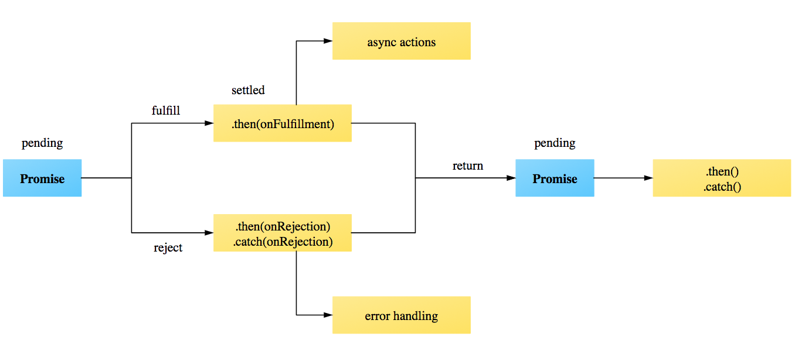

# Tema 5:

## Tecnologies web

### EI1042 - Tecnologías y Aplicaciones Web

### EI1036 - Tecnologías Web para los Sistemas de Información

# (2023/2024)

# Professora: Dra. Dolores Mª Llidó Escrivá


[Universitat Jaume I](https://www.uji.es/).

---

### Índice

1. HTTP Asíncrono: AJAX
2. Funciones Anidadas: Clousure/Callback(NUEVO)
3. Promesas - Promise
4. Async/Await(NUEVO)
5. CORS (NUEVO)
6. API FETCH
7. Servicios Web
8. Seguridad
  


<!--
https://blog.fergv.com/js/callback-hell/#callbacks
https://es.javascript.info/promise-basics
##  El elemento SCRIPT

Atributos:
 -  **src** : URI del recurso con los programas  a ser cargados.
 -  **type:**  por defecto **text/javascript**.
 -  **charset** : Por defecto utf-8. La codificación de caracteres.
 -  **async:** Boolean.  **true**  indica que el fichero del src debe ser cargados asincrónicamente.
 -  **defer:** Booleano. **true** el programa será recuperado en paralelo al
procesamiento del documento y evaluado sólo cuando se haya completado el
procesamiento del documento.


Recuerda  que para cargar un script o css en WordPress la mejor  forma es:

```php
function wpdocs_plugin_name_scripts() {
  wp_enqueue_script( 'script-name1',plugins_url('TemplateAsyncRestWP.js',__FILE__ ));
  wp_enqueue_style( 'style-name1', plugins_url('Template0.css', __FILE__ ) );
}

add_action( 'init', 'wpdocs_add_action' );

function wpdocs_add_action() {
  add_action( 'wp_enqueue_scripts', 'wpdocs_plugin_name_scripts' );

}
```


https://developer.wordpress.org/themes/basics/including-css-javascript/


## Función Flecha => (arrow functions)

Forma de definir funciones anónimas más cortas.

`([param] [, param]) => {instrucciones}`

`param => expresión` (Un parámetro)


```js
(function(quien){alert("hola" + quien)})("mundo");
(quien => alert("hola" + quien))("mundo");

["mundo"].map(quien => alert("hola" + quien))
```

El método *array.map()* crea un array como resultado de aplicar función que se pasa por parámetro a cada elemento del array del método. Es una función *callback*.


Ejemplo:
```JS
var elementos = [ "Hidrógeno","Helio","Litio"];
a = elementos.map(function(elemento){
      return elemento.length;
});

b = elementos.map((elemento) => {
  return elemento.length;
});

c = elementos.map( elementos => elementos.length );
console.log(a);

```


-->

---

# 1. HTTP Asíncrono
## Modelo Asíncrono

Asincronía: acción que no tiene lugar en total correspondencia temporal con otra acción. (Fuente: Wikipedia).

¿Ejemplo de asincronía?

--

## AJAX: Jesse James Garrett


</img>

- El término AJAX se presentó en 2005
  por primera vez en el artículo ["Ajax A New Approach to Web Applications"](http://adaptivepath.org/ideas/ajax-new-approach-web-applications/)

- AJAX es un acrónimo de **Asynchronous JavaScript + XML** , que se puede traducir como "JavaScript asíncrono + XML".

--

## Estados del motor de Ajax

API XMLHttpRequest


--

## Interacción

- AJAX mejora la interacción del usuario con la aplicación, evitando las recargas constantes de la página.

- En el **cliente** requiere un motor del Ajax que se conecta con el servidor de forma asíncrona,(API XMLHttpRequest).

- En el **servidor** no se requiere nada en particular, simplemente debe devolver el recurso que se le solicita.

<!--


##  API XMLHttpRequest: Métodos

```js
 new XMLHttpRequest();
 ```

- .open(método,URL,asincrono,usuario,clave)

   ( Métodos: get,post,put -  Asincrono: true(default)/false )

- .send(datos)

    ( datos: Vacía método get.)
-  .setRequestHeader()
-  .getResponseHeader()
-  .abort()


-->

--

### Ejemplo: Petición URL síncrona con Ajax

```js
var Ajax1=new XMLHttpRequest();
Ajax1.open(“GET”,” http://www.example.com”);
Ajax1.send();
node=document.getElementByID("central");
node.innerHTML=Ajax1.responseText;
```

- ¿Hay algun problema si es síncrono?
- ¿Y si es asíncrono?

--

### Ejemplo: Carga hiperenlaces de forma asíncrona

https://www3.uji.es/~dllido/EI1036_42/T5/AsincroAjax.html

```js
function cargaAjax(src_url, l) {
  var Ajax1 = new XMLHttpRequest();
  Ajax1.addEventListener("readystatechange", function () {
    if (this.readyState === 4) {
      if (this.status < 400) {
        l.innerHTML = Ajax1.responseText;
      }
    }
  });
  Ajax1.open("GET", src_url);
  Ajax1.send();
}
function ready() {
  enlace = document.querySelector("nav a");
  src_url = enlace.getAttribute("href");
  enlace.addEventListener("click", function (event) {
    event.preventDefault();
    cargaAjax(event.target.src, event.target.parentElement);
  });
}
document.addEventListener("DOMContentLoaded", function () {
  ready();
});
```

--

## HTTP Asíncrono

Soluciones en Javascript:

- API XMLHttpRequest: Eventos. Motor AJAX
- API FETCH: Promesas.

---

## Funciones Anidadas: Clousure/Callback

- En JavaScript, el ámbito de una variable se define por su
ubicación dentro del código fuente y las funciones
anidadas tienen acceso a las variables declaradas en su
ámbito externo.


- **clousure/cierre** - es una función que se evalúa en un entorno que contiene una o más variables vinculadas. Cuando se llama, la función puede acceder a estas variables.
- **callback/rellamada** - código ejecutable que se pasa cómo argumento a otro código. Un cierre puede actuar cómo callbak. 

Generalmente, las  funciones asíncronas se pasan cómo callback.


--


#### Closure/cierre

- Una  funciones anidadas que toman variables del contexto donde se definen es un **clousure o cierre**. (Función que cierra la expresión). Recuerdan el entorno donde se han creado.
- La función o expresión que contiene un clousure es una función **contenedora**


-La función clousure utilizará los valores actuales de las variables que se pasan como parámetros (en lugar de copiarlos). Como punteros.


-  REGLA: El clousure toma el último valor de la variable de la función contenedora.

--

#### Ejemplo de Clousure

```js
function init() {
var name = "Mozilla";
function displayName() {alert(name);}
displayName();
}
init();
```

¿Qué aparece por la pantalla?

--

#### Ejemplo 

```js
function creaSumador(x) {
  return function(y) {
    return x + y
    }
  }

var suma5 = creaSumador( 5 );
var suma10 = creaSumador( 10 );
console.log(suma5(2))// muestra 7
console.log(suma10(suma5(2)); // muestra 12
```
- funcion contenedora: creaSumador
- función de cierre: función anónima
- parámetro del cierre y
- parámetro de la función contenedora x

--

#### Cuestión: 
- ¿Qué función es el clousure?
- ¿Qué expresión es la contenedora?
- ¿Qué valores  tiene el "item.id" en cada iteración?
- ¿Qué valores  tiene el "item.help()" cuando se hace foco en el elemento con id =email?
```js 
var helpText = [{ 'id': 'email', 'help': 'Correo electrónico' },
 { 'id': 'name', 'help': 'Nombre completo' },]
for (var i = 0; i < helpText.length; i++) {
  var item = helpText[i];
  document.getElementById(item.id).addEventListener
    ("focus",function ()  {      showHelp(item.help) });
}
```
Ejemplo Problema: https://www3.uji.es/~dllido/EI1036_42/EjemplosTeo/T5/closureProblem.html

Ejemplo Solución: https://www3.uji.es/~dllido/EI1036_42/EjemplosTeo/T5/closureProblemSolv.html

--

### Clousures en bubles: Definir variables con LET

Dentro de bucles, la variable que toma dentro del clousure en su llamada es el último valor que toma en la función contenedora. Por ello se han de definir las variables con LET si no se quiere este comportamiento.

 
Extracto Solución ejemplo anterior

```js

function showHelp(help1) {
    document.getElementById('help').innerHTML = help1;
}
function setupHelp() {
  var helpText = [
    { 'id': 'email', 'help': 'Correo electrónico' },
    { 'id': 'name', 'help': 'Nombre completo' },
    { 'id': 'age', 'help': 'Edad (Mínimo de 16 años)' }];
  for (let i = 0; i < helpText.length; i++) {
      let item = helpText[i];
      document.getElementById(item.id).addEventListener
      
      ("focus", function () { showHelp(item.help) });
    }
}
document.addEventListener("DOMContentLoaded", function (){
   setupHelp();});

```

Cuestiones:
¿Existe algun clousure?
¿Existe algun callback?

---


## Promesas- Promise

- Las promesas son un Patrón de diseño para controlar la ejecución de un determinado cómputo del cual no sabemos: ni cómo, ni cuándo se nos va a devolver un determinado valor.
- Una promesa es un objeto que por medio de una máquina de estados podemos controlar cuándo un valor está disponible o no.
- Los métodos de las promesas devuelven promesas, permitiendo que las promesas se puedan encadenar.
- Permite escribir funciones asíncronas como si fueran síncronas.
- EmacScript 7

--

## Constructor 
-El constructor requiere una función anónima con 2 parámetros que son callbacks. 
 **promise = new Promise(function(resolve[, reject]) {});**

- resolve: Callback que se ejecuta en caso de éxito 
- reject: Callback que se ejecuta en caso de  fracaso.

Cuando se quiere que la promesa termine con éxito/(fracaso) en el código se llama a resolve(reject) con un valor X.  La promesa devolverá el estado de exito(fracasos) con el valor X.
```js
  promise = new Promise(function(resolve) {resolve(5);});
```
Los callbacks **resolve(value)** o **reject(value)** estan predefinidos. No hacen más que devolver una promesa con éxito/fallo.

En este caso la promesa termina con éxito, con valor 5


--

### Estados de las promesas

Una Promesa está en uno de estos 3 estados:

- pending (pendiente): estado inicial, ni cumplido ni rechazado.
- fulfilled (cumplida): lo que significa que la operación se completó con éxito.
- rejected (rechazada): lo que significa que la operación falló.
  
  

--

#### Cuestiones

```js
var promiseOk = new Promise(function(resolve, reject) {
  setTimeout(() => resolve("hecho!"), 1000);
});
//Equivalente a 
var promiseOk = new Promise(function(resolve, reject) {
  setTimeout(function() { resolve("hecho!")}, 1000);
});


```
¿Qué devuelve promiseOK? En que estado está la promesa?


--

### Métodos Promesas

Métodos de las promesas que devuelven promesas:
- Promise.resolve(value): Método del *contructor* que termina la promesa con éxito y devuelve value.
- Promise.reject(value): Método del *constructor* que termina la promesa con fracaso  y devuelve value.
- promesa.then: El método para  encadenar promesas indicando que hacer en caso de éxito o fracaso, para ello permite un máximo de 2 parámetros (  2  funciones callback para los casos de éxito / fallo. 
- El método catch(): El método  para  encadenar promesas en caso de fracaso. 
  <!--Se comporta igual que al llamar a promesa.then(undefined, onRejected).-->

```js
const promise1 = Promise.resolve(123);
//promise1 termina con éxito con valor 123.
promise1.then((value) => {
  console.log(value);
  // Expected output: 123
});
//devuelve una promesa con  éxito,con valor indefinido y 
//muestra por la consola 123

```

--

### Cuestiones. 

Indica  que hace el código y los estados/valores de las promesas.

```js
let promiseOk = new Promise(function(resolve, reject) {
  setTimeout(() => resolve("hecho!"), 1000);
});
let promiseRej = new Promise(function(resolve, reject) {
  setTimeout(() => reject(new Error("Vaya!")), 1000);
});

promiseOk.then(ee=>alert(ee))
promiseOk.then(alert)//equivalente anterior
promiseRej.catch(ee=>alert("error:"+ee))


```

--

### Encadenamiento simple de promesas

Para encadenar promesas en caso de éxito o fracaso tenemos estos métodos:

- **then(onFulfilled,onRejected)** : Método para indicar que funcion ejecutar en el caso de que la promesa termine como cumplida(onFulfilled) o rechazada(onRejected).Más común usar sólo 1 parámetro.
- **catch(onRejected)**: Método para indicar que hacer cuando una promesa devuelve una promesa rechazada no capturada  o una  excepción. 

Estos métodos pueden:
- Devolver un valor con return(),  método then queda resuelta adoptando el valor de retorno.
- Si se produce un error, la Promesa devuelta por el método then es rechazada, adoptando el error como su valor.
- Devolver una promesa 
- Si no hay return, se devuelve una promesa resuelta/rechazada sin valor.

**NOTA** Generalmente se concadenan then(onFUllfiles) o catch(Onrejected)

--

#### Cuestiones: 
- ¿Cuantas promesas hay?
- ¿Qué es a, que tipo es?. ¿Qué estado y que  valores tiene?
- ¿Qué hace el código?

```js
a=new Promise(function (resolve, reject) {
    setTimeout(function () {
      const now = new Date();
      hora=now.getHours()
      if (hora >= 21) {
        resolve("yes");
      } else if (hora<8) {
        throw new Error("Whoops! Durmiendo")
      }
      else reject("no")
    }, 1000);})
.then(x=>alert("exito:"+x),y=>{alert("fracaso:·"+y);return("hecho!")})
.catch(z=>alert("error:"+z));

```

--

A una promesa en caso de éxito o fracaso se le  puede asignar varias acciones.
```js
a.then(x=>alert("exito:"+x),y=>alert("fracaso:·"+y))
   .catch(x=>alert(z=>"error:"+z));
a.then(x=>alert("exito2:"+x),y=>alert("fracaso2:·"+y))
   .catch(x=>alert(z=>"error2:"+z));
```

--


### try…catch implícito

Las promesas tienen un try_catch implícito.
```js

new Promise((resolve, reject) => {
  throw new Error("Whoops!");
}).catch(alert); // Error: Whoops!
//…Hace exactamente lo mismo que este:
new Promise((resolve, reject) => {
  reject(new Error("Whoops!"));
}).catch(alert); // Error: Whoops!

```

--

## Ejemplo promesa con una promesa como resolve

```
let promiseOk = new Promise(function(reject) {
  setTimeout(() => reject("hecho!"), 1000);
});
promesa=new Promise((promiseOk,reject)=> {
  alert("hola"); promiseOk(5);})

promesa.then(
  result => {alert("ok "+result);return("Exito")}, // no se ejecuta
  error => alert("err "+error)// muestra "Error: ¡Vaya!" después de 1 segundo
);
```

- Copiar en consola y ver el funcionamiento.
- Podemos ver que una acción tarda en realizarse, es un ejemplo de función asíncrona.
- Esto es un ejemplo de funciones asíncronas pero escritas como si fueran síncronas gracias a las promesas
- Además el callback de resolve lo hemos definido  promesaOK.


--

#### Ejemplo de Función que devuelve  una  promesa 


```js
function isDinnerTime() {
  return new Promise(function (resolve, reject) {
    setTimeout(function () {
      const now = new Date();
      if (now.getHours() >= 22) {
        resolve("yes");
      } else {
        reject("no");
      }
    }, 1000);
  });
}
isDinnerTime()
  .then((data) => console.log("success: " + data))
  .catch((data) => console.log("error: " + data));
```
Si son las 12 devuelve una promesa fullfilled  u en la consola "success yes

Si son las 12 devuelve una promesa rejected y en la consola "error no.

--

#### Cuestión:

¿Qué hace este código y el estado/valores de las promesas?

¿Si son las 10H, si son las 14H si son las 23H?

```
b=new Promise ((isDinnerTime, reject)=>{
  const now = new Date();
  hora=now.getHours();
  if (hora>12) isDinnerTime(6);
  else reject("Durmiendo")})
.then(x=>alert("éxito:"+x),y=>alert("fracaso:·"+y))
.catch(x=>alert(z=>"error:"+z));

```


--



En las promesas se pueden sustituir las promesas por funciones que devuelvan promesas.

--

#### Cuestiones:
- ¿Qué problema hay en el siguiente ejemplo?
- ¿Qué tipo de dato es a?¿Qué es a?

```js
function g(){
  let promise = new Promise((resolve, reject) => {
    resolve("done!")}); 
  return(promise)
}
function f() {
  let promise = new Promise((resolve, reject) => {
    setTimeout(() => resolve("done!"), 10000)});
  return(promise)
}
a=f()
a.then(alert)
alert("fallo")

```

Aparece antes la alerta de fallo que la alerta alert.

¿Qué pasa si a=g()?

**Nota** El programa ejecuta en paralelo las sentencias sin esperar que acaben las funciones asíncronas.


<!--
#### Ejemplo error: ¿Quien captura "Whops"?


```js


function f() {

  let promise = new Promise((resolve, reject) => {
    setTimeout(() => {throw new Error("Whoops!")}, 1000)
  });
  return(promise)
}
//a=g()
a=f();
a.catch (x=>alert(x))
alert("I sigue ...")
```
El error se produce  asíncronamente, la promesa no lo puede capturar.
Tendríamos que poner un try/catch


async function f() {

  let promise = await new Promise((resolve, reject) => {
    setTimeout(() => {throw new Error("Whoops!")}, 1000)
  });
  return(promise)
}

a= await f();
a.catch (x=>alert(x))
alert("I sigue ...")


 promesa=await new Promise(function(resolve, reject) {
  setTimeout(() => {
    throw new Error("Whoops!");
  }, 1000);
  return promesa

})

if promesa: alert("correcto")
else: alert("error")


-->

---


# Asinc/await

Con async/await tenemos una forma más cómoda de trabajar con promesas, y escribir el código asíncrono como si fuera síncrono.

- La palabra clave **async** se pone antes de una función que devuelve una promesa.

- El operador  **await** hace que JavaScript espere hasta que esa promesa termine y devuelva su resultado en rv.

**[rv] = await expression;** 

```js
async function f() {
  let promise = await new Promise((resolve, reject) => {
    setTimeout(() => resolve("done!"), 1000)});
  return(promise)
}
//a=g()
try{ a=await f()}
catch {alert("Fallo");exit}
alert("I sigue ...")
alert(a)  //¿A es una promesa?
```

---

##  CORS/Cross-Origin Resource Sharing 

- Por seguridad JS en el intercambio de recursos de origen cruzado  no permite que una  aplicación que reside en un servidor  pueda  extraer datos de otro.
- El uso compartido de recursos de origen cruzado (CORS- introducido en HTML5) permite a las aplicaciones web de un dominio realizar solicitudes de dominio cruzado.
- Hay que habilitar estas llamadas tanto en el servidor como en el cliente.

--


--


### CORS en el servidor

Se puede que habilitar CORS de dos formas:
- Con un encabezado (header): 

```php
<?php header('Access-Control-Allow-Origin: *');?>
```
- o en el fichero .httacess:
```txt
Header set Access-Control-Allow-Origin "*" 
```

--


### CORS en el cliente

- Por razones de seguridad, los navegadores restringen las peticiones HTTP de origen cruzado iniciadas desde scripts. 
- Por ejemplo, XMLHttpRequest y la API Fetch siguen la Política Same-origin. Esto significa que una aplicación web que utilice esas API solo puede solicitar recursos del mismo origen desde el que se cargó la aplicación, a menos que la respuesta de otros orígenes incluya las cabeceras CORS adecuadas.


--

EJEMPLO Google maps con CORS y sin CORS

https://www3.uji.es/~dllido/EI1036_42/T5/webDOMIframe.html

https://www.google.es/maps/@39.8466303,-0.4785588,15z
Referrer Policy: origin
https://cdn.jsdelivr.net/npm/chart.js
Referrer Policy:
strict-origin-when-cross-origin

---


# 2. API FETCH

- Es una API más simple y  limpia que XHTMLRequest.
- No envia ni recibe ninguna **cookie**.
- Utiliza las promesas de JavaScript. 
- El objeto **Fetch** permite  solicitar recursos definidos  y devuelve un objeto **Response** que es  una promesa.

Constructor:  **fetch(resource[, requestInit])**


--

## Fetch GET

```js
fetch("./api/some.json")
  .then(function (response) {
    if (response.status !== 200) {
      console.log(
        "We have a problem. Status Code: " + response.status
      );
      return;
    } // Examine the text in the response
    response.json().then(function (data) {
      console.log(data);
    });
  })
  .catch(function (err) {
    console.log("Fetch Error :", err);
  });
  console.log("Termino")
```


https://www3.uji.es/~dllido/EI1036_42/T5/AsincroFetch.html

`response.status !== 200` Es un error. ¿no se debería recogerse con catch?


--

## Constructor  

Constructor:  **fetch(resource[, requestInit])**

- resource(recurso de la petición): una cadena con la **URL** 
   o un objeto **Request**.  Objeto  con  la solicitud de un recurso para la petición Fetch.   
- **requestInit**: Objeto JSON de inicialización de la petición, cuyos valores sobrescriben los que existen en el objeto Request. Es optativo. Estos parámetros pueden ser:
    * Cadena **method**: request HTTP method:Por defecto GET.
    * Objeto **headers**: request HTTP headers.
    * Objeto **body**: request HTTP body.

--

### Objeto Request

**request = new Request([recurso][,requestInit])**
Los parámetros del requestInit son las  propiedades del objeto Request.

```js
const request = new Request('https://www.mozilla.org/favicon.ico');
const url = request.url;
const method = request.method;
```

--

### Objeto Headers

- **Headers** : Objeto que Representa los encabezados de la respuesta/solicitud, lo que le permite consultar y tomar diferentes acciones en función de los resultados.

```
var myHeaders = new Headers();
myHeaders.append('Content-Type', 'text/xml');
myHeaders.get('Content-Type') // should return 'text/xml'
```

--

### Objeto Body

Objeto proporciona métodos relacionados con el contenido de la respuesta/solicitud, lo que le permite declarar cuál es su tipo y cómo debe manejarse.

```js
body: "foo=bar&lorem=ipsum";
```

--

### Promesa Response

- Representa la respuesta a una solicitud.
- Es la promesa que devuelve fetch.
- Devolverá un estado de Fallo(rejected) sólo cuando hay un error de red. No el código de error HTTP como 404 o 500.

Métodos:

- response.ok : true (false) si el estado esta entre 200-299.
- response.status: Código HTTP de respuesta.

--

Tipos de respuesta:

- response.arrayBuffer(): El objeto ArrayBuffer se usa para representar un buffer genérico, de datos binarios crudos (raw) con una longitud específica
- response.blob():Un objeto Blob representa un objeto tipo fichero de datos planos inmutables
- response.json()
- response.text()


--

#### Ejemplo de petición FETCH

```js
function loadText(url) {
  return fetch(url)
    .then(response => {
      if (response.status == 200) {
        return response.text();
      } else {
        throw new Error(response.status);
      }
    },x=>alert("serv"+x)).catch(e=>alert("er"+e))
}

url1='https://javascript.info/no-such-user.json' //No existe el recurso
url2="https://cdn.jsdelivr.net/npm/bootstrap@5.3.2/dist/css/bootstrap.min.css"
url3="http://www.uji.es"
url4="./T4.html"

loadText(url)
  .catch(x=>alert(x)) 
  .then(x=>alert("ok: "+x))
```
#### Cuestiones: 
- ¿Qué pasa si llamamos a loadText con las distintas urls anteriores
- ¿Qué pasa si no existe la URL?
- Si existe que ocurre. ¿Estado/valor promesas?
- ¿Qué pasa si el fichero json es muy grande?


--

#### Ejemplo Fetch devuelve texto

[EjemploFechTxt](https://www3.uji.es/~dllido/EI1036_42/T5/fetch.html)

--

# Peticiones Fetch asíncronas
Podemos usar async/await para las peticiones fetch
#### Ejemplo peticion recurso con error
```js

function f() {
    try {let response = fetch('http://no-such-url');}
    catch (err) {alert(err);}}\\ no captura el error
a=f()
```

#### Ejemplo con async
```js
async function f() {
  try {let response = await fetch('http://no-such-url');} 
  catch(err) {
    alert(err); // TypeError: failed to fetch
  }
}
a=f(url);
```


**NOTA:**En la notación fletxa con 1 parámetro **x=>alert(x)** se puede simplificar a **alert**


--

### Ejercicio:
Reescribir con async/await
```js
function loadJson(url) {
  return fetch(url)
    .then(response => {
      if (response.status == 200) {
        return response.json();
      } else {
        throw new Error(response.status);
      }
    });
}

loadJson(url)
  .catch(alert); // Error: 404
```


<!--
Solución:
async function loadJson(url) { // (1)
  let response = await fetch(url); // (2)

  if (response.status == 200) {
    let json = await response.json(); // (3)
    return json;
  }

  throw new Error(response.status);
}

loadJson('https://javascript.info/no-such-user.json')
  .catch(alert); // Error: 404 (4)

-->

--

### Fetch: Request Get Blob

Ejemplo: Carga una imagen
https://www3.uji.es/~dllido/EI1036_42/T5/ImageSend.html


```js
function asyncCall() {
  var myImage = document.querySelector("#mi_imagen");
  fetch("https://upload.wikimedia.org/wikipedia/commons/7/77/Delete_key1.jpg")
    .then(function (response) {
      if (!response.ok) {
        throw new Error(response.statusText);
      }
      response.blob().then(function (data) {
        var objectURL = URL.createObjectURL(data);
        myImage.src = objectURL;
      });
    })
    .catch(function (error) {
      console.log(error);
    });
}
```
Estudia que hace createObject URL.
¿Donde se muestra la imagen?


[EjemploAsyncImagenes](https://www3.uji.es/~dllido/EI1036_42/T5/fetchImg.html)
[EjemploAsyncImagenes](https://www3.uji.es/~dllido/EI1036_42/T5/fetchImgAsync.html)

--

# fetch POST

```js
async function enviaForm(evento) {
  try {
    evento.preventDefault();
    let url = evento.target.getAttribute("action")
    let data =new FormData(evento.target)
    let init = {
        method: 'POST',
        body: data
    };
    let request0 = new Request(url,init);
    const response = await fetch(request0);
    if (!response.ok) {
        throw Error(response.statusText);
    }
    const result = await response.text();
    p = document.createElement("p");
    p.innerHTML = "Resultado:"+result;
    evento.target.appendChild(p);
    console.log('Envio Correcto');
  } 
  catch (error) {
    console.log('Envio Incorrecto:'+error);
  }
}

document.addEventListener("DOMContentLoaded", function () {
  if (document.forms.length > 0) {
   document.forms[0].addEventListener("submit", function (event) {
      enviaForm(event);
})}})
```

--

Otros ejemplos

[EjemploFormulario](https://www3.uji.es/~dllido/EI1036_42/T5/formFetch.html)
[EjemploFormularioConImagenes](https://www3.uji.es/~dllido/EI1036_42/T5form/FetchMulty.html)


---

# 3. Servicio Web

Los Servicios Web son un conjunto de aplicaciones o de tecnologías con capacidad para interoperar en la Web y que intercambian datos entre sí con el objetivo de ofrecer servicios.

Podemos clasificar los servicios web en:

- Servicios Web **REST**, el propósito principal del servicio es manipular las representación de los recursos WEB (XML,JSON) usando un conjunto uniforme de operaciones sin estado(Métodos).
- Servicios Web **SOAP**: en el cual el servicio se expone con un conjunto arbitrario de operaciones.(XML)

--

## RESt API o servicio web rest

Transferencia de Estado Representacional

Los sistemas REST utilizan estos métodos para identificar operaciones sobre los distintos recursos

- GET (read): Se utiliza para consultar, leer y en definitiva acceder a un recurso
- POST (create): Envía datos para crear un recurso.
- PUT (update): Utilizado para editar un recurso.
- DELETE (delete): Es la opción para eliminar un recurso

--


(http://geek-and-poke.com/)

--

## Wordpress RestApi

http://v2.wp-api.org/
https://developer.wordpress.org/rest-api/

Existe un Endpoint especial, llamado wp-json, al que se accede mediante la ruta raíz o inicial y que devuelve toda la información relativa a la API REST

https://piruletas3.000webhostapp.com/wp-json/

Guia de referencia: http://v2.wp-api.org/reference/posts/

https://piruletas3.000webhostapp.com/wp-json/wp/v2/posts

https://piruletas3.000webhostapp.com/wp-json/wp/v2/posts/2

--

La api Rest de Wordpress permite realizar operaciones CRUD pueden afectar a cualquiera de los elementos de información de nuestro sitio WordPress:

- Entradas
- Páginas
- Usuarios
- Multimedia
- Taxonomías
- CustompostTypes

--

## Rutas base

|       Elemento |     Ruta base     |
| -------------: | :---------------: |
|          Posts |   /wp/v2/posts    |
| Post Revisions | /wp/v2/revisions  |
|     Categories | /wp/v2/categories |
|           Tags |    /wp/v2/tags    |
|          Pages |   /wp/v2/pages    |
|       Comments |  /wp/v2/comments  |
|     Taxonomies | /wp/v2/taxonomies |
|          Media |   /wp/v2/media    |
|          Users |   /wp/v2/users    |
|     Post Types |   /wp/v2/types    |
|  Post Statuses |  /wp/v2/statuses  |
|       Settings |  /wp/v2/settings  |

--

## Ejercicio:


https://www.el-tiempo.net/api

- ¿Qué puedes decir de este servicio web?
- Haz un aside en una página web que muestre la información de un municipio fijo. Utiliza  Fetch_API.

---


# 5. Seguridad

La seguridad supone un coste económico y de eficiencia.

- El riesgo cero no es práctico
- Hay diversas formas de mitigar el riesgo
- No se puede gastar un millón para proteger un
  céntimo

--

## Tipos de seguridad:

1.Seguridad en el Cliente:

- Aparece incrustado en un documento HTML. Un cliente de correo o un navegador que cargue el documento lo ejecutará en la máquina cliente.

2.Seguridad en el Servidor

- Revisar periódicamente los ficheros de log (access_log y error_log en Apache) para detectar posibles ataques.

3.Seguridad en la Comunicación:

- Conectar con un sitio web protegido con SSL

4.Seguridad en la Aplicación:

- Almacenar los datos sensibles de forma encriptada

--

## Seguridad: Top 10

###### https://www.owasp.org

#### The Open Web Application Security Project (OWASP).

- Informe2017 https://www.owasp.org/images/b/b0/OWASP_Top_10_2017_RC2_Final.pdf
- Top 10
- A1-Injection
- A2-Broken Authentication and Session Management
- A3-Cross-Site Scripting (XSS)
- A4-Broken Access Control
- A5-Security Misconfiguration
- A6-Sensitive Data Exposure
- A7-Insufficient Attack Protection
- A8-Cross-Site Request Forgery (CSRF)
- A9-Using Components with Known Vulnerabilities
- A10-Underprotected APIs

---


# Bibliografía
https://developer.mozilla.org/es/docs/Web/JavaScript/Reference/Global_Objects/Promise/catch
https://javascript.info/promise-basics
https://developer.mozilla.org/es/docs/Web/API/fetch
https://es.javascript.info/fetch
https://developer.mozilla.org/es/docs/Web/HTTP/CORS
http://enable-cors.org